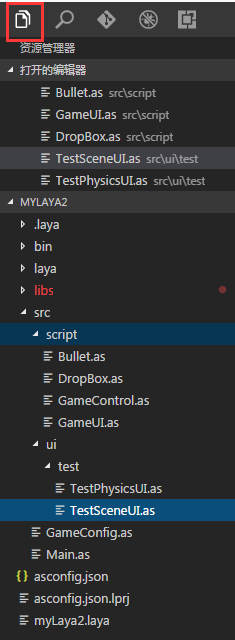

#Introduction to Toolbar Layout

###In this chapter, we will introduce the toolbar in code mode:

 
(Figure 1) Toolbar Panel

##I. Project Manager Switch Button

When the toolbar clicks the button, it switches to the project manager's function panel.

 
(Figure 2) Project Panel

 

##Search button

  
(Figure 3) Search function

After clicking the magnifying glass search button, you can switch to the search function window, enter keywords in the search bar and click the search option button on the right side, then you can get all the file positions and specific lines containing the file, and the number of included lines. At the same time, the keyword will be highlighted in the function view window. On the right side of the search bar, the function of the Aa button is case-sensitive search, the function of the Ab button is full-word matching search, and the function button on the right side is to use regular expression search.

 

 

##III. GIT Button

When this button is clicked, the Resource View window will be converted into a GIT window. You can set the address of your GIT in the GIT window so that you can quickly submit the version for team operation.

​          
(Figure 4) GIT Switch Button

 

##Debugging button

When this button is clicked, the resource view window will be transformed into a debug window. In the debug window, you can quickly view or monitor variables and functions. At the same time, you can customize the breakpoint location according to the function name.

  
(Fig. 5) Debugging button

 
(Figure 6) debugging monitoring area

At the same time, you can move the mouse over the title line of the column window, which will display a`“+”`Icon, Click to customize the addition of variables or functions that need to be monitored.

 

##V. Extension Button

 

(Figure 7) Search Extension Panel

Click this button to open the extension function panel of vscode. You can search and install the extension in the vscode store.