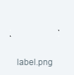

# Label 组件参考


## 一、通过LayaAirIDE创建Label组件

###1.1 Create Label

The Label component is used to display a paragraph of text, which can be a system font or a BMFont font.

Click on the Label component in the resource panel and drag it into the page editing area to add the Label component to the page.
Refer to the script interface for the Label component[Label API](http://layaair.ldc.layabox.com/api/index.html?category=Core&class=laya.ui.Label)。

Resource examples of Label components:

​<br/>
(Fig. 1)

After dragging and dropping the Label component into the editing area, setting the value of the text attribute to LayaAir IDE shows the following effect:

​<br/>
(Figure 2)


 

 


###1.2 Label attribute

​<br/>
(Figure)

A kind of**attribute**| Functional description|
| --------------------------------------------------------------------------------------------------------------------------------------------------------|
| Text | Text content string. A kind of
| Horizontal alignment of align | text. Optional values are left, center, right. A kind of
| Valign | Vertical alignment of text. Optional values are top, middle, bottom. A kind of
| Color | The color value of the text. The default is black. A kind of
| bgColor | Text background color. A kind of
|Font the font name of the text. A kind of
| fontSize | font size of text. A kind of
| Whether the bold | text is shown in bold. A kind of
| Italic | text appears in italic. A kind of
| WordWrap | Does the text wrap? A kind of
| stroke | Description width of text. A kind of
| StrkeColor | Description edge color of text. A kind of
| Whether the text of asPassword | is displayed in password style or not. A kind of
| Lead | Vertical line spacing of text. A kind of
| Padding | Text margin. A kind of


 


##2. Creating Label Components by Code

When we write code, we inevitably control UI through code and create it.`UI_Label`Class, which sets Label-related properties through code.

**Run the example effect:**
​<br/>
(Figure 5) Create Labels from code

Other attributes of Label can also be set by code. The following sample code demonstrates how to create different skin (style) Labels by code. Interested readers can set Label by code themselves to create text effects that meet their needs.

More text effects can be seen in the text section of the 2D Foundation.

**Sample code:**


```javascript

module laya {
	import Stage = Laya.Stage;
	import Label = Laya.Label;
	import WebGL = Laya.WebGL;

	export class UI_Label {
		constructor() {
			// 不支持WebGL时自动切换至Canvas
			Laya.init(800, 600, WebGL);

			Laya.stage.alignV = Stage.ALIGN_MIDDLE;
			Laya.stage.alignH = Stage.ALIGN_CENTER;

			Laya.stage.scaleMode = Stage.SCALE_SHOWALL;
			Laya.stage.bgColor = "#232628";

			this.setup();
		}

		private setup(): void {
			this.createLabel("#FFFFFF", null).pos(30, 50);
			this.createLabel("#00FFFF", null).pos(290, 50);
			this.createLabel("#FFFF00", "#FFFFFF").pos(30, 100);
			this.createLabel("#000000", "#FFFFFF").pos(290, 100);
			this.createLabel("#FFFFFF", "#00FFFF").pos(30, 150);
			this.createLabel("#0080FF", "#00FFFF").pos(290, 150);
		}

		private createLabel(color: string, strokeColor: string): Label {
			const STROKE_WIDTH: number = 4;

			var label: Label = new Label();
			label.font = "Microsoft YaHei";
			label.text = "SAMPLE DEMO";
			label.fontSize = 30;
			label.color = color;

			if (strokeColor) {
				label.stroke = STROKE_WIDTH;
				label.strokeColor = strokeColor;
			}

			Laya.stage.addChild(label);

			return label;
		}
	}
}
new laya.UI_Label();
```


 	