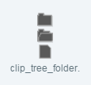
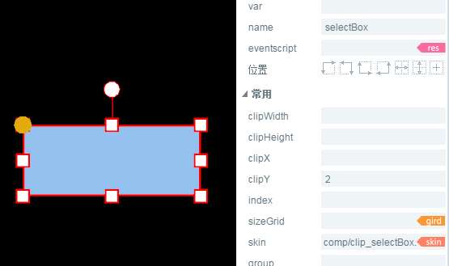
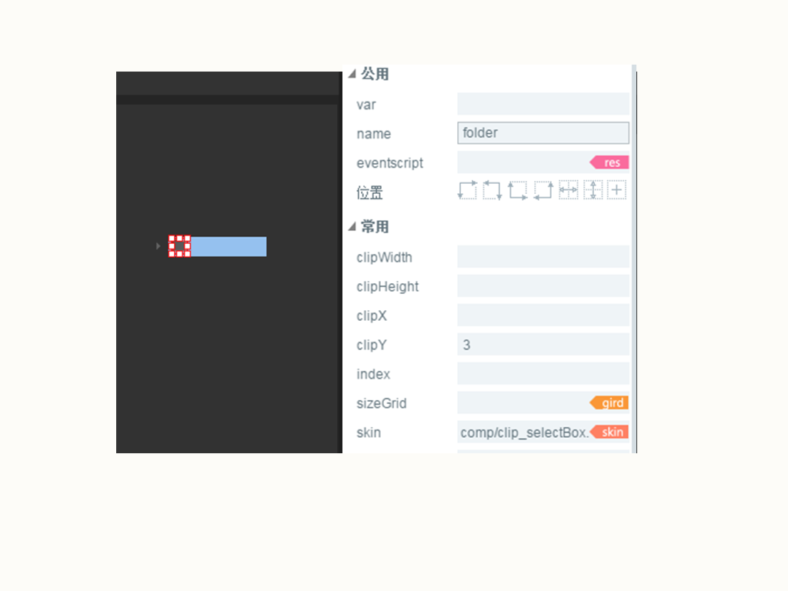

# Tree 组件参考


## 一、通过LayaAirIDE创建Tree组件

​        Tree 组件用来显示树状结构。用户可以查看排列为可扩展树的层次结构数据。
​        Tree 组件的脚本接口请参考 [Tree API](http://layaair.ldc.layabox.com/api/index.html?category=Core&class=laya.ui.Tree)。

 

### 1.1 Tree 组件主要由两个部分组成：

- 项单元格（可以是 Box 、页面 View、自定义页面）；
- 纵向滚动条 VScrollBar；


### 1.2 Tree 组件的单元格通常由四部分组成：

- 一个单元格选择状态切片动画 Clip；
- 一个折叠箭头切片动画 Clip ；
- 一个文件状态切片动画 Clip ；
- 单元格其他内容元素；


### 1.3 Tree 组件的图像资源示例

1. 单元格选择状态切片动画 Clip 资源：
   切片数为2，切片索引从0开始依次代表：单元格未被选中状态图、单元格选中或悬停状态图。
   ​        <br/>
   ​    （图）
2. 折叠箭头切片动画 Clip 资源：
   切片数为2，切片索引从0开始依次代表：文件夹节点折叠状态图、文件夹节点展开状态图。
   ​        <br/>
   ​    （图）
3. 文件状态切片动画 Clip 资源：
   如果切片数是3，则切片索引从0开始依次代表：文件夹节点折叠状态图、文件夹节点展开状态图、非文件夹节点状态图；
   如果切片数是2，则切片索引从0开始依次代表：文件夹节点状态图、非文件夹节点状态图；
   ​        <br/>
   ​    （图）


### 1.4创建 Tree 组件

 ####1. 编辑 Tree 组件的列表项。

   列表项可以是 Box 类型、View（页面） 类型或自定义的页面类型。此处以Box 类型为例。
   a.从资源面板里选择拖入一个单元格选择状态的切片动画（ Clip 组件），设置此Clip 组件对象的 name 属性值为 selectBox，设置属性 clipY 的值为2；
   *注意：此处的选择状态切片动画 （Clip 组件）对象的 name 属性值必须设置为 selectBox，只有这样程序才能识别它，并实现此 Clip 组件对象的显示状态跟随单元项的选择状态而改变的功能，否则此 Clip 对象将会被识别为此单元项的普通显示对象。*

​        <br/>
​    （图）


   b.从资源面板里选择并拖拽一个单元格的折叠箭头切片动画（Clip 组件），设置此 Clip 组件对象的 name 属性值为 arrow，设置属性 clipY 的值为2；
   *注意：此处的折叠箭头切片动画 （Clip 组件）的 name 属性值必须设置为 arrow，只有这样程序才能识别它，并实现点击此 Clip 对象打开或折叠树形节点的功能。否则此 Clip 对象将会被识别为此单元项的普通显示对象。*
​        <br/>
​    （图）
   c.从资源面板里选择并拖拽一个单元格的文件状态切片动画（Clip 组件），设置此 Clip 组件对象的 name 属性值为 folder，设置属性 clipY 的值为 3；
   *注意：此处的文件状态切片动画（Clip 组件）的 name 属性值必须设置为 folder，只有这样程序才能识别它，并实现此 Clip 组件对象的显示状态跟随单元项的折叠、展开、节点类型（是否有字节点）而改变的功能。否则此 Clip 对象将会被识别为此单元项的普通显示对象。*
​        <br/>
​    （图）

    d.拖入此单元项的普通显示对象。
   此处以 Label 为例，从资源面板里选择并拖入一个 Label 组件对象，在此给这个 Label 对象设置一下属性 name 值为 label ，方便在脚本中对它进行赋值，此name 属性值自定义即可。再设置一下 Label 对象显示相关的属性，使它看起来更美观。

​        <br/>
​    （图）
   e.选中以上编辑的所有组件对象，使用快捷键 Ctrl + B 或选择 **\*菜单栏->编辑->转换为容器*** 选项，打开转换为容器设置面板，选择容器类型为 Box，然后点击确定按钮完成 Box 容器的添加。
​        <br/>
​    （图）

​    

####2. 转化为 Tree 容器。
   选择列表渲染项对象，使用快捷键 Ctrl + B 或选择 **菜单栏->编辑->转换为容器** 选项，打开转换为容器设置面板，选择容器类型为 Tree，然后点击确定按钮完成 Tree 容器的添加。
​           <br/>
   ​    （图）

####3. 指定 Tree 组件的列表渲染项。
   双击 Tree 组件对象，进入 Tree 对象内部进行编辑，设置 Tree 组件的列表渲染项的属性 name 的值为 render。
   *注意：此处列表渲染项属性 name 的值必须为 render，否则程序将无法识别。*
   ​        <br/>
   ​    （图）

####4. 为 Tree 组件添加滚动条。
   从资源面板里选择一个 VScrollBar 组件，将VScrollBar 组件的资源地址（skin 属性值）设置为 Tree 组件属性scrollBarSkin 的值。
​           <br/>
   ​    （图）

####5. 调整 Tree 的宽高。
​	设置 Tree 对象的属性 var（全局引用名）的值为 m_tree ，此处名字可以自定义，目的是在脚本中对此 Tree 组件对象赋值。
​           <br/>
​       （图）

####6. 在代码里给 Tree 对象赋值

```javascript
var xmlString:string="<data>"+
                        "<dir label='box1' isOpen='true'>"+
                            "<file label='child1 ' isOpen='true'/>"+
                            "<file label='child2 ' isOpen='true'/>"+
                            "<file label='child3 ' isOpen='true'/>"+
                            "<file label='child4 ' isOpen='true'/>"+
                            "<file label='child5 ' isOpen='true'/>"+
                        "</dir>"+
                        "<dir label='box2' isOpen='true'>"+
                            "<file label='child1 ' isOpen='true'/>"+
                            "<file label='child2 ' isOpen='true'/>"+
                            "<file label='child3 ' isOpen='true'/>"+
                            "<file label='child4 ' isOpen='true'/>"+
                            "<file label='child5 ' isOpen='true'/>"+
                        "</dir>"+
  					"</data>";
//解析xml字符。 
var xml:any = domParser.parseFromString(xmlString, "text/xml");
//设置 m_tree 的数据源。
m_tree.xml =xml;
```
#### 7. 在程序中运行查看效果。

​           <br/>
   ​    （图）

### 1.5 Tree 组件常用属性

​        <br/>
​    （图）

 

| **属性**        | **功能说明**          |
| ------------- | ----------------- |
| scrollBarSkin | 滚动条皮肤。            |
| spaceBottom   | 每一项之间的间隔距离。单位是像素。 |
| spaceLeft     | 左侧缩进距离。单位是像素。     |


##  二、通过代码创建Tree组件

​	在我们进行书写代码的时候，免不了通过代码控制UI，创建UI_Tree类，在代码中导入`laya.ui.Tree`的包，并通过代码设定Tree相关的属性。

**运行示例效果：**
​	<br/>
​	(图5)通过代码创建Tree

​	Tree的其他属性也可以通过代码来设置，下述示例代码演示了如何通过代码创建不同皮肤（样式）的Tree，

有兴趣的读者可以自己通过代码设置Tree，创建出符合自己需要的文件夹。

**示例代码：**

```javascript
module laya {
    import Stage = Laya.Stage;
    import Tree = Laya.Tree;
    import Browser = Laya.Browser;
    import Handler = Laya.Handler;
    import WebGL = Laya.WebGL;
    import Utils = Laya.Utils;

    export class UI_Tree {
        constructor() {
            // 不支持WebGL时自动切换至Canvas
            Laya.init(550, 400, WebGL);

            Laya.stage.alignV = Stage.ALIGN_MIDDLE;
            Laya.stage.alignH = Stage.ALIGN_CENTER;

            Laya.stage.scaleMode = Stage.SCALE_SHOWALL;
            Laya.stage.bgColor = "#232628";

            var res: Array<string> = [
                "res/ui/vscroll.png",
                "res/ui/vscroll$bar.png",
                "res/ui/vscroll$down.png",
                "res/ui/vscroll$up.png",
                "res/ui/tree/clip_selectBox.png",
                "res/ui/tree/clip_tree_folder.png",
                "res/ui/tree/clip_tree_arrow.png"
            ];

            Laya.loader.load(res, new Handler(this, this.onLoadComplete));
        }

        private onLoadComplete(): void {
            // 组装tree的数据
            var treeData: string = "<data>";
            for (var i: number = 0; i < 5; ++i) {
                treeData += "<item label='Directory " + (i + 1) + "' isOpen='true'>";
                for (var j: number = 0; j < 5; ++j) {
                    treeData += "<leaf label='File " + (j + 1) + "'/>";
                }
                treeData += "</item>";
            }
            treeData += "</data>";
            // 解析tree的数据
            var xml:any = Utils.parseXMLFromString(treeData);

            var tree: Tree = new Tree();
            tree.scrollBarSkin = "res/ui/vscroll.png";
            tree.itemRender = Item;
            tree.xml = xml;
            tree.size(300, 300);
            tree.x = (Laya.stage.width - tree.width) / 2;
            tree.y = (Laya.stage.height - tree.height) / 2;
            Laya.stage.addChild(tree);
        }
    }
}

import Box = Laya.Box;
import Clip = Laya.Clip;
// 此类对应的json对象：
// {"child": [{"type": "Clip", "props": {"x": "13", "y": "0", "left": "12", "height": "24", "name": "selectBox", "skin": "ui/clip_selectBox.png", "right": "0", "clipY": "2"}}, {"type": "Clip", "props": {"y": "4", "x": "14", "name": "folder", "clipX": "1", "skin": "ui/clip_tree_folder.png", "clipY": "3"}}, {"type": "Label", "props": {"y": "1", "text": "treeItem", "width": "150", "left": "33", "height": "22", "name": "label", "color": "#ffff00", "right": "0", "x": "33"}}, {"type": "Clip", "props": {"x": "0", "name": "arrow", "y": "5", "skin": "ui/clip_tree_arrow.png", "clipY": "2"}}], "type": "Box", "props": {"name": "render", "right": "0", "left": "0"}};
class Item extends Box {
    constructor() {
        super();

        this.right = 0;
        this.left = 0;

        var selectBox: Clip = new Clip("res/ui/tree/clip_selectBox.png", 1, 2);
        selectBox.name = "selectBox";//设置 selectBox 的name 为“selectBox”时，将被识别为树结构的项的背景。2帧：悬停时背景、选中时背景。    
        selectBox.height = 32;
        selectBox.x = 13;
        selectBox.left = 12;
        this.addChild(selectBox);

        var folder: Clip = new Clip("res/ui/tree/clip_tree_folder.png", 1, 3);
        folder.name = "folder";//设置 folder 的name 为“folder”时，将被识别为树结构的文件夹开启状态图表。2帧：折叠状态、打开状态。
        folder.x = 14;
        folder.y = 4;
        this.addChild(folder);

        var label: Label = new Label("treeItem");
        label.name = "label";//设置 label 的name 为“label”时，此值将用于树结构数据赋值。
        label.fontSize = 20;
        label.color = "#FFFFFF";
        label.padding = "6,0,0,13";
        label.width = 150;
        label.height = 30;
        label.x = 33;
        label.y = 1;
        label.left = 33;
        label.right = 0;
        this.addChild(label);

        var arrow: Clip = new Clip("res/ui/tree/clip_tree_arrow.png", 1, 2);
        arrow.name = "arrow";//设置 arrow 的name 为“arrow”时，将被识别为树结构的文件夹开启状态图表。2帧：折叠状态、打开状态。
        arrow.x = 0;
        arrow.y = 5;
        this.addChild(arrow);
    }
}

new laya.UI_Tree();
```


 