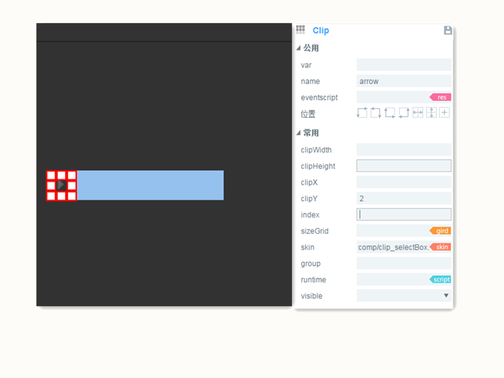
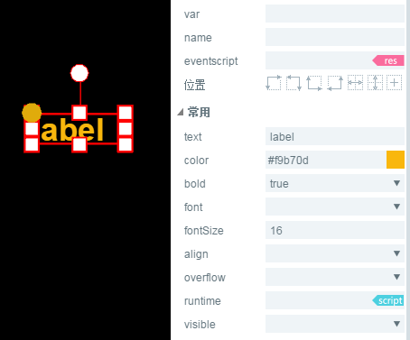
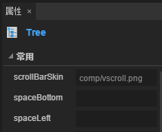

#Tree Component Reference


##1. Creating Tree Components through LayaAirIDE

Tree components are used to display tree structures. Users can view hierarchical data arranged as extensible trees.
Refer to the script interface for Tree components[Tree API](http://layaair.ldc.layabox.com/api/index.html?category=Core&class=laya.ui.Tree)。


 


###1.1 Tree component consists of two parts:

##- Item cells (can be Box, Page View, Custom Page);Vertical scroll bar VScrollBar;


###1.2 Tree component cells are usually composed of four parts:

##- A cell selection status slice animation Clip;A folding arrow slice animation Clip;
##- A file status slice animation Clip;Other content elements of the cell;


###1.3 Examples of Image Resources for Tree Components

1. Cell selection status slice animation Clip resource:
The number of slices is 2, and the slice index is represented in turn from 0: the unselected state diagram of cells, the selected or hovered state diagram of cells.
​<br/>
(Figure)
2. Folding arrow slice animation Clip resources:
The number of slices is 2. The slice index is represented by folder node folding state map and folder node unfolding state map from 0.
​<br/>
(Figure)
3. File status slice animation Clip resources:
If the number of slices is 3, the slice index is represented from 0 in turn: folder node folding state map, folder node expanding state map, and non-folder node state map.
If the number of slices is 2, the slice index is represented from 0 in turn: folder node state map, non-folder node state map;
​<br/>
(Figure)


###1.4 Create Tree Components


 ####1. Edit the list items of the Tree component.

List items can be Box type, View (page) type, or custom page type. Take the Box type as an example.
A. Select and drag a clip animation (Clip component) of cell selection status from the resource panel. Set the name attribute value of the Clip component object to selectBox and the clipY attribute to 2.
   *Note: The name attribute value of the selected state slice animation (Clip component) object must be set to selectBox. Only in this way can the program recognize it and realize the function that the display state of the Clip component object changes with the selection state of the unit item, otherwise the Clip object will be recognized as the normal display object of the unit item.*

​<br/>
(Figure)


B. Select and drag a folded arrow slice animation (Clip component) of a cell from the resource panel. Set the name attribute value of the Clip component object to arrow and the clipY attribute to 2.
   *Note: The name attribute value of the folded arrow slice animation (Clip component) here must be set to arrow, so that the program can recognize it and realize the function of clicking on this Clip object to open or fold the tree node. Otherwise, this Clip object will be recognized as a normal display object for this unit item.*
​<br/>
(Figure)
C. Select and drag a cell file status slice animation (Clip component) from the resource panel, set the name attribute value of the Clip component object to folder, and set the value of the attribute clipY to 3;
   *Note: The name attribute value of the Clip component must be set to folder. Only in this way can the program recognize it and realize the function that the display state of the Clip component object changes with the folding, unfolding of the unit item and the type of node (whether there are byte points). Otherwise, this Clip object will be recognized as a normal display object for this unit item.*
​<br/>
(Figure)

D. Common display object dragged into this unit item.
Here, take Label as an example, select and drag a Label component object from the resource panel. Set the attribute name value of the Label object to label, which is convenient to assign to it in the script. The name attribute value can be customized. Set up the Label object to display the relevant properties to make it look more beautiful.

​<br/>
(Figure)
E. Select all the component objects edited above, use the shortcut key Ctrl + B or select *** menu bar - > Edit - > to convert to containers***Options, open the Conversion to Container Settings panel, select the Container Type as Box, and then click the OK button to complete the addition of Box Containers.****
​<br>
(Figure)

​

####2. Convert to Tree container.
****Select the list rendering item object, use the shortcut key Ctrl + B or select**Menu Bar - > Edit - > Convert to Container ** Option, Open the Conversion to Container Settings Panel, select Container Type Tree, and click OK button to complete the addition of Tree Container.
​<br/>
(Figure)

####3. Specify list rendering items for Tree components.
Double-click on the Tree component object, enter the Tree object for editing, and set the value of the attribute name of the list rendering item of the Tree component to render.
   *Note: The value of the list rendering item attribute name here must be render, otherwise the program will not recognize it.*
​<br/>

(Figure)

####4. Add scrollbars for Tree components.
Select a VScrollBar component from the Resource Panel and set the resource address (skin attribute value) of the VScrollBar component to the value of the Tree component attribute scrollBarSkin.
​<br/>
(Figure)

####5. Adjust the width and height of Tree.
Set the value of the attribute var (global reference name) of the Tree object to m_tree, where the name can be customized to assign values to the Tree component object in the script.
​<br/>
(Figure)

####6. Assign Tree objects in code


```javascript

var xmlString:string="<data>"+
                        "<dir label='box1' isOpen='true'>"+
                            "<file label='child1 ' isOpen='true'/>"+
                            "<file label='child2 ' isOpen='true'/>"+
                            "<file label='child3 ' isOpen='true'/>"+
                            "<file label='child4 ' isOpen='true'/>"+
                            "<file label='child5 ' isOpen='true'/>"+
                        "</dir>"+
                        "<dir label='box2' isOpen='true'>"+
                            "<file label='child1 ' isOpen='true'/>"+
                            "<file label='child2 ' isOpen='true'/>"+
                            "<file label='child3 ' isOpen='true'/>"+
                            "<file label='child4 ' isOpen='true'/>"+
                            "<file label='child5 ' isOpen='true'/>"+
                        "</dir>"+
  					"</data>";
//解析xml字符。 
var xml:any = domParser.parseFromString(xmlString, "text/xml");
//设置 m_tree 的数据源。
m_tree.xml =xml;
```

####7. Run the program to see the effect.

​<br/>
(Figure)

###1.5 Tree Component Common Properties

​<br/>
(Figure)

A kind of**attribute**A kind of**Function description**A kind of
| -------------------------------------------------------------------------------------------------------------------------------------------|
| scroll BarSkin | scroll bar skin. A kind of
| SpaceBottom | The distance between each item. Units are pixels. A kind of
| Space Left | Left indentation distance. Units are pixels. A kind of


##2. Creating Tree Components through Code

When we write code, we inevitably control UI through code, create UI_Tree class, and import it into code.`laya.ui.Tree`Tree-related properties are set by code.

**Run the example effect:**
​<br/>
(Figure 5) Creating Tree through Code

Other attributes of Tree can also be set by code. The following sample code demonstrates how to create different skin (style) Trees through code.

Interested readers can set up Tree by their own code and create folders that meet their needs.

**Sample code:**


```javascript

module laya {
    import Stage = Laya.Stage;
    import Tree = Laya.Tree;
    import Browser = Laya.Browser;
    import Handler = Laya.Handler;
    import WebGL = Laya.WebGL;
    import Utils = Laya.Utils;

    export class UI_Tree {
        constructor() {
            // 不支持WebGL时自动切换至Canvas
            Laya.init(550, 400, WebGL);

            Laya.stage.alignV = Stage.ALIGN_MIDDLE;
            Laya.stage.alignH = Stage.ALIGN_CENTER;

            Laya.stage.scaleMode = Stage.SCALE_SHOWALL;
            Laya.stage.bgColor = "#232628";

            var res: Array<string> = [
                "res/ui/vscroll.png",
                "res/ui/vscroll$bar.png",
                "res/ui/vscroll$down.png",
                "res/ui/vscroll$up.png",
                "res/ui/tree/clip_selectBox.png",
                "res/ui/tree/clip_tree_folder.png",
                "res/ui/tree/clip_tree_arrow.png"
            ];

            Laya.loader.load(res, new Handler(this, this.onLoadComplete));
        }

        private onLoadComplete(): void {
            // 组装tree的数据
            var treeData: string = "<data>";
            for (var i: number = 0; i < 5; ++i) {
                treeData += "<item label='Directory " + (i + 1) + "' isOpen='true'>";
                for (var j: number = 0; j < 5; ++j) {
                    treeData += "<leaf label='File " + (j + 1) + "'/>";
                }
                treeData += "</item>";
            }
            treeData += "</data>";
            // 解析tree的数据
            var xml:any = Utils.parseXMLFromString(treeData);

            var tree: Tree = new Tree();
            tree.scrollBarSkin = "res/ui/vscroll.png";
            tree.itemRender = Item;
            tree.xml = xml;
            tree.size(300, 300);
            tree.x = (Laya.stage.width - tree.width) / 2;
            tree.y = (Laya.stage.height - tree.height) / 2;
            Laya.stage.addChild(tree);
        }
    }
}

import Box = Laya.Box;
import Clip = Laya.Clip;
// 此类对应的json对象：
// {"child": [{"type": "Clip", "props": {"x": "13", "y": "0", "left": "12", "height": "24", "name": "selectBox", "skin": "ui/clip_selectBox.png", "right": "0", "clipY": "2"}}, {"type": "Clip", "props": {"y": "4", "x": "14", "name": "folder", "clipX": "1", "skin": "ui/clip_tree_folder.png", "clipY": "3"}}, {"type": "Label", "props": {"y": "1", "text": "treeItem", "width": "150", "left": "33", "height": "22", "name": "label", "color": "#ffff00", "right": "0", "x": "33"}}, {"type": "Clip", "props": {"x": "0", "name": "arrow", "y": "5", "skin": "ui/clip_tree_arrow.png", "clipY": "2"}}], "type": "Box", "props": {"name": "render", "right": "0", "left": "0"}};
class Item extends Box {
    constructor() {
        super();

        this.right = 0;
        this.left = 0;

        var selectBox: Clip = new Clip("res/ui/tree/clip_selectBox.png", 1, 2);
        selectBox.name = "selectBox";//设置 selectBox 的name 为“selectBox”时，将被识别为树结构的项的背景。2帧：悬停时背景、选中时背景。    
        selectBox.height = 32;
        selectBox.x = 13;
        selectBox.left = 12;
        this.addChild(selectBox);

        var folder: Clip = new Clip("res/ui/tree/clip_tree_folder.png", 1, 3);
        folder.name = "folder";//设置 folder 的name 为“folder”时，将被识别为树结构的文件夹开启状态图表。2帧：折叠状态、打开状态。
        folder.x = 14;
        folder.y = 4;
        this.addChild(folder);

        var label: Label = new Label("treeItem");
        label.name = "label";//设置 label 的name 为“label”时，此值将用于树结构数据赋值。
        label.fontSize = 20;
        label.color = "#FFFFFF";
        label.padding = "6,0,0,13";
        label.width = 150;
        label.height = 30;
        label.x = 33;
        label.y = 1;
        label.left = 33;
        label.right = 0;
        this.addChild(label);

        var arrow: Clip = new Clip("res/ui/tree/clip_tree_arrow.png", 1, 2);
        arrow.name = "arrow";//设置 arrow 的name 为“arrow”时，将被识别为树结构的文件夹开启状态图表。2帧：折叠状态、打开状态。
        arrow.x = 0;
        arrow.y = 5;
        this.addChild(arrow);
    }
}

new laya.UI_Tree();
```


 