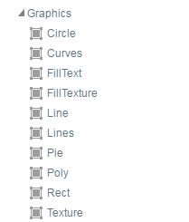

#LayaAir IDE Component Library

###1. Overview of Component List

The component library of LayaAirIDE stores common components that come with IDE. They are 2D basic components, Graphics vector components and UI common components. Figures 1, 2 and 3 are shown.

  

(Figure 1) 2D Foundation Components

 

(Figure 2) Graphics Vector Component

 

(Figure 3) Common UI components

###2. The Difference between Component Library and Resource Manager

####2.1 Storage Location Difference

All components in the component library are stored in the directory of LayaAirIDE and belong to the common components of all projects.

Components in Resource Manager are stored in the project directory and are only used by the current project.

####2.2 Skin Differentiation

Components stored in the component library are skin-free by default. Set the skin manually as needed after putting it into the scene editor.

The component skin resource is stored in the resource manager. After being put into the scene editor, the corresponding component is identified and distinguished by the prefix of the resource, and the dragged resource is used as the component skin resource.

####2.3 Component Type Difference

Component library includes UI component, Graphics vector component and 2D basic (display object) component.

Only UI components are stored in Resource Manager.

###3. Document references related to other components

Custom components can also be stored and displayed in component libraries.`使用IDE创作`Classified`《自定义组件的制作与使用》`。

An introduction to each component in the component library is given in`设计模式基础`Classified`《属性设置器文档》`as well as`IDE组件属性详解`The classification is described in detail.

`资源管理器`There are also introductions related to UI components, such as component naming rules, etc. in the document.`设计模式基础`Classified`《资源管理器介绍》`。

