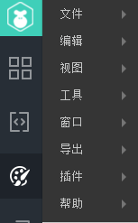
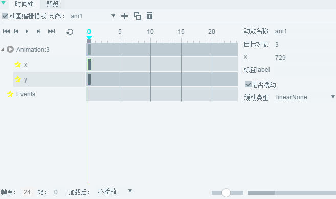
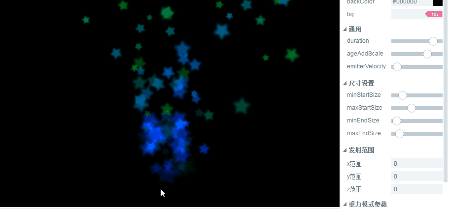

# 设计模式界面概述

​         LayaAirIDE分为设计模式，编码模式等多个模块组成。本章节中将介绍设计模式的常用布局及功能区，快速浏览各个面板组成的名称和作用。

​	  
​	（图1）

### 一、模式导航栏：

​        模式转换按钮功能可以便捷的在界面模式与代码编辑模式间切换

​	  
​	（图2）

### 二、菜单栏:

​        菜单栏上包括了程序操作集合、界面操作、控件操作命令以及工具集合等，详情请阅读菜单栏介绍一节。

​	 
​	（图3）

 

### 三、工具栏：

​        工具栏上包括了文件操作、控件操作和场景操作按钮，详情请阅读工具栏介绍一节。
​	 
​	（图4）

### 四、项目管理器:

​        项目管理器中显示了项目中所有建立的页面(Page),这里会以树状结构来显示,您可以在项目管理器中通过双击来打开要编辑的页面，详情请阅读项目管理器一节.

​	 
​	（图5）

 

### 五、资源管理器：

​        资源管理器里显示了项目资源文件夹（ assets ）中的所有资源。这里会以树状结构显示文件夹中的资源内容。您可以使用右键打开所在文件夹进行资源添加。详情请阅读资源管理器一节。

​	 
​	（图6）

 

### 六、场景编辑器：

​          场景编辑器是用来展示和编辑UI或动画场景中可视内容的工作区域。所见既所得的场景搭建工作都依靠场景编辑器的显示来完成。详情请阅读场景编辑器一节。

​	 
​	（图7）

 

### 七、属性设置器：

​           属性设置器是我们查看并编辑当前选中节点和组件属性的工作区域，这个面板会以最适合的形式展示和编辑选中控件的属性数据。详情请阅读属性设置器一节。

​	 
​	（图8）

  

### 八、层级管理器：

​       层级管理器用树状列表的形式展示场景中的所有节点和他们的层级关系，所有在场景编辑器中看到的内容都可以在层级管理器中找到对应的节点条目，在编辑场景时这两个面板的内容会同步显示，一般我们也会同时使用这两个面板来搭建场景。详情请阅读层级管理器一节。

​	 
​	（图9）

### 九、时间轴动画编辑器：

 时间轴动画编辑器用来在页面里创建时间轴动画。帧属性面板用于显示设置时间轴上的帧详情。详细用法请阅读时间轴动画编辑器一节。

​	 
​	（图10）

### 十、粒子编辑器：

粒子编辑器用来在页面里创建粒子动画。粒子属性面板用于显示设置粒子的属性详情。详细用法请阅读粒子编辑器一节。

​	 
​	（图11）