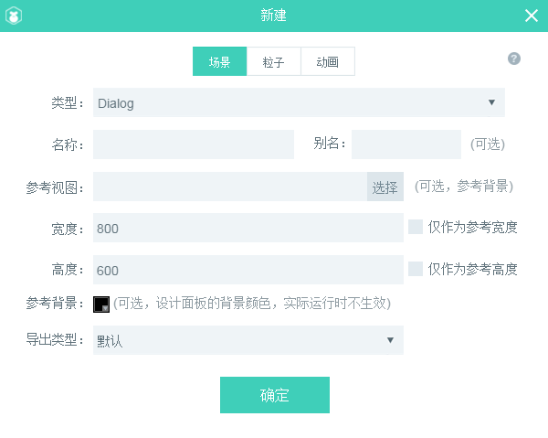
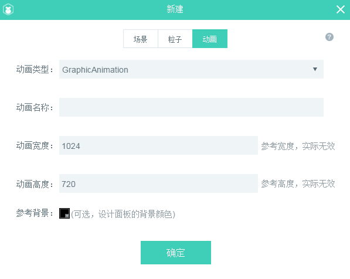

# UI页面、粒子、动画、脚本新增面板详解

　　 在项目管理器器中，右键可以新建UI页面、粒子、动画、脚本，如图1所示，本篇将针对这些功能的一些参数展开介绍。

​         
​        	（图1）

### 一、新建UI页面

**在新建的面板中，`页面`栏里可以创建View与Dialog两种UI界面。如图2所示**：

​         
​        	（图2）

**【参数说明】**

**页面类型**：

　　 默认为View，该类型的页面，没有关闭功能，通常用于游戏背景与一直保持打开的层级页面。另一个选项类型为Dialog，Dialog继承自View，除View的所有功能外，还可以实现会话框的弹出、拖动，关闭窗口等功能，常用于游戏的弹出界面。

**页面名称**：

　　 新建的页面文件名，该项必须填写。 

**参考视图**：

　　 参考视图是通过在设计界面的背景加载一张美术设计原图，方便UI的制作拼接与原设计保持一致的参照图片。该项为可选，参考视图的背景图片并不会导出到项目中，仅用于UI制作的参照。

**页面宽度**：

　　 页面的宽，设置后超过宽度不会被计算，勾选“仅作为参考宽度”后，需要实时计算宽度，对性能会产生额外的压力，不建议勾选。

**页面高度**：

　　 页面的高，设置后超过高度不会被计算，勾选“仅作为参考宽度”后，需要实时计算高度，对性能会产生额外的压力，不建议勾选。

**参考背景**：

　　 参考背景与参考视图类似，仅用于UI制作的对比参照，不会在项目中生效。是可选项。

### **二、新建粒子**

　　 在新建粒子里，可以创建重力模式与半径模式的2D例子动画，也可以创建3D粒子动画。如下图所示：

​         
​        	（图3）

**【参数说明】**

**粒子类型**：

　　粒子类型为重力模式、半径模式、粒子3D模式三种，默认为重力模式。

　　重力模式的粒子是一个角度向另一个方向呈发射式的粒子效果。

　　半径模式是围绕中心点为半径的旋转式粒子效果。半径模式与重力模式没有根本性区别，重力模式通过调整参数可以实现半径模式的效果，半径模式也可以调整为重力模式的效果，区别仅在于初始参数的配置不同。

　　粒子3D模式是基于3维的粒子效果。

**粒子名称**：

　　 新建的粒子文件名，该项必须填写。

### **三、新建动画**

　　  在新建动画里，可以创建一个帧动画。

​         
​        	（图4）

**【参数说明】**

**动画类型**：

　　 动画类型为GraphicAnimation与EffectAnimation两种。

　　 GraphicAnimation是默认选项，该项可以创建一个包含多个动画效果的时间轴动画。

　　 EffectAnimation为动画模板，只能创建一个动画效果的模板，将效果作用于某个组件，而不能独立显示动画效果。

**动画名称**：

　　 新建的帧动画文件名，该项必须填写。

**动画宽度**：

　　动画宽度的设置仅作为设计时的背景宽度使用，在游戏运行中该设置无效。

**动画高度**：

　　 动画高度的设置仅作为设计时的背景高度使用，在游戏运行中该设置无效。

**参考背景**：

　　 参考背景也仅用于动画制作的背景色对比参照，不会在项目中生效。是可选项。
