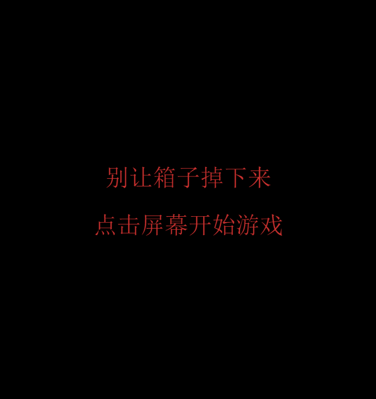
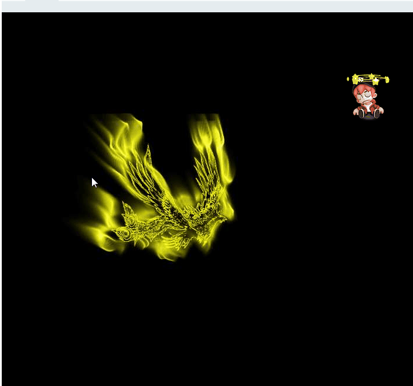
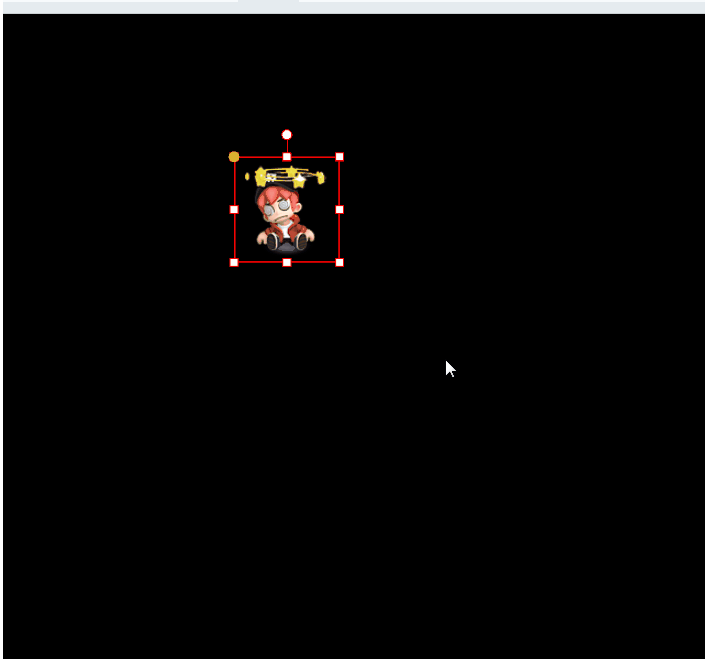
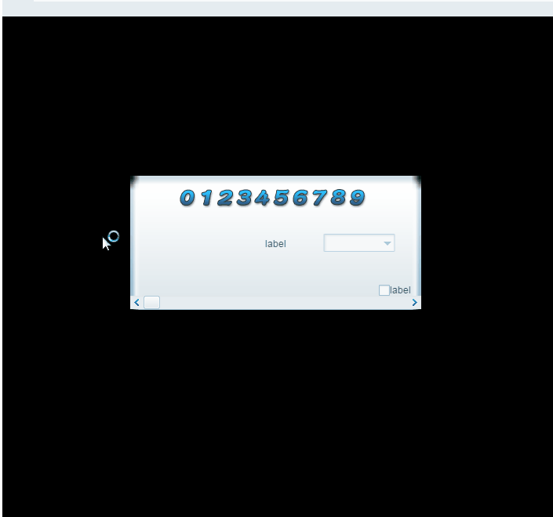
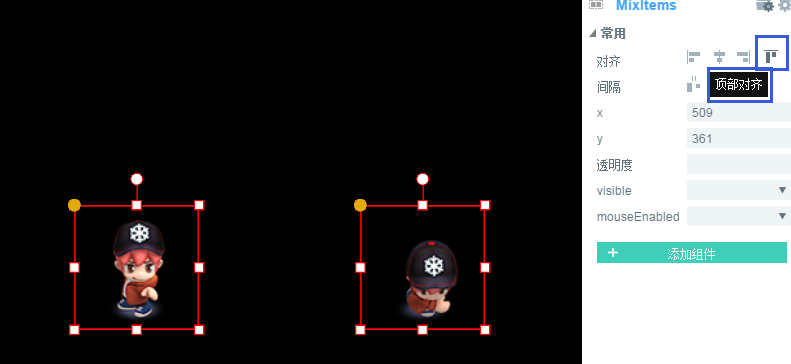

#UI Scene Editor

Scene Editor is the core work area of UI, animation and other content creation. As shown in Figure 1, we can select and place controls, composite containers and so on in Scene Editor. When we select the component in the scene editor, we can also modify the location, rotation, scaling, size and other properties of the component in the property setter to get a preview of the scene effect of WYSIWYG.

​ 
(Fig. 1)

##1. Introduction of Views

####1.1 View Operation

You can move and locate the view of the scene editor by doing the following:

1. Hold on`鼠标右键`Or hold down`鼠标滚轮`You can drag and drop a moving view.

2. Shortcut keys`Ctrl + +`or`鼠标滚轮向前`The view can be enlarged.

3. Shortcut keys`Ctrl + -`Or the mouse wheel can be turned back to narrow the view.

4. Shortcut keys`Ctrl + 0`The original scale view can be restored to 100%.

When viewing, you can see the zoom scale prompt in the lower right corner of the UI Scene Editor. The related operations are shown in Figure 2.

    (动图2)

####Constraint box for 1.2 components

Components can see the constraint box (red and nodal wireframe) when the mouse is selected, and the rectangular area of the constraint box represents the size attribute size of the component. Any node in a point can directly change the size of the component.

​  (Motion 3)

**Tips**Even if the control does not contain an image rendering component (such as Sprite), you can set the size attribute for the control.

####1.3 Multiple Selected Nodes

Press and drag the left mouse button in the scene editor to draw a rectangular selection box with red lines. When the mouse button is released, the same layer components in the selection box will be selected. You can change the area of the selection box by sliding the mouse freely before releasing the mouse button. The operation effect is shown in Figure 4.

   （动图4）

####1.4 Arrangement of nodes using alignment tools

The core function of the scene editor is to edit and arrange the visible elements in the scene in a WYSIWYG manner. We can also quickly deploy scene nodes through a series of alignment tools above the main window toolbar.

​  (Fig. 5)

**Tips**For an introduction to the use of specific alignment tools, please refer to`工具栏介绍`File.
