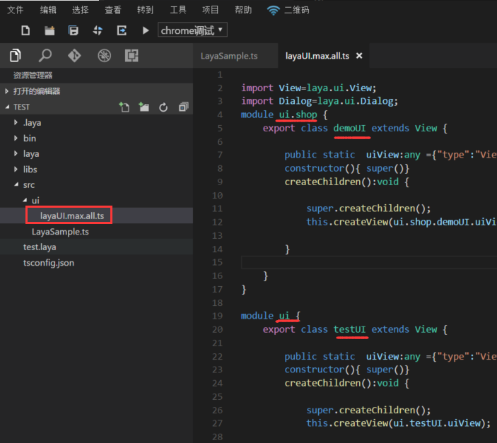

# 用代码显示IDE创建的页面

> 阅读本篇前请先阅读设计模式基础里的文档《UI页面、粒子、动画、脚本新增面板详解》

本篇面向刚接触LayaAir引擎与IDE的新手，如果使用了IDE创建了UI页面，进行了IDE编辑，那么如何通过编写代码将UI页面显示出来呢。请继续看以下内容。


## 必须了解的UI使用基础

#### 1、了解UI类导出在哪个目录

首先，我们要知道，导出UI页面（`F12或ctrl+F12`）后，如果我们没改默认 值，导出的UI类代码是在`src/ui`目录下。如果要改，可以按F9快捷键调出项目设置面板，如图1所示。

 

(图1)

#### 2、TypeScript项目必须了解的UI目录命名规则

由于TypeScript自身的原因，TS项目在给UI创建目录命名时，有两个重要规则需要特别注意：

1、禁止新建目录的名称为`ui`，否则会导致用代码显示时报错。

2、禁止同一个纵向目录下有重名目录。比如，父目录与子目录同名（aa/aa），或者父目录与孙目录同名(aa/bb/aa)，不管相隔多少个层级关系，同一个纵向目录下，任何层级关系的相同目录命名，都是禁止的，会导致报错。

#### 3、导出后生成的代码文件

在使用IDE导出功能后，默认会在src/ui目录下生成一个ts的 UI类文件(`layaUI.max.all.ts`)。里面包括了所有创建的UI页面信息，如图2-1所示。

 

(图2-1)

 

(图2-2)

对照图2-1的红线部分和图2-2的目录结构，其实我们很容易发现其中的关系。ui是根结构，shop是ui下的一级目录。demo是UI文件的文件名，在类文件中，用UI文件名与UI关键字共同组成了UI类名（如demoUI），在代码编写的时候，用到的就是这种类名。而不是原来在IDE里创建的UI文件名。例如引用要用的UI类，如下面代码所示：

```typescript
import demoUI = ui.shop.demoUI;
```

#### 4、了解在index.html中引入的UI类js

默认情况下，IDE会在index.html里自动引入编译后的UI类。如图3所示。这里我们知道就好了，除非是出问题了，可以来这里看看。

  

(图3)


## 编写代码，显示IDE创建的页面

假设我们要显示的是图2-2中的test.ui中编辑的页面

#### 1、要先引用导出的UI类

```typescript
//引入test页面的UI类
import testUI = ui.testUI;
```

#### 2、创建一个私有的装载方法，用于加载UI图集资源的回调

在这个方法里，将引入的testUI对象实例化给test，然后添加到舞台。

```typescript
private onLoaded():void{
        //实例化UI界面
        var test:testUI = new testUI();
        //把实例后的UI界面添加到舞台
         Laya.stage.addChild(test);
    }
```

#### 3、加载页面中用到的图集资源，然后通过回调方法将UI显示到舞台。

```typescript
//加载页面中的图集，并将页面显示
Laya.loader.load("res/atlas/comp.atlas", Laya.Handler.create(this, this.onLoaded));
```

#### 4、完整的代码

示例空项目的入口程序 LayaSample.ts

```typescript
//引入test页面的UI类
import testUI = ui.testUI;
class GameMain{
    constructor()
    {
        Laya.init(600,400);
      	//加载页面中的图集，并将页面显示
        Laya.loader.load("res/atlas/comp.atlas", Laya.Handler.create(this, this.onLoaded));
    }

    private onLoaded():void{
        //实例化UI界面
        var test:testUI = new testUI();
        //把实例后的UI界面添加到舞台
         Laya.stage.addChild(test);
    }
}
new GameMain();
```


> 本篇文档非常基础，也很简单，如果没有成功显示出来UI，请一定要严格按本文档的步骤，甚至命名都要一致，先确保没有问题，再灵活尝试。