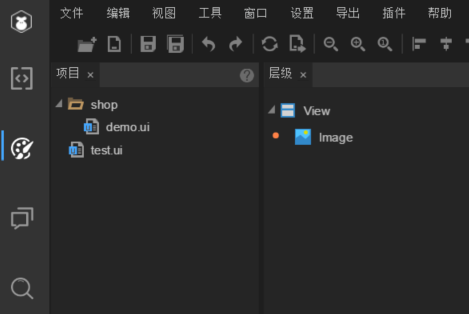

#Display IDE-created pages in code

> Before reading this article, please read the document "UI Pages, Particles, Animation, Additional Panel Details of Scripts" in the foundation of design patterns.

This article is for novices who have just come into contact with LayaAir engine and IDE. If IDE is used to create UI pages and edit IDE pages, how to display UI pages by writing code? Please continue to read the following.


##Understanding the basics of UI usage

####1. Understand which directory UI classes are exported to

First, we need to know that we export UI pages（`F12或ctrl+F12`) Later, if we do not change the default value, the UI class code exported is`src/ui`Under the directory. If you want to change it, you can press F9 shortcut to bring up the project settings panel, as shown in Figure 1.

 


(Fig. 1)

####2. Naming rules for UI directories that a TypeScript project must understand

Because of TypeScript's own reasons, TS projects have two important rules to pay special attention to when creating directory names for UIs:

1. The name of the prohibited new directory is`ui`Otherwise, it will result in errors in displaying time with code.

2. It is forbidden to have duplicate names under the same vertical directory. For example, the same name of parent directory and subdirectory (aa/aa), or the same name of parent directory and grandson directory (aa/bb/aa), regardless of how many hierarchical relationships are separated, under the same vertical directory, the same name of directory of any hierarchical relationship is prohibited, leading to errors.

####3. Code files generated after export

After using the IDE export function, a TS UI class file is generated by default in the src/ui directory.（`layaUI.max.all.ts`) It contains all the UI page information created, as shown in Figure 2-1.

 


(Fig. 2-1)

 


(Fig. 2-2)

Compared with the red line section of Figure 2-1 and the directory structure of Figure 2-2, we can easily find the relationship between them. UI is the root structure and shop is the first level directory under ui. Demo is the file name of UI file. In class file, the UI class name (such as demoUI) is composed of UI file name and UI keyword. When coding, the class name is used. Instead of the UI file name originally created in the IDE. For example, reference the UI class to be used, as shown in the following code:


```typescript

import demoUI = ui.shop.demoUI;
```


####4. Understand the UI class JS introduced in index. HTML

By default, IDE automatically introduces compiled UI classes into index. html. As shown in Figure 3. We just know here, unless something goes wrong, we can come here and have a look.

  


(Fig. 3)


##Write code to display pages created by IDE

Suppose we want to show the page edited in test. UI in Figure 2-2.

####1. Refer to the exported UI class first


```typescript

//引入test页面的UI类
import testUI = ui.testUI;
```


####2. Create a private loading method for loading callbacks to UI Atlas resources

In this method, the introduced testUI object is instantiated to test and then added to the stage.


```typescript

private onLoaded():void{
        //实例化UI界面
        var test:testUI = new testUI();
        //把实例后的UI界面添加到舞台
         Laya.stage.addChild(test);
    }
```


####3. Load the atlas resources used in the page, and then display the UI to the stage by callback method.


```typescript

//加载页面中的图集，并将页面显示
Laya.loader.load("res/atlas/comp.atlas", Laya.Handler.create(this, this.onLoaded));
```


####4. Complete code

Entry program LayaSample.ts for example empty project


```typescript

//引入test页面的UI类
import testUI = ui.testUI;
class GameMain{
    constructor()
    {
        Laya.init(600,400);
      	//加载页面中的图集，并将页面显示
        Laya.loader.load("res/atlas/comp.atlas", Laya.Handler.create(this, this.onLoaded));
    }

    private onLoaded():void{
        //实例化UI界面
        var test:testUI = new testUI();
        //把实例后的UI界面添加到舞台
         Laya.stage.addChild(test);
    }
}
new GameMain();
```


> This document is very basic and simple. If the UI is not displayed successfully, please strictly follow the steps of this document, even the naming should be consistent. First, make sure there is no problem, then try flexibly.