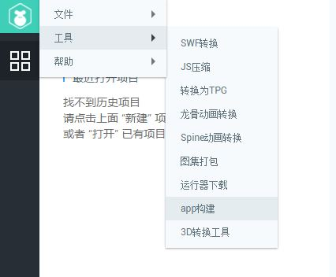
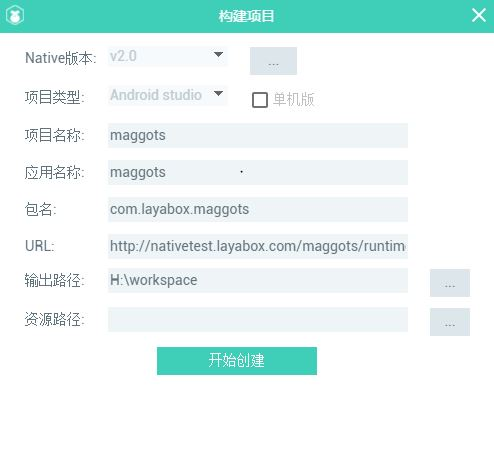

#LayaBox Construction Tool
The build tool is used to generate LayaPlayer's mobile App project, which is equivalent to the App Project Wizard. It currently supports Android (Eclipse project, Android studio project) and iOS (XCode project).
**Be careful:**
**LayaNative 2.0-Android, requiring the minimum version of the system to be 4.0**
**LayaNative 2.0-iOS, requiring the minimum version of the system to be 10.0**
##1. Operational requirements
####1.1 Basic Development Environment

Building a project must be prepared for the development environment. For example, to build an iOS project, you need to be ready for Mac computers and XCode, and Android needs to be ready for Eclipse or Android studio.

##2. User-oriented
Whether it's building Android or iOS projects, there must be a corresponding Android or iOS App development foundation. If you don't have it, please learn the basic knowledge first.


##3. Open App Construction in LayaAirIDE

stay[Layabox官网](http://localhost/LayaAir2_Auto/Layabox.com)Download Laya AirIDE, open Laya AirIDE - > click on the LOGO icon - > Tool - > app build, as shown in Figure 1:




(Fig. 1)


Because the library files needed to build the tool are large, they are not directly included in LayaAirIDE. When using the tool for the first time, SDK packages will be downloaded, as shown below.

! [] (0.gif)

(Fig. 2)

**Be careful**

This file is large, so you need to wait patiently when downloading it.

Once the download is complete, the build dialog will pop up when you click "App Build" later.

##4. Interface parameters of project construction

Open the project build interface in LayaAirIDE, as shown in Figure 3:


(Fig. 3)

* platform

There are three types of project projects to build: Android Eclipse project, Android studio project and iOS project. If you need to generate Android project, you can choose Android-eclipse or Android-studio. (Since Google no longer maintains Eclipse, it is recommended to choose Android Studio project, we will also remove Eclipse support in future versions.) If you need to generate an XCode (iOS) project, select the iOS option.


* Stand-alone App:

If this option is checked, the packaged App for the built project is a stand-alone version or an online version. The stand-alone version does not need to be networked, there is no corresponding url, and no URL is provided. But game resources must be provided, otherwise they will not run after packaging.

* Project name:

The name of App. It is also the output directory of the construction project.

* package name:

The package name of the application is not normally visible. In general, anti-domain name naming rules are adopted (which are helpful to distinguish and avoid conflicts with existing APPs in the system).

For example: com.layabox.runtime.demo
The package name must be in xxx.yyy.zzz format, with at least two levels, xxx.yyy. Otherwise, the packaging will fail.

* Game url:

If the application to be packaged is an online project, you need to provide a boot URL pointing to a JS or JSON file, which is the entry of the application. Projects generated by LayaAir output a startup page, usually index. js. When testing, for convenience, the local URL address is usually used to test in the browser. When typing into Android App, there must be a real web server address.

For example:

* LAN address:*


```

    http://10.10.20.19:8888/index.js
```

* Actual address:*

```

    http://nativetest.layabox.com/layaplayer/index.js
```


* Output path:

Build the storage address of the generated App project.

* Resource Path:

Resources are scripts, pictures, sounds and other resources. For online games, as long as there is a game URL, it can run normally. However, if you directly input resources into the app package, you can avoid network download and speed up resource loading. If it's a stand-alone game, since there's no game url, you have to pack all the resources you need into App by giving the resource catalog.

The resources packaged into App can still be updated through our DCC tool (Resource Cache Management).
If the resource path is not set at this time, after building the project, you can still add resources manually and add method references.[LayaDcc工具](https://ldc.layabox.com/doc2/?nav=zh-as-6-2-0)。


   **注意：**  

The disadvantage of packaging resources is that it increases the size of the package.

Online games with packaged resources must play DCC on server side, otherwise they will lose the advantage of packaged resources and still download all resources. How to play DCC for reference[LayaDcc工具](https://ldc.layabox.com/doc2/?nav=zh-as-6-2-0)。


##5. Use of constructed project projects

The built App project can be opened with corresponding development tools for secondary development and packaging operations.

##- Android-eclipe (android) projects can be imported and developed using eclipse software.Android-studio (android) projects can be imported and developed using android-studio software.
- XCode (ios) projects can be imported and developed using Xcode software. After opening the XCode (ios) project, you need to select the real IOS device to build. (Note: The real devices are armv7, armv7s, and arm64 architectures. If using IOS Simulator is X86 architecture, LayaNative has not yet supported X86 architecture on IOS devices, and if compiled with simulator, it can not pass. (Version 0.9.5 started supporting simulators)


**Reference resources:**

-[Eclipse搭建Android环境](https://github.com/layabox/layaair-doc/tree/master/Chinese/LayaNative/setUpAndroidEnvironment_Eclipse)

-[Android Studio的使用和配置](https://github.com/layabox/layaair-doc/tree/master/Chinese/LayaNative/AndroidStudio_ConfigurationAndApplication)

-[IOS打包发布App详细流程](https://github.com/layabox/layaair-doc/tree/master/Chinese/LayaNative/packagingReleases_IOS)

​

##6. Manual switching between stand-alone and network versions

Once the build is completed, you can switch between stand-alone and network versions by modifying the code directly in the project.

1. Android Project

Open MainActivity. Java in the project under construction and search`mPlugin.game_plugin_set_option("localize","false");`  
The stand-alone version needs to be set to "true", such as`mPlugin.game_plugin_set_option("localize","true");`  
If you want to set it as a web version, you need to modify it as follows:`mPlugin.game_plugin_set_option("localize","false");`And set the correct address:
     `mPlugin.game_plugin_set_option("gameUrl", "http://你的地址/index.js");`


2. iOS project

After the iOS project is completed, the resource/scripts/index.js script in the project directory has a function to execute loadUrl, which loads the home page address. Modifying the address here can switch between the stand-alone version and the network version. The address of the stand-alone version is fixed as follows`http://stand.alone.version/index.html`。

For example, it started as a web version with the address of:


    `loadUrl(conch.presetUrl||"http://10.10.20.19:7788/index.js");`   
To change it to a stand-alone version, amend this sentence:
    `loadUrl(conch.presetUrl||"http://stand.alone.version/runtime.json");`  
Vice versa.


   **Be careful**   
Once the URL address has been changed, the original packaged resources are invalidated. At this point, you need to manually delete the contents of the cache directory and re-use layadcc to generate the packaging resources.[《LayaDCC工具》](https://ldc.layabox.com/doc2/?nav=zh-as-6-2-0)。

##7. Resource Renewal

Build the project through IDE, if you choose the stand-alone version and the package resource version. In the resource / cache directory, all the resources of H5 projects (including scripts, pictures, html, sounds, etc.) will be packaged into this directory.
``android的目录： assets/cache/  ``<br>``iOS的目录：  resource/cache/  ``<br><br>But in the development process, the H5 project has been changing, in order to avoid rebuilding every time, after the IDE-1.7.6-Beta version, it can be refreshed through the command line.<br><br>Resource bundle version call command:``layanative refreshres -u http://testgame.layabox.com/index.js``<br>Single version call command:``layanative refreshres``

***Tips***
**1. The command must be executed in the app project directory under construction. The most obvious sign is in the navtie. JSON directory, as shown in the following figure:**
! [] (3.jpg)

Refer to the layanative command line for how to install and use it[layanative命令行工具使用](https://ldc.layabox.com/doc2/?nav=zh-as-6-3-0)


##8. Other considerations
After the Android studio is built, you need to modify the version number of Android SDK according to your environment. Now it is set to 23, and you need to modify the version number of Android sdk.
The file is app/build.gradle.