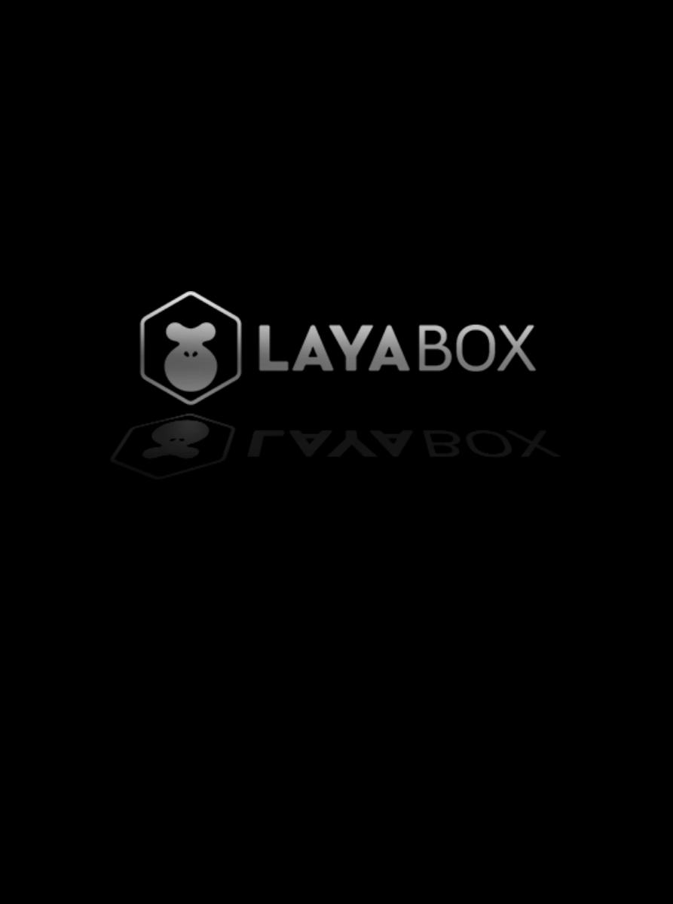

#Loading interface
To facilitate developers, customize Loading View, LayaNative uses native functionality to implement a new Loading View.

When the application starts, it needs to load the necessary html, JS and pictures. At this time, it needs to show the progress through the loading interface. When LayaNative runs the project, it defaults to have a Loading View interface. After a period of time, it can enter the game, as shown in Figure 1:

​<br/>

Figure 1

##1. Progress bar control

Developers can control the background color, font color, Tips and so on of LoadingView in config.js.

Location of config.js:

```

Android: 工程目录下的assets/scripts/config.js  
IOS:工程目录下的resources/scripts/config.js  
```


The content in config.js is as follows. Developers can modify it according to their own needs:


```javascript

window.loadingView = new loadingView();
if(window.loadingView)
{
    window.loadingView.loadingAutoClose=true;//true代表引擎控制关闭时机。false为开发者手动控制
    window.loadingView.bgColor("#FFFFFF");//设置背景颜色
    window.loadingView.setFontColor("#000000");//设置字体颜色
    window.loadingView.setTips(["新世界的大门即将打开","敌军还有30秒抵达战场","妈妈说，心急吃不了热豆腐"]);//设置tips数组，会随机出现
}
```


##2. Examples of progress bar control

In the actual development process, usually want to accurately control the hiding and display of LoadingView, so developers can config. JS in this way to set the value of loadingView. loadingAutoClose false.
Then in the project, according to the completion of loading, the display progress of the progress bar is set, and the calling function is as follows:


```javascript

window.loadingView.loading(nPercent);//参数为0-100的整数值，当值为100的时候LoadingView自动关闭
```
The specific steps are as follows:

**Step 1:**stay`config.js`Set in`loadingView.loadingAutoClose`The value is`false`


```javascript

window.loadingView = new loadingView();
if(window.loadingView)
{
    window.loadingView.loadingAutoClose=false; // 设置值为false，开发者手动控制加载界面的关闭
    ...
}

```


**Step 2:**call`loadingView.loading(nPercent)`Update progress bar

The pseudocode is as follows:


```javascript

var nPercent=0;
var image1 = document.createElement('img');
image1.onload=function()
{
    if(window.loadingView){
        nPercent+=33;
        window.loadingView.loading(nPercent);
    }
}
image1.src = "a.png";

var image2 = document.createElement('img');
image2.onload=function()
{
    if(window.loadingView){
        nPercent+=33;
        window.loadingView.loading(nPercent);
    }
}
image2.src = "b.png";

var image3 = document.createElement('img');
image3.onload=function()
{
    if(window.loadingView){
        nPercent+=33;
        window.loadingView.loading(nPercent);
    }
}
image3.src = "c.png";
```


**Tips:**

When`loadingView.loading(nPercent)`When the value of the function is equal to 100, the loading interface will automatically close. It can also be invoked`loadingView.hideLoadingView()`Close the loading interface.

##3. Remove all text displays

You can remove all text displays, including tips and load percentages, modify config. js, and`showTextInfo`The value is set to`false`The code is as follows:


```javascript

window.loadingView = new loadingView();
if(window.loadingView)
{
    ...
    window.loadingView.setTips(["新世界的大门即将打开","敌军还有30秒抵达战场","妈妈说，心急吃不了热豆腐"]);//设置tips数组，会随机出现

    window.loadingView.showTextInfo=false; // 值设置为false

}
```


##4. Custom Interface and Functions
All code is open, so developers can modify the code to implement any custom functions they need.

##5. Special description
Start screen, Android version using native Java development, iOS version using Object-C development, code is open source, if developers need to customize the interface, they can modify themselves, if not Android and iOS interface, then go to learn.

Follow-up LayaBox will have a whitelist mechanism. If the developer purchases the authorization, he can remove LayaBox's logo. If he does not purchase it, he will need to force the increase of LayaBox's logo. Inside the engine, there will be a detection mechanism, random detection, and if the detection does not pass, Crash application will be forced.

LayaNative is not an open source engine, but it's free for developers to use. If you want to remove LayaBox's Logo, you have to pay. Developers can contact LayaBox Business through LayaBox Public Number, Official Website, etc.