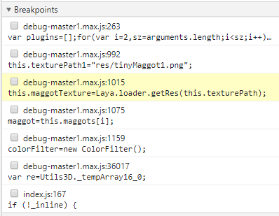
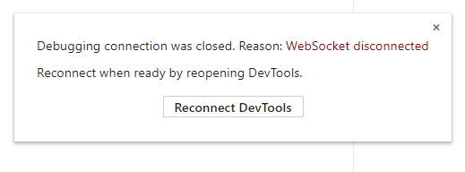

# 在android真机上调试JavaScript代码

## 注意：
由于最近chrome版本更新到了69，导致在LayaNative环境真机调试JS，无法手工设置断点调试，解决方案：
1、开发者可以在代码中写debugger的方式，进行调试。
2、安装一个Chrome68的版本进行调试。
我公司引擎组会尽快解决这个问题，给大家造成不便，敬请谅解。

## 一、调试的原理

JavaScript代码的调试，是使用调试机上的Chrome浏览器进行的。Android测试机上的LayaNative启动的时候，会同时启动一个WebSocket服务器。Chrome浏览器通过WebSocket与LayaNative连接通信，从而实现使用Chrome对项目的JavaScript的调试。

在调试项目中的JavaScript的代码时，有以下两种调试模式可以选择：

1. Debug/Normal模式

    在该模式下，Android测试机上的项目可以直接启动并运行，Chrome浏览器可以在项目运行后连接调试。

2. Debug/Wait模式

    在该模式下，Android测试机上的项目启动后，会一直等待Chrome浏览器的连接。当Chrome连接成功后，才会继续执行JavaScript脚本。
    
    当需要对启动时加载的JavaScript脚本进行调试时，请优先选择该模式。

**注意：在调试的工程中请确保调试机与Android测试机在同一网络上。**

## 二、调试layaAirIDE构建的Android项目

### 步骤1: 

使用LayaAirIDE对项目进行构建，生成Android的工程。

<!-- TODO：添加链接地址。 具体可参考“使用IDE构建工程”。 -->

### 步骤2：修改调试模式

使用Android Studio打开构建后的工程。

打开android_studio/app/src/main/assets/config.ini，修改JSDebugMode的值,设置需要的调试模式。如图1：

图1

JSDebugMode的取值和含义如下：

|取值|含义|
|:--:|:--:|
|0|关闭调试功能|
|1|Debug/Normal模式|
|2|Debug/Wait模式|

**Tips：**

当项目正式发布后，请将JSDebugMode的值设置为0，否者会对项目运行时的性能有影响。

### 步骤3：编译并运行项目

使用Android Studio编译工程。

如果选择的是Debug/Normal模式，等待Android测试机成功**启动并运行**项目。

图2 Android测试机成功启动并运行项目

如果选择的是Debug/Wait模式，等待Android测试机成功**启动**项目。

图3 Android测试机成功启动

### 步骤4：使用Chrome连接工程

打开调试机上的Chrome浏览器，输入以下网址：

>chrome-devtools://devtools/bundled/inspector.html?experiments=true&v8only=true&ws=10.10.82.142:5959

**注意：** ws=10.10.82.142:5959里的10.10.82.142是Android测试机的ip地址，5959是步骤2中config.ini文件里JSDebugPort设置的端口号值，请根据自己设备的实际情况和需求进行更改。

### 步骤5：进行调试

连接成功后，便可以使用Chrome对项目中JavaScript进行调试。如图2所示：

图4

## 三、使用测试App进行调试

### 步骤1：确认ip地址和端口号

打开测试App, 可以在左上角看到Android设备的ip地址和调试时需要的端口号。

如图1所示，设备的ip地址为10.10.82.142，端口号为：5959。

图5

### 步骤2：选择调试模式

点击屏幕下方中间的按钮，选择调试模式。

图6

图7

### 步骤3：扫描项目的二维码

点击测试App中间的蓝色二维码图标，扫描项目的layanative的二维码地址。

如果选择的是Debug/Normal模式则等待项目成功**启动并运行**。

图8 案例项目成功运行

如果选择的是Debug/Wait模式则等待测试App弹出下面的界面：

图9

### 步骤4：在Chrome浏览器中连接测试App

打开Chrome浏览器，输入以下网址：

>chrome-devtools://devtools/bundled/inspector.html?experiments=true&v8only=true&ws=10.10.82.142:5959

**注意：** ws=10.10.82.142:5959是步骤1中查看的ip地址和端口号，请根据自己设备的实际情况进行更改。

### 步骤5：进行调试

连接成功后，便可以使用Chrome对项目中JavaScript进行调试。如图7所示：

图10

**Tips：** 测试App中的快捷按钮

测试App成功运行项目以后，会在屏幕上显示两个按钮。两个按钮的作用如下：

**1.刷新按钮**

当更改项目的代码后，点击刷新按钮，即可重新载入更改后的工程，不需要重新扫码。

**注意：** Chrome连接情况下，测试App点击刷新按钮时会有崩溃的情况。该问题以后版本会解决，敬请谅解。

**2.返回按钮**

点击返回按钮，可以返回到扫码的界面，重新进行扫码。

## 四、目前版本存在的问题

**下面的问题会在以后的版本里解决，敬请谅解。**

在调试器调试的过程中，使用调试器手动添加的断点（非debugger断点)，有几率会出现调试混乱。
如果遇到这种情况，请按以下步骤进行处理：

步骤1：设置的断点如下

图11

步骤2：取消所有的断点

图12

步骤3：重启启动工程，再使用Chrome连接工程。

图13

步骤4：恢复需要的断点

图14