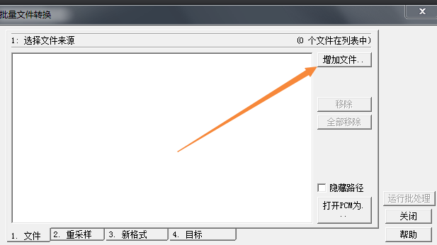
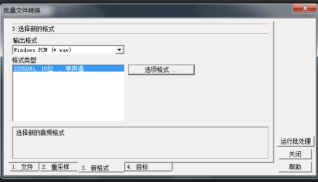

#About voice

In Laya Native, sound is divided into two modes: background music and sound effect.

##1. Background music

In LayaNative, background music only supports MP3 format, while playing only one background music.

##2. sound effects

In the project, sound effects are high-frequency events, in order to ensure operational efficiency, LayaNative uses openAL to play sound effects, because MP3 is streaming media format, it is still unable to parse.
**Tips:**  
**1. Sound effects in LayaNative only support wav and Ogg formats.**  
**2. Wave and Ogg only support 8 bits and 16 bits, but not 32 bits.**

**Tips:**Wave and Ogg recommend 22050 sampling rate, 16 bit, mono channel.

##3. Tips

If called`SoundManager.playSound()`However, if the file format is mp3, a prompt message will pop up. The prompt message is as follows:
`The sound only supports wav or ogg format,for optimal performance reason,please refer to the official website document.`  
At this point, MP3 needs to be converted into WAV or Ogg format.


##4. Solving Compatibility

If your project uses MP3 format for sound effects in the web version, but Wave format is used in LayaNative. It is recommended that the project be loaded in the form of a configuration file, so that it can only be used in the place where the configuration file is loaded, adding one time to determine whether it is a LayaNative running environment. Pseudo-code is as follows:


```javascript

if(window.conch)
{
    ...加载 "soundConfig-LayaPlayer.json"
}
else
{
    ...加载 "soundConfig-json"
}
SoundManager.playSound(soundJson[0].url,1);
....
SoundManager.playSound(soundJson[1].url,1);
```


**Tips**  
* 1. Conh can only be invoked in LayaNative environment. There is no conch definition in the web version, so we need to judge whether it exists or not. *
*2. If you use as language to develop, you can`Browser.window['conch'] `This way you get conch objects.*
*3. or use`if(Render.isConchApp )`You can judge.*

##5. Sound format conversion using Cool Edit Pro tools
There are many tools for converting MP3 to wav. Here is a brief introduction of a Cool Edit Pro tool. Here is a brief introduction of the specific steps of the tool in converting MP3 to wav:
1. First download and install the Cool Edit Pro tool, then open the Cool Edit Pro program.


2. Click "Batch Conversion" under "File" in the upper left corner to enter the "Batch Conversion" submenu.


**Note: It is recommended that the batch file conversion should be done step by step in the following steps: 1, 2, 3 and 4.**

3. Select the source of the file: click on the right to add the file. Here we select all the files under sound file for batch processing, and then click Open.




4. Convert the sampling type: Click to change the target format under the resampling directory, select the sampling rate of 22050 Hz, mono channel, 16 bit, and then click to confirm.


5. Choose a new format: Output format chooses the Windows PCM (*. wav) we need, format type 22050Hz, 16 bits, mono channel;


8. Choose the target folder and file name: Here is a simple choice of output directory, and then click "run batch processing" to output the desired files. When the "file batch conversion completed" prompt appears, it means that you have successfully completed the batch conversion of MP3 converted wav.


9. If the following pop-up window appears when running the Cool Edit Pro tool for batch processing, just replace the Resample.xfm file and run Cool Edit Pro again.


**In this case, Baidu can search cool edit resample. xfm, or buy the original cool edit, or... (you know)**

**10. If the cool edit pro downloaded on the Internet does not have batch conversion, it can be transferred to one first and then to batch conversion.**
