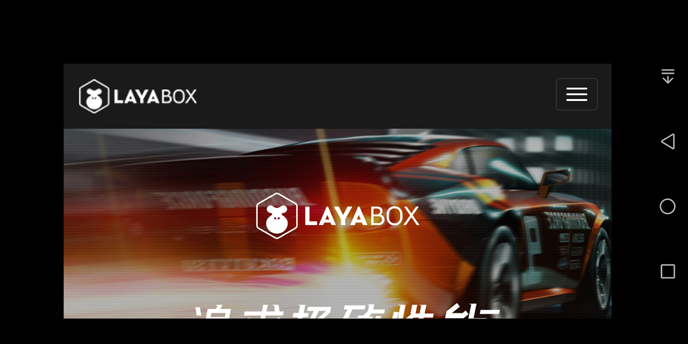

#WebView

##I. Introduction

Because LayaNative does not support standard html, sometimes a project needs to display a complete HTML page, which can be achieved through an interface provided by LayaNative to display the WebView interface.
###1. Interface definition


```typescript

    /**
     * 显示一个webview
     * @param url {string} 要显示的url地址。
     * @param posx {number} weview的左上角位置
     * @param posy {number} webivew的左上角位置
     * @param width {number} webview的宽度
     * @param height {number} webview的高度
     * @param canclose {boolean} webview是否可以被关掉。
     */ 
    setExternalLinkEx(url:string,posx:number,posy:number,width:number,height:number,canclose:boolean):void;
```


This function displays a new view at the top of the canvas, where the contents of the URL are displayed.

`canclose`Parameters are used to control whether the WebView can be turned off:
* set to`false`Time:

The code is as follows:


    
```typescript

    document.addEventListener('touchstart',()=>{
        if(conch){
            var l = 50;
            var t = 50;
            var w = window.innerWidth - l * 2;
            var h = window.innerHeight - t * 2;
            conch.setExternalLinkEx('http://www.layabox.com',l,t,w,h,false); // canclose设置为false
            //conch.setExternalLink('http://www.baidu.com');
        }
    });
    ```


When the WebView is displayed, it cannot be turned off. The effect is as follows:


    

Figure 1

* set to`true`Time:

The code is as follows:


    
```typescript

    document.addEventListener('touchstart',()=>{
        if(conch){
            var l = 50;
            var t = 50;
            var w = window.innerWidth - l * 2;
            var h = window.innerHeight - t * 2;
            conch.setExternalLinkEx('http://www.layabox.com',l,t,w,h,true); // canclose设置为true
            //conch.setExternalLink('http://www.baidu.com');
        }
    });
    ```


* Under ios, there will be a small closing button, click this button, you can close webview. The results are as follows:


        

Figure 2

* Because the closing button covers part of the page content, and the back button is provided on the Android device, there is no closing button after the WebView is displayed on the Android device.**Backspace**Close webview. The following picture:


        

Figure 3 At this point, you can click the Back button to close WebView

###2. limitation
1. At present, web view can not interact with app.
2. The implementation of WebView depends on the system, and the low version of Android may not be displayed.

**Tips**  
* 1. Conh can only be invoked in LayaNative environment. There is no conch definition in the web version, so we need to judge whether it exists or not. *
*2. If you use as language to develop, you can`Browser.window['conch'] `This way you get conch objects.*


##2. How to dynamically close WebView page in code

Calling the following code can dynamically close the WebView page:


```javascript

conch.closeExternalLink();
```
