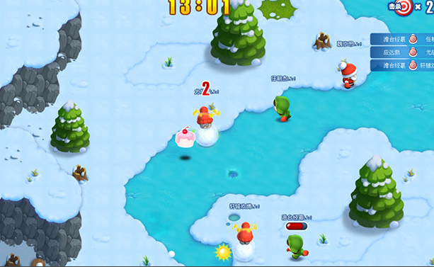

#Layabox Engine Game Case

Since Layabox launched the development of HTML5 game engine in 2011, it has gone through three stages: non-open source HTML5 engine LAYA, the first generation of open source HTML5 engine LayaFlash, and the second generation of open source HTML5 engine LayaAir.

##Some LayaAir Engine Game Cases

Please go to Layabox's case section for a code-sweeping experience:[https://www.layabox.com/gamelist/](https://www.layabox.com/gamelist/)

There are a large number of 3D and 2D selected cases in the link, you can use wechat to scan the code experience.

##Layabox's first generation open source engine, LayaFlash

The first generation engine LayaFlash is developed entirely based on AS3 language and adopts Canvas rendering mode. It is the only engine in HTML5 industry that can fully support Flash AS3 language and AS3 native API to develop HTML5 games. After the launch in 2015, more than ten products based on the engine were launched in QQ browser within one year. LayaFlsah, the second-generation engine, has stopped updating due to its stronger performance advantages and language support.

###Laya Flash's representative work "Drunken Journey to the West"

It is the transplantation of LayaFlash engine for Forgame Group's top MMORPG pages with a total running water of over 600 million yuan. It is the first app-level MMORPG game in HTML5 industry. It was launched in QQ browser in 2016.

###Laya Flash's representative work "Mocha Fantasy"

It is a well-known mobile game developer Mohe's monthly mobile tour boutique, which is transplanted to HTML5 products through LayaFlash. Because of the company's accident of Muhe Network, the game stopped maintenance and went off the shelf shortly after the QQ browser came online.

###Laya Flash's representative work "Mini Hunter"

It is a RPG card game adapted from Japanese popular classic comic book "Full-time Hunter". The game is developed with AS3 Starling framework and released into HTML5 game through LayaFlash engine.

##The Case of LAYA Non-Open Source Engine

**Based on JS language development, using Canvas rendering mode, there are three main representative works on-line.**

###The first "Crazy Snowball"

HTML5 is the first multi-player online game in the HTML5 industry. It was launched in 2012. Until 2017, there was no competition for the same type of HTML5 game, which demonstrates the technical strength of LAYA engine.

The game has been released in HTML5 and Android APK, and HTML5 is still running in the PC client of QQ Game Hall until the end of 2016.

The address of "Crazy Snowball" in QQ Game Hall is:[http://qqgame.qq.com/app/gamedetail_10434.shtml](http://qqgame.qq.com/app/gamedetail_10434.shtml) 

​ 
Picture (1) "Crazy Snowball"

###Section 2 "Going to the Bar Hero"

It is the first card strategy HTML5 game in the industry. It was launched in 2013. The copyright fee of HTML5 in Taiwan reached 3 million. The APP version was listed on TOP10 in Taiwan. In 2015, HTML5 was launched in Android's QQ browser, with a maximum monthly flow of more than a million. At present, it is still in the state of online operation, which can be directly experienced by scanning two-dimensional codes in the case of Layabox official website.

​ 
Picture (2) The Lord of Shangba (once named Miaomei of Three Kingdoms)

###Section 3 "Hunting Blade 2"

It is the industry's first heavy action HTML5 game. In 2015, it was launched in Android QQ browser. With the exquisite painting quality and flowing and gorgeous action effect of APP level, HTML5 technology has been proved to be able to achieve the heavy game quality and effect of APP game in the early booming stage of HTML5 game industry. LAYA engine proves the peak strength of the engine by its product performance.

​ 
Figure (3) "Hunting Blade 2"