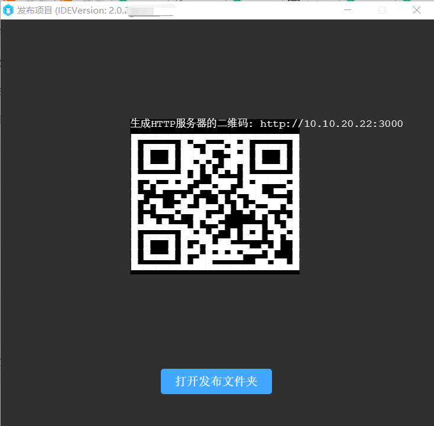
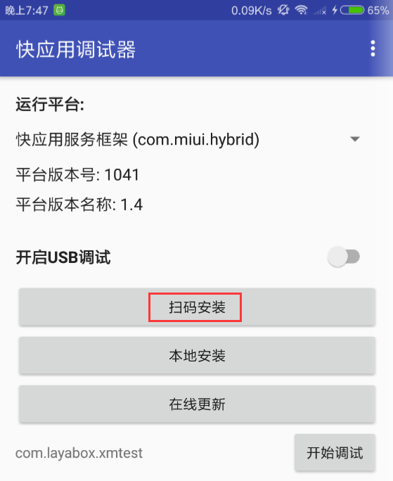

# Xiaomi fast game release and debugging guide

> update : 2019-07-17
>
> The release of Xiaomi Express must use LayaAirIDE. For the download and use of IDE, please check the related documents, which is beyond the scope of this article.

## 1、Xiaomi fast game release, debugging environment preparation

1、Xiaomi brand mobile phone (note that it must be MIUI 8.5 or above).

2、Download and install the test app for Xiaomi, download page : [https://dev.mi.com/console/doc/detail?pId=1779](https://dev.mi.com/console/doc/detail?pId=1779)

After entering the page, pull down to find the third step, ** debug self-test ** that column, directly press the prompt to download.

3、PC computer chrome browser and mobile phone data cable.

4、Install the nodejs environment [node website：[https://nodejs.org/en/](https://nodejs.org/en/)]

It is to download and install, it is relatively simple, and it is not detailed. It is a success to be able to call the npm command on the command line.

5、LayaAirIDE centralized development environment, LayaAir 2.0.2beta or above [ Official website download: [https://ldc2.layabox.com/layadownload/?type=layaairide](https://ldc2.layabox.com/layadownload/?type=layaairide) ]

6、Install ADB

It is recommended to install ADB, because sometimes, because of authorization or other unexplained reasons. Will cause the chrome machine to debug properly. So installing ADB can verify and facilitate the connection authorization between the phone and the PC. If you do not have USB debugging authorization issues, you can also do not install it.

 [ ADB Official website download:  [http://adbshell.com/downloads](http://adbshell.com/downloads) ]

For a quick reminder, download ADB Kits, download the compressed package, and recommend unpacking it to a directory with a simple path (eg `D:\adb`). Remember to add environment variables (I don't know how to add environment variables to Baidu).

## 2、Xiaomi fast game release and access complete process

### 1、Release Xiaomi Fast Game Pack(xx.rpk)

LayaAirIDE's publishing function, built-in the release function of Xiaomi fast game, you need to first make the LayaAir engine project, through the publishing function into the .rpk suffix package. About the use of the publishing feature. This is not repeated here. No, you can go to the official website document to view.

link：[https://ldc2.layabox.com/doc/?nav=zh-ts-3-0-6](https://ldc2.layabox.com/doc/?nav=zh-ts-3-0-6)

### 2、Keep publishing the QR code interface.

After publishing, there will be a two-dimensional code interface, as shown in Figure 1. This interface should not be turned off. The back mobile phone scanner needs to be used.

 

（figure 1）

### 3、Open Publishing Folder and Start Command Line Mode

Click on the `Open Publishing Folder'button in Figure 1 to enter the post-release Millet Express Game Project Catalogue. Then press `Shift + right-click'to quickly enter shell or command window mode in the current directory, as shown in the markup section in Figure 2-1 or 2-2.

 

（figure 2-1）

 

（figure 2-2）

Of course, you can also use Git to enter the command line (Git Bash Here) or other ways to enter the command line, and then enter the Xiaomi fast game project directory to complete this step.

This link is mainly to tell developers how to enter the current release directory quickly in the command line mode. Because the debug command to start chrome debugging must be operated in the release directory of Xiaomi Express. Here is a brief understanding and keep the command line open. Will be used later.

### 4、Start the chrome debugging environment

####  4.1 Install and enter the fast application debugger

To start the chrome debugging environment of the computer PC, we must first install the debugging app of the Xiaomi fast game (fast application debugger), as shown in Figure 3. Then click to enter.

 

（figure 3）

#### 4.2 In the fast application debugger interface scan code to install the rpk package of Xiaomi fast game

After entering the fast application debugger, we can see the APP interface shown in Figure 4.

 

(figure 4)

At this point, we click on the scanner installation in Figure 4 to scan the two-dimensional code on the publishing interface in LayaAir IDE. Mobile phones can run in a real environment.

> Here's a reminder: the mobile network and PC in the same LAN segment (with 4G network sweep LAN code is certainly not feasible).

If the RPK package in the publishing directory / dist directory is transferred to the mobile phone, it is also possible to install it by clicking the `Local Installation'button. But it is recommended to install scanner, because the steps of scanner are more convenient and fast.

#### 4.3 Maintaining physical connection and authorization

For developers with relative experience, this step can be skipped to ensure that the physical line of the USB mobile phone connection line is connected and that the USB debugging authorization is okay.

##### The relevant operations are as follows：

1、First, keep the phone physically connected to the PC by using the mobile phone connection line. Turn on the developer mode of the mobile phone, and turn on Usb debugging.

At this point, we need to pay attention to the mobile phone, whether there is a prompt as shown in Figure 5-1, and if so, point to determine whether debugging is allowed.

 

（figure 5-1）

2、Verify authorization.

When the USB debugging mode is authorized successfully, we enter ADB devices, which should be shown in Figure 5-3.

 

（figure 5-2）

In short, in this link, we need to ensure that the PC is authorized to debug this mobile device.

#### 4.4 Start the chrome debugging environment

The development and debugging environment of millet fast game without tools on PC is to connect mobile devices through USB, and then in PC command line mode, to debug Chrome debugger by `npm run debug'command (provided that PC is installed with chrome browser) to debug the RPK package of mobile phone real environment, as shown in Figure 6.

 

(figure 6)

When we see the prompt `Debugger URL opened in Chrome.', it shows that chrome has been successfully invoked and is consistent with the screen in the real machine. As shown in Figure 7. The various operations in the real machine will be fully synchronized to the PC chrome, so we can debug the millet fast game project according to the chrome debugging method.

 

(figure 7)

So far, the whole process from release to start chrome debugging has been introduced.

Finally, the specific debugging method. I won't go into detail in this article.

## article feedback

If you find this article helpful, please scan the code to appreciate the author, your feedback is also our motivation to write more quality documents.

