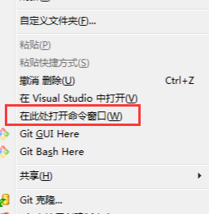
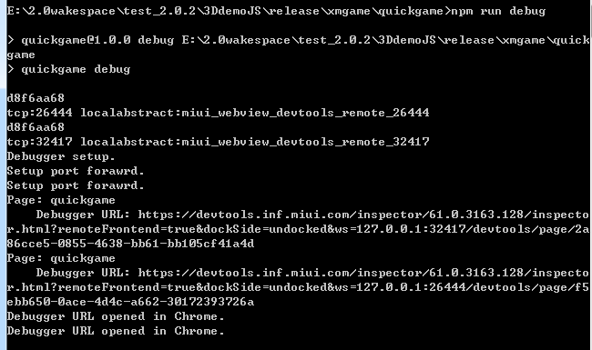

# Xiaomi "quick game" release and debugging guide

> update: 2019-07-17
>
> The release of Xiaomi Express Game must use LayaAirIDE. For the download of IDE, please refer to the relevant documents, not within the scope of this article.

##1. Preparing for release and debugging environment of Xiaomi fast game

1. Xiaomi Brand Mobile Phone (Note must be MIUI version 8.5 or above).

2. Download the test APP for installing Xiaomi and download the page:[[https://dev.mi.com/console/doc/detail?pId=1738](https://dev.mi.com/console/doc/detail?pId=1738)](https://dev.mi.com/console/doc/detail? PID = 1779)

After entering the page, drop down to find Step 3.**Debug self test**In that column, just download it as prompted.

3. Chrome browser of PC and data connection line of mobile phone.

4. Installing nodejs environment[node官网：[https://nodejs.org/en/](https://nodejs.org/en/)]

It's easy to download and install, and it's not detailed. Calling NPM commands from the command line is a success.

5. LayaAir IDE Centralized Development Environment, LayaAir 2.0.2 beta or above[ 官网下载: [https://ldc2.layabox.com/layadownload/?type=layaairide](https://ldc2.layabox.com/layadownload/?type=layaairide)]

6. Installation of ADB

It is recommended to install ADB because sometimes it is authorized or for some other strange reason. It will result in the failure to start chrome debugging properly. Therefore, the installation of ADB can verify and help the connection authorization between mobile phone and PC. If you ensure that there is no USB debugging authorization problem, you can also not install it.

 [ ADB官网下载:  [http://adbshell.com/downloads](http://adbshell.com/downloads)]

A simple hint, download ADB Kits, download the compressed package, it is recommended to decompress and put into a directory with a simpler path (such as:`D:\adb`) Remember to add environment variables (Baidu can add environment variables on its own if you don't know how to add them).

##2. The whole process of releasing and accessing Xiaomi fast game

###1. Publish the Xiaomi Express Game Pack (xx.rpk)

LayaAirIDE release function, built-in release function of Xiaomi fast game, need to first LayaAir engine project, through the release function into. RPK suffix package. About the use of publishing functions. This is not repeated here. No, you can check the official documents before.

Links:[https://ldc2.layabox.com/doc/?nav=zh-ts-3-0-6](https://ldc2.layabox.com/doc/?nav=zh-ts-3-0-6)

###2. Retain the publishing two-dimensional code interface.

After publishing, there will be a two-dimensional code interface, as shown in Figure 1. This interface should not be turned off. The back mobile phone scanner needs to be used.

 

(Fig. 1)

###3. Open the Publishing Folder and Start Command Line Mode

Click on Figure 1`打开发布文件夹`Button to enter the post-release Xiaomi Express Game Project Catalogue. Then hold down.`Shift + 右键`You can quickly enter shell or command window mode in the current directory, as shown in the markup section in Figure 2-1 or 2-2.

 

(Fig. 2-1)

 

(Fig. 2-2)

Of course, Git can also enter the command line (Git Bash Here) or other ways to enter the command line, and then enter the Xiaomi Express Game Project Directory to complete this step.

This part mainly tells developers how to quickly enter the current release directory in command line mode. Because the debug command to start chrome debugging must operate in the release directory of the Xiaomi fast game. Here's a quick look, and keep the command line open. I'll use it later.

###4. Start the chrome debugging environment

####4.1 Install and enter Fast Application Debugger

To start the chrome debugging environment of PC, we need to install the debugging APP (fast application debugger) of Xiaomi fast game, as shown in Figure 3. Then click Enter.

 

(Fig. 3)

####4.2 Install RPK package of Xiaomi fast game in the interface of fast application debugger

After entering the fast application debugger, we can see the app operation interface as shown in Figure 4.

 

(Fig. 4)

At this point, we click on the scanner installation in Figure 4 to scan the two-dimensional code on the publishing interface in LayaAir IDE. Mobile phones can run in a real environment.

> Here's a reminder: the mobile network and PC in the same LAN segment (with 4G network sweep LAN code is certainly not feasible).

If you pass the RPK package in the publishing directory / dist directory to your mobile phone, you can click`本地安装`Button to install, is also possible. But it is recommended to install scanner, because the steps of scanner are more convenient and fast.

####4.3 Maintaining physical connection and authorization

For developers with relative experience, this step can be skipped to ensure that the physical line of the USB mobile phone connection line is connected and that the USB debugging authorization is okay.

#####The relevant operations are as follows:

1. Maintain the physical connection between the mobile phone and the PC by using the mobile phone connection line. Turn on the developer mode of the mobile phone, and turn on Usb debugging.

At this point, we need to pay attention to the mobile phone, whether there is a prompt as shown in Figure 5-1, and if so, point to determine whether debugging is allowed.

 

(Fig. 5-1)

2. Authentication.

When the USB debugging mode is authorized successfully, we enter ADB devices, which should be shown in Figure 5-3.

 

(Fig. 5-2)

In short, in this link, we need to ensure that the PC has the right to debug this mobile device.

####4.4 Start the chrome debugging environment

The development and debugging environment of Xiaomi fast game without tools on PC is connected to mobile device through USB, and then in PC command line mode, through`npm run debug`The command calls up the Chrome debugger (provided that the PC is installed with the Chrome browser) to debug the RPK package of the mobile phone's real environment, as shown in Figure 6.

 

(Fig. 6)

When we can see`Debugger URL opened in Chrome.`At the time of this prompt, it indicates that chrome has been successfully tuned up and is consistent with the screen in the real machine. As shown in Figure 7. The various operations in the real machine will be fully synchronized to the PC chrome, so we can debug the Xiaomi fast game project according to the chrome debugging method.

 

(Fig. 7)

So far, the whole process of Xiaomi fast game from publishing to launching chrome debugging has been introduced.

Finally, the specific debugging method. I won't go into detail in this article.

##This article appreciates

If you think this article is helpful to you, you are welcome to sweep the code and appreciate the author. Your motivation is our motivation to write more high quality documents.

