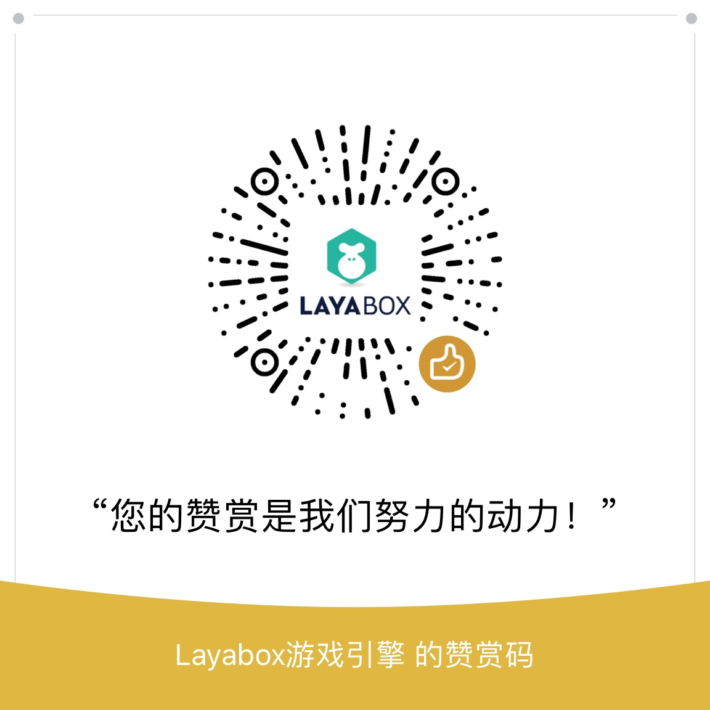

#4M Local Packet and Dynamic Resource Loading for Wechat Games

> author: Charley

Usually when we develop a project, we use the local path directly, for example, the local path is referred to in the example.


```json

Laya.Texture2D.load("res/layabox.png");
```


If the total size of the project directory does not exceed 4M, as long as local resources can be found, it is no problem to write it.

However,

The local package of Wechat games is limited to 4M. Once the limit is exceeded, upload and live preview are not allowed.

So, our**If the project is larger than 4M, how to deal with it?**

One solution is subcontracting. Starting with version 2.0 of the basic library of mini-games, it can reach 8M by configuring subcontracting. Subcontracting will be described in detail in a separate document. Here's another option.

Another solution is dynamic network loading.

In our local package, JS code must be put in, because JS does not allow network loading to be created dynamically. So if the JS in the local package exceeds 4M, the first consideration is how to optimize the JS volume, such as obfuscation compression, and UI code separation. If not, it can only be solved through the subcontracting solution of small games. If the JS does not exceed 4M, you can also put some pre-loaded basic resources as appropriate.

In short, for most small games, network dynamic loading is a necessary way to use.

that**How to deal with the path of network dynamic loading?**。 Loaded locally`load()`The method is then used`URL.basePath`Method.

For example:


```java

material.diffuseTexture = Laya.Texture2D.load("res/layabox.png");
box.meshRender.material = material;
Laya.URL.basePath = "https://XXXX.com";//请把XXXX换成自己的真实网址；
//在此之下，再使用load加载资源，都会自动加入URL网址。从网络上动态加载。
```


Use`URL.basePath`After loading the local path with load, the URL in the URL. basePath is automatically added. This realizes the combination of local and network loading.

**Is that over? Did not!**

In the way I just wrote it,`res/layabox.png`It has been uploaded to the local directory of Wechat games, but if it is in use`URL.basePath`After that, load again`res/layabox.png`It is not loaded locally, but dynamically loaded from the network. This is not the result we want.

So, the engine is for use`URL.basePath`After that, how to use local loading again is done**Processing of Special Catalogues and Documents**That is, the local whitelist mechanism. As shown in the following example:


```json

MiniAdpter.nativefiles =  [
    "wxlocal",
    "res/atlas/houzi.atlas",
    "res/atlas/houzi.png",
    "common/tishi.png",
    "common/bg.png",
    "ui.json",
    "newLb/bg031.png"
];
```


**As long as the directory name or file exists in MiniAdpter. nativefiles, the engine automatically treats the directory as a local directory.**Even with the use of URL. basePath, directory names or files included in the whitelist of native files are not dynamically loaded from the network, but only locally.


If you have any questions about this document, please go to the official QQ community and ask questions. You can also send links from the community to @administrator Charley in the official QQ group.

Community Web site: https://ask.layabox.com/


##This article appreciates

If you think this article is helpful to you, you are welcome to sweep the code and appreciate the author. Your motivation is our motivation to write more high quality documents.

