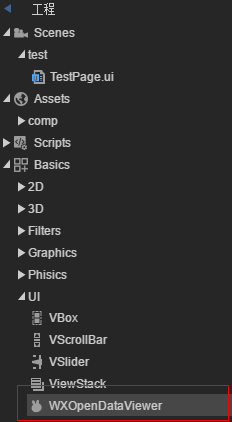
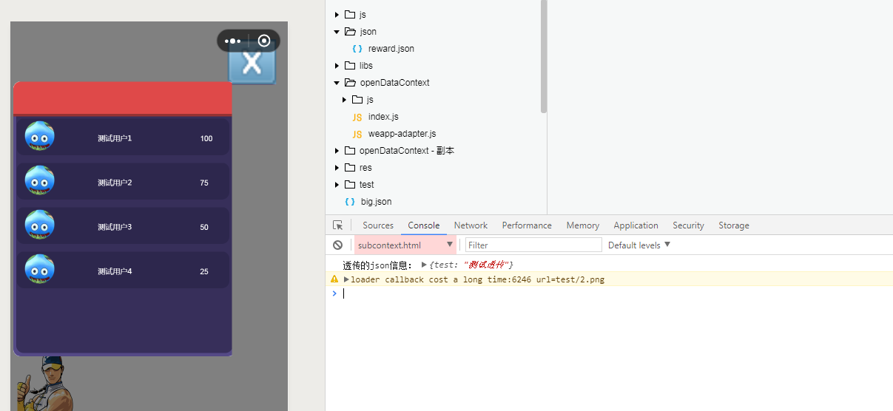

# 微信开放数据域

> language: ActionScript3  

## 一、微信开放数据域展示组件

微信开放数据域使用一直是很麻烦的事情，需要特殊编码，并且会是性能瓶颈，还有经常发生鼠标事件对不上的问题，从LayaAir2.0开始，Laya官方给出了微信开放域UI组件，一并解决上述问题，使其使用起来更简单，性能更高

开放数据域组件可以在工程树里面的 Basics > UI > WXOpenDataViewer 找到

 


### 开放域展示组件的使用

1.先设计一个开放数据域程序，比如大小为500*500

2.主域的IDE内，拉出一个WXOpenDataViewer组件到合适位置，设置大小为500*500

 


3.在微信调试器里面查看，即可看到开放数据域内容，并且性能和鼠标事件都能达到最优化

 


总结：使用新的微信开放域数据组件，无需编码，即可展示开放域内容，并且性能和鼠标事件都能得到优化。


## 二、开放域透传接口使用

在微信开放域中只支持本地单张图片加载，不能使用图集，那样使用起来是非常不方便的。而且在2.0中的场景是自动预加载图集的，这可能就会导致wx开放域报错。为了解决这个问题，同时方便开放域开发，2.0中提供了透传接口。这样就能在子域使用json，图集等文件了。

目前支持透传的文件类型有单独的图片，JSON文件，图集文件。

分别对应MiniAdapter中的接口：`sendSinglePicToOpenDataContext`，`sendJsonDataToDataContext`，`sendAtlasToOpenDataContext`。

下面是使用透传的示例：

#### 主域部分节选：

在使用对应文件之前，需要先使用这些接口将 *主域*  加载好的信息透传到子域。这些透传接口是使用的微信提供的主域往子域透传信息的接口，更多的信息可以查看MiniAdapter源码和微信官方文档。

```typescript
if(Browser.onMiniGame){
    //加载一个json和图集
Laya.loader.load(["json/reward.json","res/atlas/test.atlas"],Handler.create(this,function(){
    //加载完成
    //使用接口将图集透传到子域
	MiniAdpter.sendAtlasToOpenDataContext("res/atlas/test.atlas");	
    //使用接口将json投促函到子域
    MiniAdpter.sendJsonDataToDataContext("json/reward.json");
}));
}
```

#### 子域部分节选:

该部分代码源自于2.0.1bate版 **开放域项目** 示例代码。此处有简单的修改，因为透传了两个文件，需要确认透传的两个文件都接受到再使用。

接收透传文件需要使用微信子域的`wx.onMessage`接口。详情可以查看微信[官方文档](https://developers.weixin.qq.com/minigame/dev/api/wx.onMessage.html)。

```typescript
//用于计数
var mark:int = 0;
if(Browser.onMiniGame)
    Browser.window.wx.onMessage(function(data:*):void{//微信接受信息
        if(data.url == "res/atlas/test.atlas" || data.url == "json/reward.json"){
        	mark ++;
            if(mark == 2)//确认数据全部接收后
            	Laya.loader.load([
               		"res/atlas/test.atlas",
                	"json/reward.json"],Handler.create(this,onComplete));
        }
	}.bind(this));
```

onComplete方法，注意与原版有部分修改。

```typescript
private function onComplete():void() {
    //获取资源
    var testJosn:* = Laya.loader.getRes("json/reward.json");
    //输出透传过来的json
    console.log('透传的json信息：', testJosn);
    //加载IDE指定的场景
    var big:BigRank = new BigRank();
    big.init();
}
```

微信环境下测试，效果如图1：

<br>(图1)

