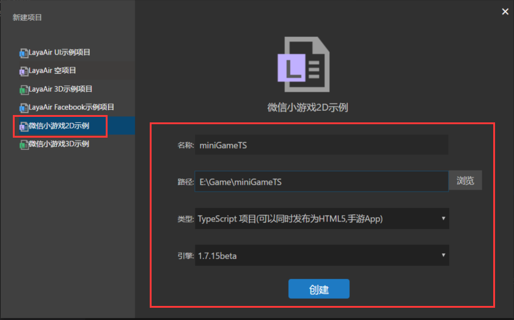

# 创建第一个微信小游戏

> *Author: charley*

### 一、准备好开发环境

#### 1、下载并安装LayaAirIDE集成开发环境

LayaAirIDE是LayaAir引擎的集成开发环境，集成了LayaAir引擎与示例项目，UI、动画等可视化编辑，项目代码编写与管理等开发工具。**开发者可以直接采用LayaAirIDE创建微信小游戏的示例项目。**

**官网下载地址** ：[http://ldc.layabox.com/layadownload/?type=layaairide](http://ldc.layabox.com/layadownload/?type=layaairide)

> Tips：由于从1.7.17的版本增加了3D适配与缓存管理，建议开发者使用1.7.17或更高的版本。

#### 2、下载并安装微信小游戏开发工具

微信小游戏开发工具是小游戏开发与测试的环境，由于LayaAir引擎的开发者完全可以使用LayaAirIDE进行项目开发，那么安装这个小游戏开发工具主要是用于小游戏项目编译、预览、真机测试与调试、上传发布等。

**开发工具下载地址**：
[https://developers.weixin.qq.com/minigame/dev/devtools/download.html](https://developers.weixin.qq.com/minigame/dev/devtools/download.html)

  

#### 3、创建一个小程序的企业开发者帐号，获得开发者ID(AppID)

尽管没有AppID也可以开发调试，但是功能会受到限制。所以在开发之前，最好先去创建一个小程序的开发者帐号。

注册地址：[https://mp.weixin.qq.com/wxopen/waregister?action=step1](https://mp.weixin.qq.com/wxopen/waregister?action=step1)

**Tips:**

*个人开发者不需要版号，但也不能开通支付功能，如果游戏中涉及支付功能，必须要使用企业开发者帐号。并且要提交版号。*

注册完开发者帐号并登录后，在设置菜单的开发设置里可以获得开发者ID。

**Tips:**

> *建议开发者先注册好开发者帐号，记录好AppID*

### 

### 二、用LayaAirIDE创建和发布微信小游戏项目

#### 1、用LayaAirIDE创建小游戏示例项目

打开LayaAirIDE，新建项目。选择”微信小游戏示例“，设置项目名称、项目路径、开发语言类型、引擎版本。就可以创建小游戏项目了，如下图所示。

#### 2、查看示例项目效果

创建完项目之后，我们可以直接点一下调试按钮或者F5（如下图所示）。我们先看看示例什么样子。

  

> 对于AS与TS项目，打开调试之前也会自动启动编译。所以这一步不要跳过。

#### 3、发布为微信小游戏

点击项目发布按钮，在弹出的发布项目界面里，选择发布平台为微信小游戏。然后如果目录不想改变，直接点发布即可。

 

**Tips** ：

> 点击发布平台右侧的问号图标，可以查看各选项的介绍说明。

### 三、用微信开发者工具创建小游戏项目

#### 1、开发者帐号登录，选择项目类型

打开”微信web开发者工具“，用开发者的微信扫码登录。然后选择**小程序项目**点击进入项目设置。

 

#### 2、创建小游戏项目

在小程序项目设置面板里，`项目目录`可以选择LayaAirIDE刚刚发布小游戏的目录（目前这只是为了跑通流程，新的IDE版本对于小游戏发布有了更适合的方案，后面文档会改）。AppID按之前准备好的ID输入即可，不输入也可以开发调试，不过功能会受到限制。所以最好还是输入AppID。

 

#### 3、微信开发者工具的编译

完成小游戏项目的创建后，点击编译，即可在工具内预览效果和调试，我们可以看到模式器中的效果与LayaAirIDE中的调试效果是一致的。

 

#### 4、真机测试与调试

由于LayaAirIDE里也可以调试项目效果，除非是适配相关的问题，基本上两边的效果不会有不一一致的情况。所以这里最重要的是点击**预览**功能，通过手机微信扫码，在微信内进行真机测试与调试。

 

**Tips:**

上传真机的时候，默认不能超过4M，配置分包不能超过8M，所以IDE发布目录下，示例项目的libs这个目录可以直接删掉。因为这个示例项目能用到的已经整合到code.js里了。否则可能会因为超过4M，导致上传不上去。这个问题，也会在新版本里优化好。

用微信扫码后，就启动了小程序项目，点击右上角的浮窗按钮，可以打开调试和打开性能监控面板。

开启真机调试与性能监控面板后，如下图所示。

 

至此，一个完整的小游戏开发流程就结束了。是不是很简单。采用LayaAirIDE开发的小游戏项目，基本上是无缝用于微信小游戏项目。