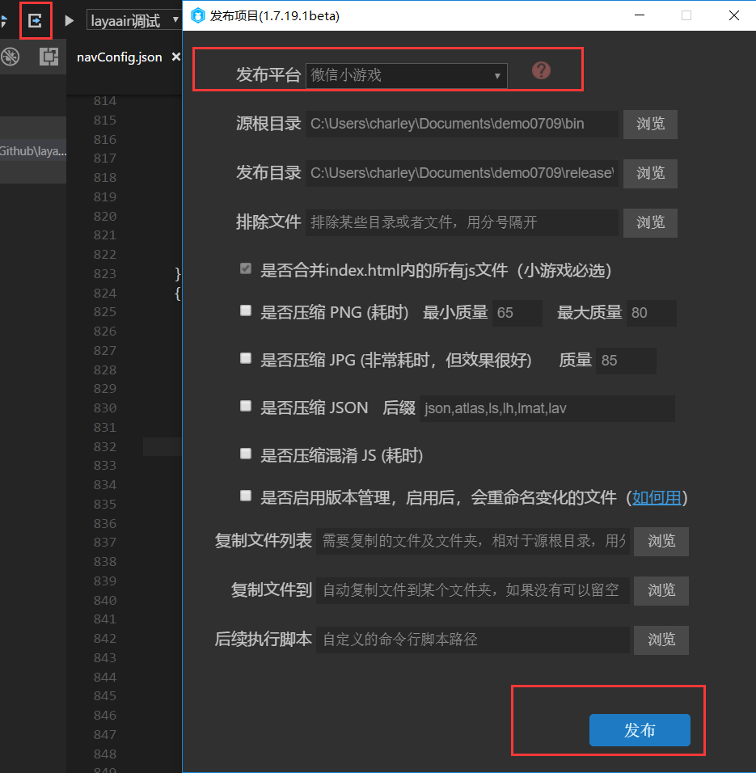
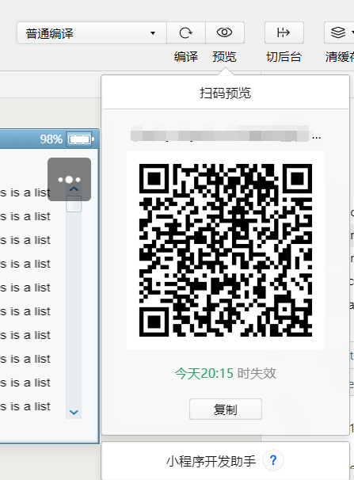

#Create the first Wechat game

>*Author: Charley*

###I. prepare the development environment

####1. Download and install LayaAirIDE integrated development environment

LayaAirIDE is an integrated development environment of LayaAir engine. It integrates LayaAir engine with sample projects, UI, animation and other visual editing tools, project code writing and management tools.**Developers can directly use LayaAirIDE to create a sample project for Weichat games.**

**Download Address on Official Website**:[http://ldc.layabox.com/layadownload/?type=layaairide](http://ldc.layabox.com/layadownload/?type=layaairide)

> Tips: Since 3D adaptation and cache management have been added from version 1.7.17, developers are advised to use version 1.7.17 or higher.

####2. Download and install the Weixin game development tool

The development tool of Weixin small game is the environment of small game development and testing. Because the developers of LayaAir engine can use LayaAirIDE for project development, the installation of this small game development tool is mainly used for compiling, preview, real-time testing and debugging, uploading and publishing of small game projects.

**Development Tool Download Address**:
[https://developers.weixin.qq.com/minigame/dev/devtools/download.html](https://developers.weixin.qq.com/minigame/dev/devtools/download.html)

  

####3. Create an enterprise developer account for a small program and get the developer ID (AppID)

Although you can develop and debug without an AppID, the functionality is limited. So before development, it's best to create a developer account for a small program.

Registration address:[https://mp.weixin.qq.com/wxopen/waregister?action=step1](https://mp.weixin.qq.com/wxopen/waregister?action=step1)

**Tips:**

*Personal developers don't need a version number, but they can't open the payment function. If the payment function is involved in the game, the enterprise developer account must be used. And submit the version number.*

After registering the developer account and logging in, you can get the developer ID in the development settings of the Settings menu.

**Tips:**

>*It is suggested that developers register their account number and record their AppID first.*

### 

###II. Creating and Publishing Wechat Game Project with LayaAirIDE

####1. Create a small game sample project with LayaAirIDE

Open LayaAirIDE and create a new project. Select "Weixin Game Example" and set the project name, project path, development language type, engine version. You can create a small game project, as shown in the following figure.

####2. View the effect of the sample project

After creating the project, we can click the debug button or F5 directly (as shown in the figure below). Let's see what the example looks like first.

  

> For AS and TS projects, compilation is also started automatically before debugging is opened. So don't skip this step.

####3. Published as Wechat Game

Click on the project release button, in the pop-up release project interface, choose the release platform for Wechat games. Then if the directory doesn't want to change, just click publish.

 

**Tips**:

> Click on the question mark icon on the right side of the publishing platform to see the description of each option.

###3. Creating Small Game Projects with Wechat Developer Tools

####1. Developer account login, select project type

Open the "Wechat Web Developer Tool" and log in with the developer's Wechat Sweep Code. Then choose**Applet project**Click to enter the project settings.

 

####2. Create small game projects

In the widget project settings panel,`项目目录`You can choose the directory where LayaAirIDE just released the game (currently it's just for the sake of running the process, the new IDE version has a more suitable solution for the release of the game, and the later documents will be changed). AppID can be input according to the ID prepared before, and can be developed and debugged without input, but the function will be limited. So it's better to enter AppID.

 

####3. Compilation of Wechat Developer Tools

After the creation of the small game project, click compile to preview the effect and debug in the tool. We can see that the effect in the modeler is the same as that in LayaAirIDE.

 

####4. Testing and debugging of real machine

Because LayaAirIDE can also debug project effects, unless it is appropriate for related issues, basically there will be no inconsistency between the two sides of the effect. So the most important thing here is to click**preview**Function, through the mobile phone Wechat scanner, in the Wechat real machine testing and debugging.

 

**Tips:**

When you go to the fax machine, by default, you can't exceed 4M and configure subcontracting can't exceed 8M. Therefore, under the IDE publishing directory, the LIBS directory of the sample project can be deleted directly. Because what this example project can use has been integrated into code. js. Otherwise, it may not be uploaded because it exceeds 4m. This problem will also be optimized in the new version.

After using Wechat to scan the code, we start the small program project. Click the floating window button in the upper right corner to open the debugging and performance monitoring panel.

After opening the debugging and performance monitoring panel of the real machine, the following figure is shown.

 

So far, a complete small game development process is over. Is it simple? The small game project developed by LayaAirIDE is basically seamless for the Weixin small game project.