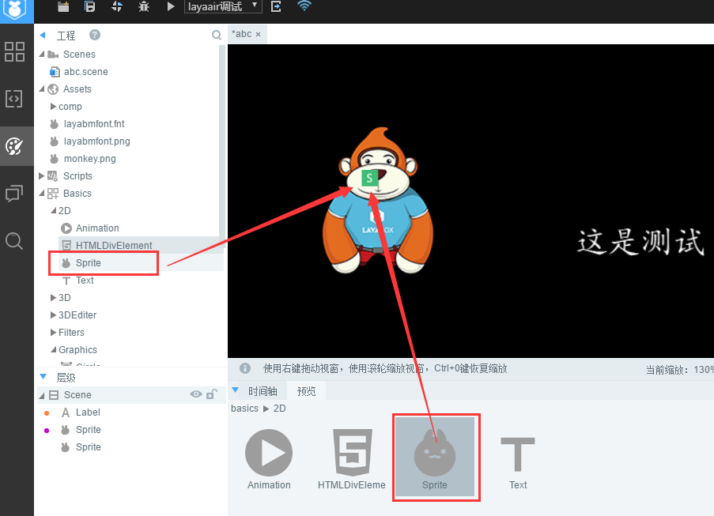
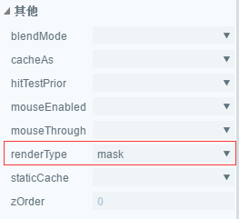

#Masque

> le masque de layaair peut comporter un objet (support de bitmap et de vecteur) et l 'afficher selon la forme de l' objet.
]


##Masque API

Propriété de masque[laya.display.Sprite](http://layaair.ldc.layabox.com/api/index.html?category=Core&class=laya.display.Sprite%3Ch1%3Emask)Dans l 'API, la description de cette propriété est indiquée dans la figure 1:

< br / > (Figure 1)


##Exemples de masques simples

###2.1 utilisons le moteur layaair pour afficher un bitmap.

Crée une catégorie d 'entrée maskdemo.as, qui est définie comme une application par défaut (recommandée avec flashbuilder) et produit le code suivant:


```java

package
{
	import laya.display.Sprite;
	import laya.resource.Texture;
	import laya.utils.Handler;
	
	public class MaskDemo
	{
		private var Res:String;
		private var img:Sprite;
      
		public function MaskDemo()
		{
			Laya.init(1136,640);
			//设置舞台背景色
			Laya.stage.bgColor = "#ffffff"        
			//资源路径              
			Res = "res/img/monkey1.png";
			
			//先加载图片资源，在图片资源加载成功后，通过回调方法绘制图片并添加到舞台
			Laya.loader.load(Res,Handler.create(this,graphicsImg));          
		}
			
		private function graphicsImg():void
		{
			img = new Sprite();
			//获取图片资源，绘制到画布
			img.graphics.drawTexture(Laya.loader.getRes(Res),150,50);
			
			//添加到舞台
			Laya.stage.addChild(img);
		}	
	}
}
```


Les résultats de la compilation sont présentés à la figure 2:

<br />（图2）


###2.2 création d 'une zone de masquage circulaire

Crée une zone de masquage circulaire avec un code.L 'effet masque peut être obtenu par l' attribut Mask.Continuez à lire le Code et les notes explicatives et changez le Code illustratif 2.1 comme suit:


```java

package
{
	import laya.display.Sprite;
	import laya.resource.Texture;
	import laya.utils.Handler;
	
	public class MaskDemo
	{
		private var Res:String;
		private var img:Sprite;
		
		public function MaskDemo()
		{
			Laya.init(1136,640);
			//设置舞台背景色
			Laya.stage.bgColor = "#ffffff"      
			//资源路径
			Res = "res/img/monkey1.png";		
			
			//先加载图片资源，在图片资源加载成功后，通过回调方法绘制图片并添加到舞台
			Laya.loader.load(Res,Handler.create(this,graphicsImg));   
		}
		
		private function graphicsImg():void
		{
			img = new Sprite();
			//获取图片资源，绘制到画布
			img.graphics.drawTexture(Laya.loader.getRes(Res),150,50);
			
			//添加到舞台
			Laya.stage.addChild(img);
			
			
			//创建遮罩对象
			var cMask:Sprite = new Sprite();
			//画一个圆形的遮罩区域
			cMask.graphics.drawCircle(80,80,50,"#ff0000");
          	//圆形所在的位置坐标
			cMask.pos(120,50);
          
         	//实现img显示对象的遮罩效果
			img.mask = cMask;
			
		}
	}
}
```


Les résultats opérationnels sont indiqués à la figure 3:

< br / > (Figure 3)

Grâce à un code de comparaison, nous avons découvert que le masque est simple à obtenir et que l 'effet Masque d' un objet d 'affichage IMG est réalisé en conférant à l' objet d 'affichage cmask une valeur de l' objet masqué aux propriétés Mask de l 'objet img.


##Etablissement de masques dans la layaairide

> outre la mise en place directe d 'un masque dans le Code, un masque peut également être disposé pour l' objet par layaairide.Nous suivons les étapes suivantes.

Première étape: créer une page UI`maskDemo.ui`, importer des ressources.*(si cette étape n 'est pas comprise, veuillez consulter la Section de l' IDE pour la création et l 'importation de l' ui)*


étape 2: glisser un panneau de ressources`Sprite`Composant dans la zone d 'édition de scène, comme le montre la figure 4

< br / > (Figure 4)


Mesure 3: Double - clic`Sprite`Dans l 'intérieur du composant, puis dans le panneau du composant`Sprite`Composants, comme le montre la figure 5.

< br / > (Figure 5)


Mesure 4: sélection`Sprite`Composant, les attributs communs sont insérés dans l 'autre panneau d' attributs à droite`renderType`Définir comme`mask`Voir la figure 6.

< br / > (Figure 6)


Mesure 5: double clic`Sprite`Dans l 'intérieur du composant, puis dans le panneau du composant`Graphics`Ensemble circulaire, réglez la position et la taille.Les relations hiérarchiques sont présentées à la figure 7.

< br / > (Figure 7)


Mesure 6: Double - clic continu sur la zone d 'édition`Sprite`L 'effet du masque est visible à l' intérieur du composant, comme le montre la figure 8.

< br / > (Figure 8)


##Application des masques layaairide dans le cadre du projet

###4.1 publication de l'UI

Appuie sur l 'interface IDE`F12`Afficher la page UI pour créer un masque`src/ui`Générer la classe ui sous la table des matières, et`bin/h5/res/atlas`Le fichier d 'Atlas sous la table des matières figure à la figure 9.

< br / > (Figure 9)


###4.2 catégories et images générées à l 'aide de l' IDE pour obtenir un effet masque

Créer un type d 'entrée`Main.as`, codé comme suit:


```java

package
{
	import laya.net.Loader;
	import laya.utils.Handler;	
	import ui.maskDemoUI;
	
	public class Main
	{
		public function Main()
		{
			//初始化舞台
			Laya.init(1136,640);
			//设置舞台背景色
			Laya.stage.bgColor = "#ffffff"    
				
			//加载图集资源，加载成功后添加到舞台
			Laya.loader.load("res/atlas/ui.atlas",Handler.create(this,onLoaded));
			
		}
		
		private function onLoaded():void
		{
			var cMask:maskDemoUI = new maskDemoUI();
			Laya.stage.addChild(cMask);
		}
	}
}
```


Comme le montre la figure 10, nous avons rapidement réalisé l 'effet masque.

 <br /> (图10)


