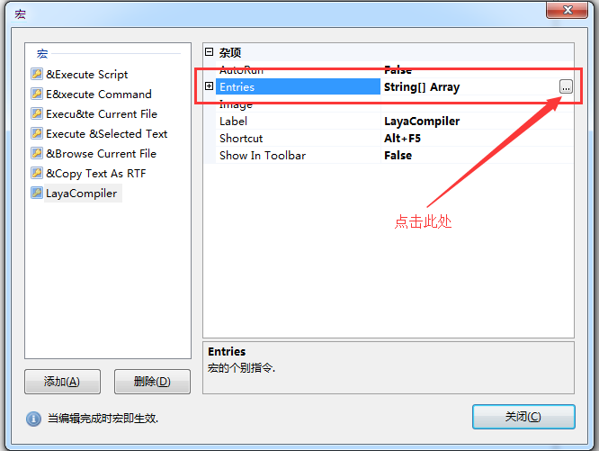

#Flashdevelop Develop Environmental configuration

###Première étape: layaair Engineering

####Moteur téléchargement

En utilisant le développement de layaairide, le téléchargement de layaairide apportera son propre paquet moteur.Si le developpeur utilise des outils tiers, il faut d 'abord télécharger le moteur.Sur la page d 'accueil du site officiel ou dans le menu central de l' développeur, avec l 'entrée des liens téléchargés par le moteur, l' ouverture des liens et l 'apparition des différentes versions de la liste de téléchargement des moteurs, chaque version offre AS3, ts et JS trois langues de développement, choisissez Le langage de développement correspondant et téléchargez sur le site officiel.

####1.2 Description de la structure du catalogue des paquets de moteur

Comme cet article présente l 'environnement de développement flashdevelop, nous Téléchargeons la version AS3 du moteur.Après téléchargement et décompression, on peut voir la structure de catalogue de la version AS3 comme le montre le diagramme suivant:

​< br / >
Figure 1

- "jslibs", "libs" est le catalogue des codes des moteurs, dans lequel le Code de la Bibliothèque des moteurs layaair se trouve.

- « laya.js.exe » est un compilateur de code AS3 dans le système Windows pour la traduction du Code AS3 en Code JS.

- layajs est un compilateur de code AS3 dans le système Mac Apple pour la traduction du Code AS3 en Code JS.

​


###Deuxième étape installation d 'un navigateur Google Chrome

Lorsqu 'une compilation de codes AS3 est effectuée, le navigateur Chrome est appelé par défaut pour ouvrir le projet d' exécution et doit être installé pour effectuer la mise en page du projet.Cette étape peut être franchie si l 'installation est installée.


 


###Phase 3 configuration de l 'environnement de compilation AS3 dans flashdevelop

​**Mesure 1**: Ouvrez flashdevelop, trouvez la macro dans la barre de menu et ouvrez le panneau de macro éditeur.

​<br/>

Figure 2

​**Mesure 2**: cliquez d 'abord sur ajout d' une macro, puis sélectionnez la macro additionnelle qui vient d 'être ajoutée, modifiez le menu de la macro dans la colonne "label" sous le nom de "Laya compiler" et installez une touche rapide macro dans la colonne "Shortcut" sous le nom de "Alt + F5" (les raccourcis claviers ne sont conçus que pour servir de référence et ne sont pas en conflit avec d' autres raccourcis claviers).

​< br / >
Figure 3

​**Mesure 3**: cliquez sur la zone d 'exploitation «... » à la position droite de la barre entries et ouvrez la fenêtre Éditeur d' ensemble de chaînes de caractères.

​< br / >
Figure 4

​**Mesure 4**: Saisissez une macro - instruction dans le panneau d 'éditeur d' ensemble de chaînes de caractères:


```

SaveAllModified
RunProcessCaptured|D:\layaide2.0\layaairide\resources\app\out\vs\layaEditor\laya\libs\2.0.0beta1\as\layajs.exe;"$(ProjectPath)";iflash=false;quickcompile=true;out=bin/js/bundle.js;subpath=
```


Si la compilation ne démarre pas le navigateur Google, ajoutez chromerun = False au - dessus.


```

SaveAllModified
RunProcessCaptured|D:\layaide2.0\layaairide\resources\app\out\vs\layaEditor\laya\libs\2.0.0beta1\as\layajs.exe;"$(ProjectPath)";iflash=false;chromerun=false;quickcompile=true;out=bin/js/bundle.js;subpath=
```


​    < br / >
Figure 5

**Tips: "D: < layaideride >**


​**Mesure 5**: cliquez sur le bouton & ‧‧; désactiver & ‧‧; et cliquez directement sur le bouton & ‧‧; désactiver & ‧‧


  


**La configuration du compilateur AS3 dans l 'environnement flashdevelop est ainsi terminée.Bienvenue dans les autres chapitres.**

