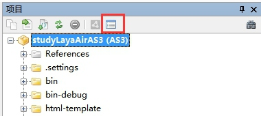
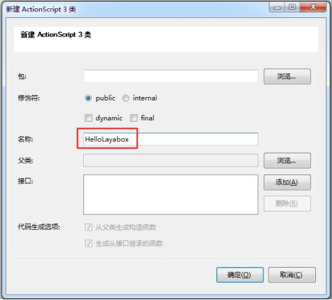

#Première procédure de flashdevelop, "Hello layabox"

]###Cet article affiche le texte Hello - layabox dans l 'environnement flashdevelop en langue AS3
> la fin de cet article est la première procédure pour achever le moteur layaair.Avant d 'apprendre ce texte, il est important de veiller à ce qu' il soit lu d 'abord:**Flashdevelop Develop Environmental configuration**
]
> la première étape peut être franchie si vous avez lu layaairide pour créer le projet AS3 et avoir une structure de catalogue détaillée et si vous avez un bon projet.Nous recommandons l'adoption du projet layaairide.
]


##La première étape passe par le nouveau projet flashdevelop.

​**Mesure 1**: Ouvrez flashdevelop, trouvez le "Projet" dans la barre de menu et cliquez sur "nouveau projet".

​< br / >
Figure 1

​**Mesure 2**: Sélectionnez le type AS3 - Project, saisissez le nom du projet, sélectionnez l 'emplacement du projet, puis cliquez sur définir pour achever l' opération du nouveau projet.

​< br / >
Figure 2


  


##Deuxième étape

###2.1 réservoir de moteurs

**Mesure 1**: cliquez sur le bouton Propriétés du projet dans le panneau du projet pour ouvrir la fenêtre de configuration des propriétés du projet.

​< br / >
Figure 3

​**Mesure 2**: cliquez sur ajout de la catégorie pour sélectionner le catalogue où se trouve le moteur layaair, puis cliquez sur confirmation pour compléter la citation de la Bibliothèque de moteurs layaair.

<br/>

Figure 4


 


###2.2 ajout de SWC à la bibliothèque

Lors du téléchargement du moteur, après la compression du paquet, on peut voir trois fichiers SWC, à savoir: playerglobal.swc, catalogue racine, layaairflash.swc, sous - Catalogue glsl2agal.swc.Playerglobal.swc est utilisé dans le cadre de la mise au point du moteur layaair API.Les deux autres fichiers SWC sont utilisés pour la publication de la version flash.Sans la publication des versions Flash, "layaairflash.swc", "glsl2agal.swc" peut également ne pas être ajouté à la bibliothèque.

​**Mesure 1**: ajouter un dossier libs sous le nouveau projet studylayaairas3.

​< br / >
Figure 5

​**Mesure 2**: faites glisser "playerglobal.swc" sous le catalogue racine du moteur layaair déchargé vers le dossier libs nouvellement créé, en le traînant dans le point de souris.Ou de copier l 'adhésif et de l' coller sous le dossier libs.Puis cliquez sur le bouton droit pour ajouter le fichier SWC à la bibliothèque.

​< br / >
Figure 6


 


##Étape 3 affiche le texte "Bonjour layabox".

###3.1 nouveaux documents hellolayabox

​**Mesure 1**: ajouter une nouvelle catégorie à la touche droite "Répertoire SRC".(indicatif: les fichiers de catégorie ajoutés doivent être enregistrés dans le répertoire SRC ou cités par le biais de l 'ajout d' un chemin de classe, faute de quoi ils ne peuvent pas être compilés)

​< br / >
Figure 7

​**Mesure 2**: définir le nom de la classe comme Hello layabox

​< br / >
Figure 8

###3.2 afficher "Hello layabox" sur la page H5

​**Mesure 1**: crée hellolayabox.as comme document.

​< br / >
Figure 9

​**Mesure 2**: ajouter un texte "Hello - layabox" à la scène, code suivant:


```java

package {
 import laya.display.Text;
  
 /** @author Charley */
  
 public class HelloLayabox {
  public function HelloLayabox() {
   //创建舞台，默认背景色是黑色的
   Laya.init(600, 300);
   var txt:Text = new Text();
    
   //设置文本内容
   txt.text = "Hello Layabox";
    
   //设置文本颜色为白色，默认颜色为黑色
   txt.color = '#ffffff';
    
   //将文本内容添加到舞台 
   Laya.stage.addChild(txt);
  }
 }
}
```


​**Mesure 3**: lorsque le Code a été établi, le Code AS3 a été compilé en HTML5 à l 'aide de raccourcis claviers compilés (ALT + F5) définis antérieurement.

​< br / >
Figure 10

Une fois la compilation terminée, le compilateur démarre automatiquement l 'affichage des résultats.

​< br / >
Figure 11

​**Mesure 4**Comme l 'indique la figure ci - dessus, « Hello layabox » apparaît déjà, mais c' est plus simple.


```java

package {
 import laya.display.Text;
  
 /**
  * @author Charley
  */
 public class HelloLayabox {
  public function HelloLayabox() {
   //创建舞台
   Laya.init(600, 300);//舞台默认背景色是黑色的
   var txt:Text = new Text();
   txt.text = "Hello Layabox";
    
   //设置文本颜色
   txt.color = '#FF0000';
   //设置文本字体大小，单位是像素
   txt.fontSize = 66;
    
   //设置字体描边
   txt.stroke = 5;  //描边为5像素
   txt.strokeColor = '#FFFFFF';
    
   //设置为粗体
   txt.bold = true;
    
   //设置文本的显示起点位置X,Y
   txt.pos(60, 100);
    
   //设置舞台背景色
   Laya.stage.bgColor = '#23238E';
    
   //将文本内容添加到舞台
   Laya.stage.addChild(txt);
   
  }
 }
}
```


Les résultats de l'opération sont indiqués dans la figure ci - après:

​< br / >
Figure 12


**Ainsi, si vous suivez ce cours d 'initiation, complétez le plan ci - dessus, félicitations pour votre entrée réussie, nous avons déjà mené à bien le premier programme HTML5 mis au point dans la langue AS3, ce qui montre bien la configuration de l' environnement de développement de layaair.Pour plus d 'informations sur l' utilisation de l 'API développé par le moteur layaair, consultez l' API et le Demo en ligne au centre de développement de layabox.**
