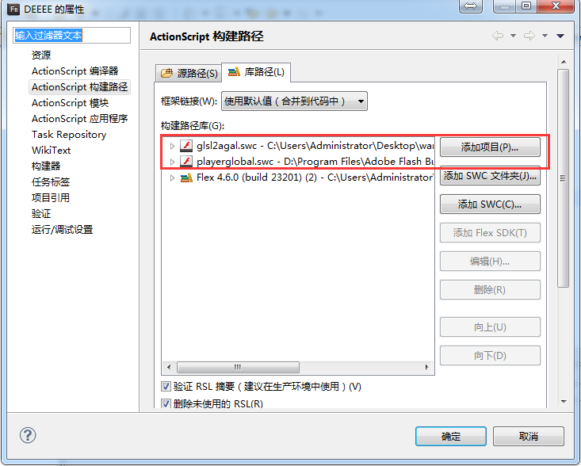

#Lancement de la version flash du projet layaair


###Préparation environnementale

Téléchargement de la dernière version stable de layaairide.

Adresse Web:[http://ldc.layabox.com/index.php?m=content&c=index&a=lists&catid=27](http://ldc.layabox.com/index.php?m=content&c=index&a=lists&catid=27) 

Téléchargement de la dernière version d'Adobe Flex SDK.

Down Address:[https://www.adobe.com/devnet/flex/flex-sdk-download.html](https://www.adobe.com/devnet/flex/flex-sdk-download.html)

Téléchargement du flash debug - player requis pour la mise en service de debug.

Down Address:[https://fpdownload.macromedia.com/pub/flashplayer/updaters/22/flashplayer_22_sa_debug.exe](https://fpdownload.macromedia.com/pub/flashplayer/updaters/22/flashplayer_22_sa_debug.exe)


 


###Compiler les paramètres de publication

####2.1 Introduction des paquets de moteurs et des codes source des bibliothèques d'exploitation flash

　　**La version actionscript3.0 de layaair a été introduite dans le projet, de même que le code source de la Bibliothèque d'exploitation flash.**

L'adresse de la version AS3 de layaair est la suivante:[http://ldc.layabox.com/index.php?m=content&c=index&a=lists&catid=28](https://github.com/layabox/layaair/tree/master/bin/as/libs/src)

Flash operating Library Source Address:[https://github.com/layabox/layaair/tree/master/bin/as/LayaAirFlash/flash/src](https://github.com/layabox/layaair/tree/master/bin/as/LayaAirFlash/flash/src)

　　*Remarque: pour introduire le chemin du paquet ici, il faut d 'abord introduire le paquet de moteur de version as de layaair, puis le paquet de code source flash qui fonctionne avec la version flash.*

####2.2 ajouter glsl2agal.swc au projet

Trouvez le dossier d 'introduction de flash et ajoutez la cuglsl2agal.swc du Répertoire à l' élément.
Adresse:[https://github.com/layabox/layaair/blob/master/bin/as/LayaAirFlash/flash/glsl2agal.swc](https://github.com/layabox/layaair/blob/master/bin/as/LayaAirFlash/flash/glsl2agal.swc)

####2.3 définir la version Flash debug - player de l 'Association de démarrage Debug

Actuellement, la version Flash debug player est au moins 11,9.

Paramètres flashdevelop, comme le montre la figure 1:


​        < br / >
Figure 1

Paramètres flashbuilder, comme le montre la figure 2:

​< br / >
Figure 2

####2.4 ajouter le fichier playerglobal.swc (uniquement dans l 'environnement FB)

Le projet a été compilé pour de nombreuses catégories liées à la norme 3D, qui ont besoin de plus de 11,9.`playerglobal.swc`Fichier, cette étape n 'est prévue que pour l' environnement flashbuilder.Trouver le chemin playeglobal.swc sous le catalogued: Program Files Adobe Flash Builder 4.7 (64 BIT) \ \ sdks Frameworks 4.7 (64 bit \ \ \ \ \ \ \ \ \\\\\\\\\\\\\\\\\\\\\\\\ajouterensuite playerglobal.swc:

​< br / >
Figure 3


###Publication de la version flash

Copier les exemples de Samples fournis par layaair dans un nouveau projet, puis créer une nouvelle catégorie de démarrage de document, nous prenons l 'exemple de main.as.

Exemple de main.as:


```java

package
{
 import flash.display.Sprite;
 import laya.flash.Window;
 public class Main extends Sprite
 {
  public function Main(){
   //通过 Window.start 方法将测试例子Animation_Altas发布为Flash
   Window.start(this,Animation_Altas);
  }
 }
}
```


**Attention:**Si l 'on envisage de publier ce projet dans la version H5, il faudra ajouter au Sommet de la catégorie main`/*[IF-FLASH]*/`Les macros sont compilées de manière à ne pas tenir compte de ces compilations lors de la publication de la version H5.

Lorsque la version H5 doit être publiée, le code source doit être modifié comme suit:


```java

/*[IF-FLASH]*/package
{
 import flash.display.Sprite;
 import laya.flash.Window;
 public class Main extends Sprite
 {
  public function Main(){
  //通过 Window.start 方法将测试例子Animation_Altas发布为Flash
   Window.start(this,Animation_Altas);
  }
 }
}
```


###Attention et erreurs courantes:

4.1 Si une bibliothèque JS est introduite dans le projet, il n'est pas possible d'exporter l'article actuel vers la version flash.

4.2 La version Flash doit être au moins 11,9.Sinon, ça pourrait arriver.`Error: Definition flash.display3D:Context3D could not be found.`Erreur d 'équilibrage

4.3 Il arrive que le nombre de paramètres d'appel de fonctions dans le projet ne corresponde pas au nombre de paramètres effectifs pendant l'exécution du projet.Par exemple:


```javascript

[Fault] exception, information=ArgumentError: Error #1063: Animation_Altas/createAnimation() 的参数数量不匹配。应该有 0 个，当前为 1 个。
```


Cela s'explique par le fait que flash a des limites plus strictes en ce qui concerne les appels de fonction que JS et que nous pouvons ajouter des paramètres similaires à E: * NULL dans des paramètres multiples.

Lorsque la fonction d 'appel est inférieure à celle du prototype de fonction, le paramètre de prototype de la fonction de modification est un paramètre par défaut tel que p = null.

4.4 lorsqu 'il existe un fichier layaair glsl - Shader personnalisé dans le projet (fonctions avancées), il est nécessaire d' initialiser les fichiers gsls Embed dans les fichiers flashmain et avant window.start, comme suit:


```javascript

public class FlashMain extends Sprite {
 [Embed(source = "./display/MutiAni/shader/aniShader.vs", mimeType = "application/octet-stream")]
 public static var anishader_vs:Class;
 [Embed(source = "./display/MutiAni/shader/aniShader.ps", mimeType = "application/octet-stream")]
 public static var anishader_ps:Class;
  
 public function FlashMain() {
  // 加入项目依赖的shader ，第一个字符串参数与 __INCLUDESTR__ 的参数一致，使用扩展Shader必须使用。
  FlashIncludeStr.addExtraShader("shader/aniShader.vs", new anishader_vs);
  FlashIncludeStr.addExtraShader("shader/aniShader.ps", new anishader_ps);
   
  // 项目代码入口
  Window.start(this, Main);
 }
}
```


4.5 Pour utiliser websocket dans la catégorie laya.net.socket de layaair, le type de paramètre dans la fonction de retour de traitement de messages correspondante doit être défini comme * type, par exemple:


```javascript

private function onMessage(e:Event=null):void {}
```


Doit se lire comme suit:


```javascript

private function onMessage(e:*=null):void {}
```


Sinon, le type d 'erreur de conversion sera indiqué lors de l' exécution!

