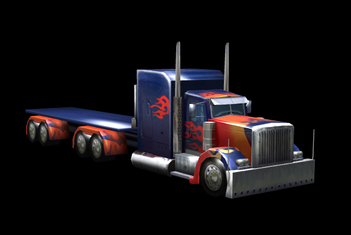
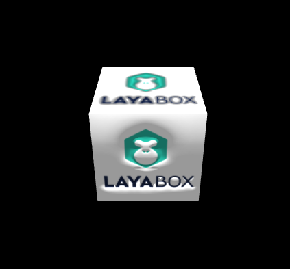

##Couleur et dessin de matériau layaair3d

###Couleur de matériau et propriétés d 'affichage

Les propriétés standard du matériau sont quelque peu similaires à celles de la lumière lumineuse, telles que les propriétés diffuse reflectance, haute lumière, ambiance, etc.On trouvera ci - après une description détaillée de ces caractéristiques.


####Reflectance

La réflectivité (albedocolor) reflète principalement la clarté et la couleur du matériau, plus les valeurs sont élevées, plus le matériau est clair.

La valeur de la réflectivité est un vecteur quadridimensionnel qui affiche les codes suivants et dont les quatre éléments représentent respectivement le rouge, le vert, le bleu et l 'Alpha transparent.

L 'effet albedocolor transparent est en pourcentage, 0 pour la transparence totale et 1 pour l' opacité.

Modifier le Code du cours de démarrage rapide en 3D pour obtenir les résultats suivants:


```java

	//创建标准材质
	var material:BlinnPhongMaterial = new BlinnPhongMaterial();
	//创建漫反射二维纹理贴图
    Texture2D.load("h5/res/layabox.png",Handler.create(this,function(text:Texture2D):void{
  		material.albedoTexture = text;
    }));
	//只有设置了渲染模式为透明混合类型才能达到透明效果
	//设置材质蓝色染色及30%半透明
	material.albedoColor=new Vector4(1,1,1,0.3);
	//渲染模式(也可设置数值，5-13等为混合类型，可观察其效果变化)
	material.renderMode =BlinnPhongMaterial.RENDERMODE_TRANSPARENT;
	//为box模型赋材质
	box.meshRenderer.material = material;
```


< br > reflectance coloration and transparent


####Diffuse reflectance Color and diffuse reflectance

La couleur diffuse réfléchissante (albedocolor) est la seule couleur propre du matériau, que l 'industrie des beaux - arts peut appeler la couleur intrinsèque de l' objet.L'albedo Texture (albedo texture) est une image texturée intrinsèque 2D du matériau, telle qu'une image texturée en bois et une image texturée en brique.

The most used in the game is diffuse reflectance Map, the most Work in the Graphics of Game Art is diffuse reflectance Map, that can reflect the Basic Quality of the object.

Les couleurs diffuses réfléchissantes et les dessins peuvent également être utilisés dans les moteurs layaair 3D, avec un effet de fusion, une couleur diffuse réfléchissante colorant la surface d 'éclairage du modèle (la surface de rétroéclairage n' est pas modifiée), qui est semblable à la couleur de source de lumière réfléchissante diffuse de la lumière et produit une couleur plus globale (fig. 2).

Modifier le Code du cours de démarrage rapide 3D pour créer une couleur bleue diffuse réfléchissante qui est bleue par la lumière (voir fig. 2):


```java

	//添加方向光（灯光色会与材质色融合，因此改灯光色为黑白灰色，且不能曝光过度）
	var directionLight:DirectionLight = scene.addChild(new DirectionLight()) as DirectionLight;
	directionLight.color = new Vector3(0.6, 0.6, 0.6);
	directionLight.transform.worldMatrix.setForward(new Vector3(10, -10, 0));
	scene.ambientColor = new Vector3(0.5,0.5,0.5);

	//创建标准材质
	var material:BlinnPhongMaterial = new BlinnPhongMaterial();
 	//创建漫反射二维纹理贴图
Texture2D.load("h5/res/layabox.png",Handler.create(this,function(text:Texture2D):void{
	material.albedoTexture = text;
	//设置材质漫反射颜色
	material.albedoColor = new Vector4(0.5,0.5,2,1);
}));
	//为box模型赋材质
	box.meshRenderer.material = material;
```


Mélange de couleurs réfléchissantes diffuses et d 'autocollants


####High Light and High Light

Les couleurs à haute lumière (speccular Color) sont, comme les lumières à haute lumière, des couleurs à haute lumière produites au coin de l 'objet modèle ou en direction de la source lumineuse.

La Haute couleur de la lumière sur le modèle est influencée par la couleur de la lumière en même temps que celle du matériau, et si la couleur de la lumière est noire sans la lumière ou la lumière, la lumière élevée sur le modèle n 'apparaît pas même si le matériau est muni d' un timbre haute couleur et haute lumière.

L 'autocollant (specular texture) est une image texturée en 2D dont la couleur de pixel représente la couleur et la luminosité élevées au niveau du modèle correspondant, plus la couleur de pixel brille, plus le modèle au niveau du pixel brille.

Bien entendu, l 'image haute couleur et l' image haute lumière peuvent être utilisées en même temps, l 'efficacité peut être améliorée, les développeurs peuvent tester à plusieurs reprises et ajuster l' effet désiré.

Modifier le Code du cours de démarrage rapide en 3D, charger un camion dans la scène, observer l 'utilisation d' images haute couleur et haute lumière, et comparer l 'utilisation par défaut de la lumière haute, comme suit


```java


  //获取模型
  var meshSprite3D:MeshSprite3D=role3D.getChildAt(0).getChildAt(0) as MeshSprite3D;
  //从模型上获取共享材质
  var sharedMaterial:BlinnPhongMaterial = meshSprite3D.meshRenderer.sharedMaterial
  //修改材质的高光颜色，让高光处偏红
  sharedMaterial.specularColor = new Vector4(1,0,0,1);
  //加载高光贴图（与漫反射一致，也可单独制作高光贴图）
  Texture2D.load("h5/res/layabox.png",Handler.create(this,function(text:Texture2D):void{
      sharedMaterial.specularTexture = text;
  }));
```

Compilez le code ci - dessus et utilisez des images de haute couleur et haute lumière pour obtenir de meilleurs résultats (fig. 3).(fig. 4) Seules les lumières sont utilisées par défaut de couleur blanche élevée, avec un effet général.

<br>（图3）


< br > (Figure 4)


####Couleur de l 'environnement

La couleur ambiante (ambiencolor) est une couleur de fusion des couleurs des matériaux dans les scènes, ce qui permet d 'éclairer les matériaux tout en simulant la couleur du ciel et l' intensité de la lumière.

Modifier le Code du cours de démarrage rapide en 3D comme suit (Figure 6):


```java

//添加3D场景
var scene:Scene3D = Laya.stage.addChild(new Scene3D()) as Scene3D;
//设置环境色，提亮模型
scene.ambientColor = new Vector3(0.5,0.5,0.5);
```


<br > (Figure 5) sous lumière fixe, la scène n 'utilise pas la couleur de l' environnement

< br > sous la lumière fixe, la scène est éclairée par la couleur de l 'environnement


####Reflectance

Nous utilisons généralement un ensemble de dessins texturés en boîte texturecube, qui enveloppe le modèle dans son ensemble et simule l 'effet de l' environnement périphérique sur le modèle.

L 'effet d' affichage de l 'écran réfléchissant est également associé à la réflectivité albedocolor, le mode de rendu rendermode.

Le mode de rendu doit être remplacé par une opacité bidirectionnelle pour afficher l 'image réfléchissante.

Plus l 'indice albedocolor est élevé, moins l' effet d 'autocollage est faible, plus l

Modifier le Code du cours de démarrage rapide en 3D comme suit, en utilisant un modèle sphérique pour mieux observer les effets réfléchissants.Résultats obtenus après l 'exécution (fig. 7):


```java

//添加方向光
var directionLight:DirectionLight = scene.addChild(new DirectionLight()) as DirectionLight;
directionLight.color = new Vector3(0.6, 0.6, 0.6);
directionLight.transform.worldMatrix.setForward(new Vector3(0, -100, 0));
//设置场景的环境光颜色
scene.ambientColor = new Vector3(0.5,0.5,0.5);
//创建一个球
var sphere:MeshSprite3D = scene.addChild(new MeshSprite3D(new SphereMesh(1)))as MeshSprite3D;
	sphere.transform.translate(new Vector3(0,1,-3))
	Laya.timer.loop(10,this,function():void{
		sphere.transform.rotate(new Vector3(0,1,0),true,false)
	});
//创建材质
var material:PBRSpecularMaterial = new PBRSpecularMaterial();
//创建漫反射二维纹理贴图
Texture2D.load("h5/res/layabox.png",Handler.create(this,function(text:Texture2D):void{
				material.albedoTexture = text;
			})); 	
//获取反射贴图（用立方体全视角贴图进行赋值（类似于360全景包裹））
TextureCube.load("h5/LayaScene_test/Assets/1v1Scene/NewCubemap.ltc",Handler.create(this,function(cube:TextureCube):void{
		//设置反射贴图
		scene.customReflection = cube;
		//设置反射贴图的反射率
		scene.reflectionIntensity = 1;
	}));
//设置渲染模式为不透明（否则无法显示反射贴图）
material.renderMode =PBRSpecularMaterial.RENDERMODE_OPAQUE
//降低材质的反射率，加强反射贴图反射
material.albedoColor=new Vector4(0.1,0.1,0.1,0);

//为模型赋材质
sphere.meshRenderer.material = material;
```


< br > diagramme réfléchissant


####Gravure Diagram

Les dessins en relief de ligne (normaltexture) jouent un rôle très important en 3D, le degré de précision de la présentation du modèle est principalement influencé par les dessins de ligne.Bien entendu, si l 'on utilise des cartes de ligne, les performances du matériel doivent être améliorées en conséquence.

Les maquettes d 'art sont produites de deux façons, l' une consistant à faire bouillir des maquettes à haut module dans des logiciels de fabrication en 3D, avec une grande charge de travail, et l 'autre à convertir des maquettes à réflexion diffuse en maquettes à faible charge de travail, avec un effet légèrement inférieur à celui de la méthode de cuisson.Comme le montre la figure 8, l 'effet de l' image de ligne est transformé par l 'image de réflexion diffuse.

<br>（图8） 


S'il est nécessaire d'utiliser une feuille de route, les questions suivantes devront être prises en compte:

Les données du modèle sont assujetties à un certain nombre d'exigences dans le cadre d'une feuille de route, et l'absence d'informations de coupure sur le modèle n'aurait pas d'effet d'évidence.Par exemple, les types de grilles de mess que le moteur layaair - 3D porte lui - même, boxmesh, spheremesh, cylindermesh, etc., ne contiennent pas d 'informations linéaires et ne présentent pas de contour dans l' affichage même si l 'on utilise une carte de ligne.

Lorsqu'il est nécessaire d'utiliser des cartes graphiques et que les modèles sont exportés par l'intermédiaire de l'interface layaair, il faut veiller à ne pas cocher l'option de la grille Mesh - setting, par exemple (fig. 9).

< br > (Figure 9)

S'il est nécessaire d'utiliser des cartes de circuit, il faut utiliser la lumière dans les scènes de jeu, faute de quoi le modèle n'aurait pas d'effet concave.


Nous avons créé un modèle cube à partir d 'unity3d (informations de coupure du Modèle créé dans l' Unity) et exporté et utilisé des données à partir d 'un insert d' Export layaair après application d 'un masque de réflexion diffuse et d' un masque de ligne, qui est automatiquement chargé sur le modèle.Modifier le Code du cours "démarrage rapide en 3D" comme suit, et voir l 'effet concave (fig.


```java

//创建unity中导出的场景
Scene3D.load("h5/LayaScene_test_Light/test_Light.ls",Handler.create(this,function(s:Scene3D):void{
	var scene:Scene3D = Laya.stage.addChild(s)as Scene3D;
	//也可以代码加载法线贴图
	//从模型中获取meshSprite3D对像
	//var meshSprite3D:MeshSprite3D=s.getChildByName("Cube") as MeshSprite3D;
	//获取模型的材质实例
    //var material:PBRSpecularMaterial=meshSprite3D.meshRenderer.material as PBRSpecularMaterial;
    //为材质添加法线贴图
 //Texture2D.load("layaScene_box/Assets/texture/layabox_normal.png",Handler.create(this,function(text:Texture2D):void{
    //material.normalTexture= text;
// }));
}));
			
```


<br > (Figure 10)


###Fichier de matériau exporté. Modification lmat

Après avoir compris la couleur du matériau et les propriétés de l 'écran, nous avons appris comment modifier les propriétés du matériau et des dessins par l' intermédiaire de codes, et de manière flexible pour contrôler les effets souhaités.

Actuellement, cependant, les effets artistiques sont essentiellement réalisés par l 'éditeur Unity, puis exportés pour être utilisés.Étant donné que le moteur layaair 3D est en cours d'amélioration et que les caractéristiques du moteur H5 ne couvrent pas tous les types de matériaux et les propriétés de l'Unity, les effets dans l'Unity peuvent être différents de ceux du jeu réel.

Dans les versions futures, nous créerons des matériaux standard layaair dans l 'Unity sous forme de fiches à l' usage des concepteurs, de sorte que les effets artistiques produits dans l 'Unity soient parfaitement compatibles avec ceux du jeu et faciles à utiliser par les concepteurs.

Alors, comment pouvons - nous modifier et obtenir des résultats artistiques en attendant?Chaque matériau de l 'Unity est généré lors de son exportation.

Par exemple, on charge une scène par le code suivant, puis on obtient l 'effet nocturne en réglant l' éclairage (fig. 11).


```java

Scene3D.load("h5/LayaScene_test_Light/test_Light.ls",Handler.create(this,function(s:Scene3D):void{
	var scene:Scene3D = Laya.stage.addChild(s)as Scene3D;
	//设置环境光偏暗蓝色
	scene.ambientColor = new Vector3(0.2,0.2,1);

    //获取场景灯光
	var light:DirectionLight = scene.getChildByName("Directional light") as DirectionLight;
	//设置灯光光偏暗
	light.color = new Vector3(0.5,0.5,0.5);
}));

```

< br > (Figure 11)

Comme le montre la figure ci - dessus, si le modèle Love doit être transformé en luminosité d 'un boîtier de lampe, il est relativement simple de modifier le fichier de matériau correspondant. Lmat, ouvre l' observation du fichier de matériau et découvre que le fichier de matériau contient une variété d 'attributs de couleur optique et de dessins (fig. 12), nous modifions la couleur ambiante du matériau de couverture en "1.5,1.2", 1.2, brosse.Les nouveaux fichiers Web permettent de voir les effets, et le modèle a changé pour atteindre l 'effet de la lampe (fig. 13).

< br > (Figure 12)

< br > (Figure 13)

Le procédé décrit ci - dessus permet d 'ajuster les propriétés des différents matériaux de la scène pour obtenir les effets souhaités de l' art.Bien sûr, nous attendons davantage du matériel exclusif layaair dans l 'unité qui suivra et de l' éditeur direct dans l 'unité de l' effet final correspondant au jeu.

