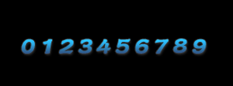

#Références de composants clip


##Création d 'un composant clip par layaairide

###1.1 Création de clip
L 'ensemble clip peut être utilisé pour afficher une animation de bitmap.Le clip peut combiner une image avec un nombre de clipx divisé horizontalement, un nombre de clipy divisé verticalement ou une largeur de clipwidth de chaque tranche transversale, et une hauteur de clipy height qui divise verticalement chaque tranche, de gauche à droite et de haut en bas en une animation de coupe.

L 'ensemble clip peut être utilisé pour reproduire une animation de tranches et pour afficher une image de trame de l' animation de tranches.
Cliquez sur l 'ensemble clip dans le panneau de ressources et faites glisser - le dans la zone d' édition de page, ce qui permet d 'ajouter l' ensemble tab à la page.
Références d 'interface de script clip[Clip API](http://layaair.ldc.layabox.com/api/index.html?category=Core&class=laya.ui.Clip)

Exemples de ressources du module clip:

​< br / >
(Figure 1)

Définit la valeur des propriétés clipx pour un effet d 'affichage après 10:

​< br / >
(Figure 2)

Définit la valeur des propriétés index comme un effet d 'affichage après 1:

​< br / >
(Figure 3)

###1.2 caractéristiques communes des composants clip

​< br / >
(Figure 4)

- 124.**Attribut**- 124.**Description fonctionnelle**- 124.
124: --------------------------------------------------------------------------------------------
La largeur de chaque lame est divisée latéralement.- 124.
Lorsque les ressources d 'image sont divisées longitudinalement, la hauteur de chaque lame.- 124.
Le nombre d 'éléments de coupe à large largeur est égal à celui des ressources d' image divisées latéralement par 124.- 124.
Lorsque la ressource d 'image est divisée longitudinalement par- 124.
L 'index de la trame d' animation active est affiché sous forme d 'animation en lames.- 124.
Données de grille valides (données de la grille de la neuvième maison) pour les ressources d 'images.- 124.
La ressource d 'image \ \ \ \ \ \ \ \ \ \ \ \ \ \- 124.
124, Groupe \ \ 124.
12.24.
124, visible \ \ 124.


##Création d 'un composant clip par Code

Quand on écrit un code d 'écriture, on ne peut pas forcément contrôler l' ui par le Code, créer`UI_Clip`Importer dans un code`laya.ui.Clip`Et définit les propriétés associées à clip par l 'intermédiaire du Code.

**Exécution de l 'exemple:**
​< br / >
Figure 5 création de compteurs par Code

​< br / >
(Figure 6)

D 'autres attributs de clip peuvent également être définis au moyen d' un code, l 'exemple ci - dessus montre comment chaque seconde de mise à jour de clip.clipx peut être obtenue au moyen d' un minuteur, la fonction de l 'horloge peut être réalisée au moyen d' une mise à jour numérique par seconde, et le lecteur intéressé peut créer lui - même un clip correspondant aux besoins de son projet par l 'intermédiaire d' un code.

**Exemple:**


```javascript

package
{
	import laya.display.Stage;
	import laya.events.Event;
	import laya.ui.Button;
	import laya.ui.Clip;
	import laya.ui.Image;
	import laya.utils.Handler;
	import laya.webgl.WebGL;
	
	public class UI_Clip
	{
		/***控制器按钮资源***/
		private var buttonSkin:String = "../../../../res/ui/button-7.png";
		/***切片资源***/
		private var clipSkin:String = "../../../../res/ui/num0-9.png";
		/***背景资源***/
		private var bgSkin:String = "../../../../res/ui/coutDown.png";
		
		/***计数器***/
		private var counter:Clip;
		/***计数器当前索引***/
		private var currentIndex:int;
		/***控制器按钮***/
		private var controller:Button;
		
		public function UI_Clip()
		{
			// 不支持WebGL时自动切换至Canvas
			Laya.init(800, 600, WebGL);
			//画布垂直居中对齐
			Laya.stage.alignV = Stage.ALIGN_MIDDLE;
			//画布水平居中对齐
			Laya.stage.alignH = Stage.ALIGN_CENTER;
			//等比缩放
			Laya.stage.scaleMode = Stage.SCALE_SHOWALL;
			//背景颜色
			Laya.stage.bgColor = "#232628";
			
			//加载资源
			Laya.loader.load([buttonSkin, clipSkin, bgSkin], 
                             laya.utils.Handler.create(this,onSkinLoaded));
		}
		
		/***加载资源完成***/
		private function onSkinLoaded(e:*=null):void
		{
			//显示背景图
			showBg();
         	//创建计数器
			createCounter();
            //显示总数
			showTotal();
            //创建控制按钮
			createController();
		}
		
		/***显示背景***/
		private function showBg():void 
		{
			//实例化背景图
			var bg:Image = new Image(bgSkin);
			//设置图片大小
			bg.size(224, 302);
			//位置居舞台中间
			bg.pos(Laya.stage.width - bg.width >> 1, Laya.stage.height -bg.height >> 1);
			//加载到舞台
			Laya.stage.addChild(bg);
		}
		
		/***创建计数器切片***/
		private function createCounter():void
		{
			//实例化计数器切片
			counter = new Clip(clipSkin, 10, 1);
			//自动播放
			counter.autoPlay = true;
			//播放间隔时间1秒
			counter.interval = 1000;			
			//计数器切片位置
			counter.x = (Laya.stage.width - counter.width) / 2 - 35;
			counter.y = (Laya.stage.height - counter.height) / 2 - 40;
			//加载到舞台
			Laya.stage.addChild(counter);
		}
		
		/***显示总数切片***/
		private function showTotal():void 
		{
			//实例化总数切片
			var clip:Clip = new Clip(clipSkin, 10, 1);
			//总数切片索引为最后一个
			clip.index = clip.clipX - 1;
			//总数切片位置
			clip.pos(counter.x + 60, counter.y);
			//加载到舞台
			Laya.stage.addChild(clip);
		}
		
		/***创建控制按钮***/
		private function createController():void 
		{
			//实例化控制按钮
			controller = new Button(buttonSkin, "暂停");
			//标签字体为粗体
			controller.labelBold = true;
			//按钮标签字体颜色的四种状态
			controller.labelColors = "#FFFFFF,#FFFFFF,#FFFFFF,#FFFFFF";
			//按钮大小
			controller.size(84, 30);
			//按钮点击事件——计数器状态控制
			controller.on(Event.CLICK, this, onClipState);
			//按钮位置
			controller.x = (Laya.stage.width - controller.width) / 2;
			controller.y = (Laya.stage.height - controller.height) / 2 + 110;
			//加载到舞台
			Laya.stage.addChild(controller);
		}
		
		/***计数器状态***/
		private function onClipState(e:*=null):void 
		{
			//如果计数器为播放状态
			if (counter.isPlaying)
			{
				//停止播放动画
				counter.stop();
				//记录当前播放索引（如果不记录，重新播放时，索引会从0开始）
				currentIndex = counter.index;
				//按钮标签改变
				controller.label = "播放";
			}
			else//计数器为停止状态
			{
				//播放动画
				counter.play();
				//从当前记录的索引播放
				counter.index = currentIndex;
				//按钮标签改变
				controller.label = "暂停";
			}
		}	
	}
}
```


 