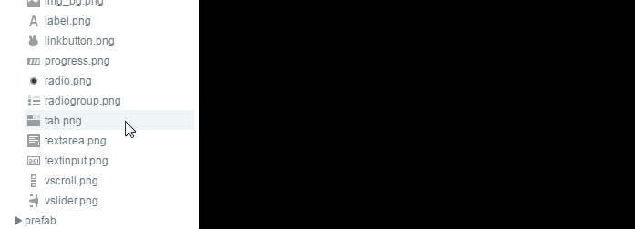
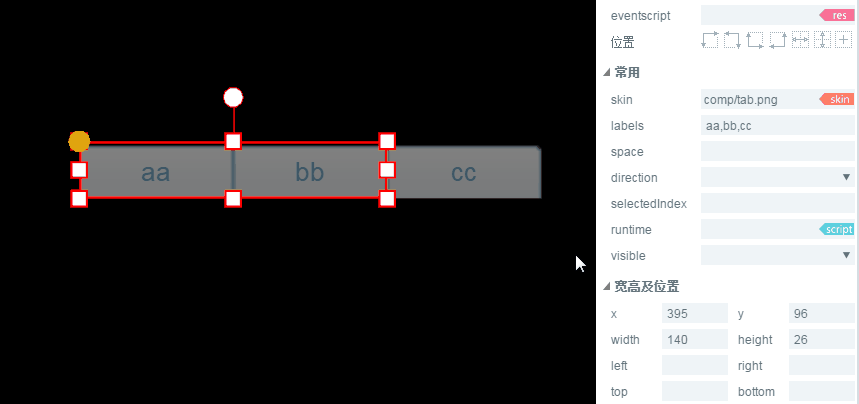
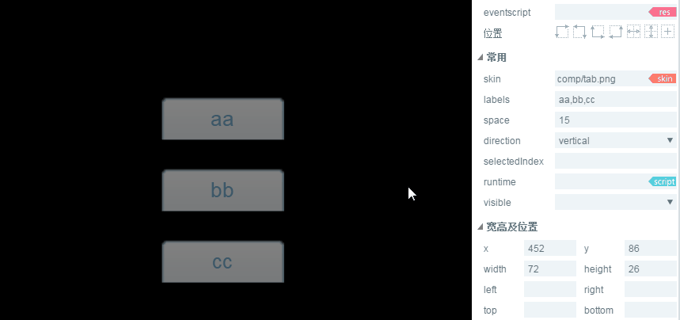
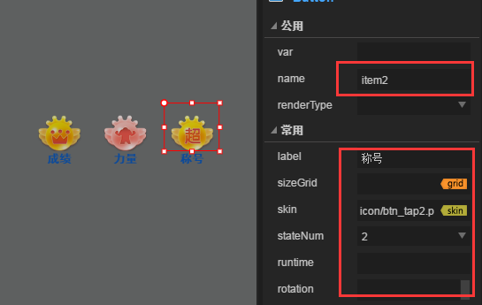
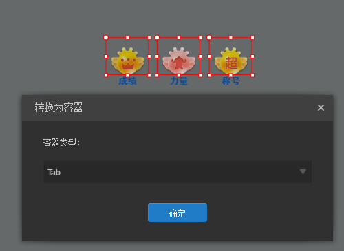

#Ensemble Tab

> Parce que de nombreux attributs de composant sont génériques, communs et communs`属性设置器`Une présentation est faite dans le document.Avant de lire ce texte, lisez le document attributs.

##Comprendre l 'ensemble Tab

###1.1 fonctionnement des composants Tab

L 'ensemble tab sert à définir un ensemble de boutons d' onglet, tel qu 'un affichage de commutation de pages multiples.Voir figure 1.

< br / > (Figure 1)

###1.2 spécifications pour la peau (Skin) des composants Tab

La peau de l 'ensemble tab est`tab`Ou`tab_`Pour nommer un préfixe, il s' agit d 'un diagramme bimodal ou trimorphe à équilibrage vertical pour la conception de la peau, comme le montre la figure 2.

< br / > (Figure 2) teint tab à trois états

*La peau de l 'ensemble tab ne peut pas utiliser les attributs de la grille, il faut donc déterminer la taille de l' application pratique lors de la conception des ressources.*

###1.3 présentation de l'API du composant Tab

L 'API du module Tab[http://layaair.ldc.layabox.com/api/index.html?category=Core&class=laya.ui.Tab](http://layaair.ldc.layabox.com/api/index.html?category=Core&class=laya.ui.Tab)

##Création d 'un composant tab par layaairide

###2.1 création de Tab

Sélection`资源管理器`La ressource de composant tab est glissée dans l 'éditeur de scène, ce qui permet de créer avec succès un composant tab sur la page.Voir figure 3.

​ （动图3）

###2.2 ajout d'étiquettes par labels

Comme l 'indique la figure 3, il n' y a que deux étiquettes dans l 'ensemble tab par défaut.Pour ajouter une étiquette, il suffit d 'ajouter une nouvelle étiquette à la propriété labels, et le contenu textuel de l' étiquette modifiée est également défini dans cette propriété, comme l 'indique la figure 4 - 1.

< br / > (Figure 4 - 1)

###2.3 modification de l 'orientation et de l' espacement des composants Tab

Le composant tab est disposé horizontalement (* horizontal *) et verticalement (* vertical *) en modifiant les propriétés de direction.**Espacement**Peut être obtenue par l 'attribut Space.Voir la figure 4 - 2.
 

(Figure 4 - 2)

###2.4 options par défaut pour définir le Groupe de cases sélectionnées Tab

Les propriétés selectindex sont utilisées pour modifier la valeur d 'index d' un composant Tab, aucune option n 'est sélectionnée en l' absence de paramétrage par défaut, et si l 'option d' étiquette par défaut du composant tab est définie, la valeur d 'attribut selectindex peut être définie, 0 pour la première étiquette, 1 pour la seconde étiquette...Par analogie.Les effets de fonctionnement sont indiqués dans les figures 4 à 3.

 

(Figure 4 - 3)

##Module tab personnalisé

Dans l 'exemple précédent, nous avons utilisé la même ressource Tab pour générer un ensemble tab de trois étiquettes en réglant les labels.Cependant, dans le jeu réel, les styles d 'étiquette sont différents dans le même composant Tab, et il n' est pas possible d 'obtenir des résultats par l' intermédiaire de la configuration labels, ce qui nécessite l 'utilisation d' un composant tab personnalisé.Voir, par exemple, la figure 5.

​	< br / > (Figure 5)

###3.1 Préparation des ressources artistiques

Nous utilisons trois ressources artistiques bimodales différentes pour personnaliser l 'ensemble Tab, comme le montre la figure 6.

 < br / > (Figure 6)

**Tips**- Oui.

Une attention particulière est accordée aux règles de dénomination des images, dans le module tab personnalisé, nous utilisons plusieurs ensembles de boutons qui ne peuvent pas être utilisés directement.`Tab`Règle de nom du composantUtilisable`Button`Assemblage`CheckBox`Assemblage`Radio`Règle de nom du composantLe préfixe BTN utilisé dans la figure 6 correspond à la règle de désignation du composant button.

​

###3.2 Création de boutons dans l 'IDE

Copier les ressources dans le dossier du gestionnaire de ressources du projet, puis faire glisser l 'ensemble button produit du gestionnaire de ressources vers l' éditeur de scène, de gauche à droite, et modifier successivement les attributs name de chaque composant radio en "item0, item1, item2...", (sans ajouter les attributs de nom Conformément à cette règle, l 'ensemble tab généré est un composant non valide, ne peut pas être corrigéFonctionnement régulierEn outre, étant donné que la ressource est bidimensionnelle, il est nécessaire de définir la valeur d 'attribut statenum comme 2.Lorsque vous définissez le texte des propriétés label, etc., les effets sont indiqués à la figure 7.

< br / > (Figure 7)

###3.3 conversion en emballages de Tab

Cliquez sur le raccourci.`Ctrl+B`Choix`Tab`Ensemble récipient`确定`Achèvement de la conversion (Figure 8).

​< br / > (Figure 8)

Après le succès de la conversion, l 'index selectedindex sélectionné par défaut est ajusté à 0 (première étiquette tab), l' espace de la case sélectionnée est de 4, et la direction peut ne pas être configurée ou transversale (horizontal), comme le montre la figure 9.

​< br / > (Figure 9)

Le succès de la fabrication de l 'ensemble tab personnalisé peut être constaté par ces étapes.La première case a été sélectionnée par défaut et transférée à son troisième état de sélection de trame, tandis que les autres cases sont les premiers états non sélectionnés de trame.

