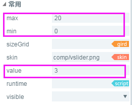

#Référence de composant vslider

##Comprendre l 'ensemble vslider

###1.1 démonstration du rôle et des effets de vslider

Les ensembles hslider et vslider sont des sous - catégories des ensembles Slider qui indiquent respectivement une barre de glissement latérale et une barre de glissement longitudinale.L 'utilisateur peut sélectionner une valeur en déplaçant le curseur entre les rails de glissière.Used in such as the Control of the Progress of the player, the Control of Volume and size, the Numerical Adjustment on Some ui.

L 'ensemble vslider est agencé verticalement.La piste de glissière s' étend de haut en bas et l 'étiquette qui affiche les valeurs est située à droite de la piste et peut être masquée.

​< br / >
(Figure 1)

###1.2 spécifications pour la peau (Skin) des composants vslider

Le Protocole de nomenclature de ressources vslider utilise le nom de préfixe vsliser, avec un total de trois ressources par défaut, respectivement des ressources de glissière`vslider$bar.png`Barre de progression`vslider$progress.png`Ressources de diagramme`vslider.png`".

La ressource doit avoir au moins deux ressources, une ressource de diagramme de base et une ressource de glissière, faute de quoi la fonction de glissement ne peut être réalisée.L 'absence de l' ensemble de ressource de bande de progression n 'est pas incorrecte, mais ne permet pas d' afficher l 'état d' avancement.

Tips: ressources de barres de progression`vslider$progress.png`Ressources de base`vslider.png`Le rythme de commutation peut être inversé.

< br / >
(Figure 2)

###1.3 présentation API des composants vslider

La présentation de l'API de vslider.[http://layaair.ldc.layabox.com/api/index.html?category=Core&class=laya.ui.VSlider](http://layaair.ldc.layabox.com/api/index.html?category=Core&class=laya.ui.VSlider)".

##Création d 'un composant vslider par layaairide

###1.1 Création de vslider

Cliquez sur les ressources du module vslider dans le panneau de ressources de sélection et faites glisser - les dans la zone d 'édition de page, ce qui permet d' ajouter le module vslider à la page.

Après avoir glissé vslider dans la zone d 'édition, définissez les propriétés de la grille sizegrid de sorte qu' elles ne s' étirent pas après l 'agrandissement et affichent les effets suivants:

​< br / >
(Figure 2)

###1.2 caractéristiques usuelles des composants vslider

L 'ensemble vslider possède les mêmes propriétés que l' ensemble hslider, à l 'exception d' un changement de direction du composant.

La valeur max de l 'attribut vslider est également définie comme 20, la valeur min de l' attribut est 0, et la valeur valeur valeur valeur value de l 'attribut est 5.

​< br / >
(Figure 3)

**Max:**La valeur maximale lorsque le curseur vslider glisse jusqu 'à l' extrémité droite, la valeur par défaut étant 100;

**Min:**Le curseur vslider glisse jusqu 'à la valeur minimale à gauche, par défaut 0;

**Valeur:**La valeur actuelle des glissières doit être égale à Max ou min ou entre elles.

​< br / >
(Figure 4)

Lors de l 'exécution du programme, vous pouvez glisser le curseur pour sélectionner une valeur:

​< br / >
(Figure 5)

###1.3 Production de bandes de contrôle du volume au moyen de vslider

Dans le développement de jeux ou d 'autres logiciels, il est courant de fabriquer des contrôleurs de volume à l' aide de vslider.Toutefois, comme le montre la figure 5, ce n'est pas l'effet que nous voulons, et l'orientation et la taille de la barre de progression sont inversées.Normalement, la valeur maximale du volume sonore doit être au - dessus, la valeur minimale au - dessous et la barre de progression doit être modifiée vers le bas.

En fait, il est très simple d 'obtenir un effet normal, en commençant par les propriétés Max et Min qui peuvent être réglées à l' inverse, par exemple en réglant max 0, min 20, puis la valeur value par défaut jusqu 'à 20.

​ 

(Figure 6)

Ensuite, il s' agit de l 'orientation de la barre d' avancement, en échangeant le nom de la ressource de la barre d 'avancement et de la ressource de la carte de base (fig. 7), en actualisant et en diffusant l' idea, et en compilant et en exécutant, on peut voir Les progrès vers le bas!Nous avons également atteint l 'effet du Contrôleur de volume dont nous avons besoin.

​< br / >
(Figure 7)

​< br / >
(Figure 7)

###1.4 autres caractéristiques particulières des composants vslider

D 'autres attributs génériques sont décrits en détail dans le paramètre d' attributs, ci - après les propriétés particulières associées à l 'ensemble hslider.

- 124.**Attribut**- 124.**Description fonctionnelle**- 124.
124 --------------------------------------------------------------------------------------------------------------
12.124 ~ arrowclickback \ \ 124 \ \ à partir d 'une valeur booléenne, spécifie si la valeur d' attribut value peut être modifiée en cliquant sur la barre de glissement.- 124.
La valeur booléenne \ \ 124 \ \ showlabel \ \ 124 détermine si l 'étiquette affiche la valeur value au - dessus du curseur.- 124.
La valeur d 'échelle de la barre coulissante \ \ \ \ \ \ \ \ \ \ \ \ \ \ \La valeur par défaut est 1.- 124.

 
