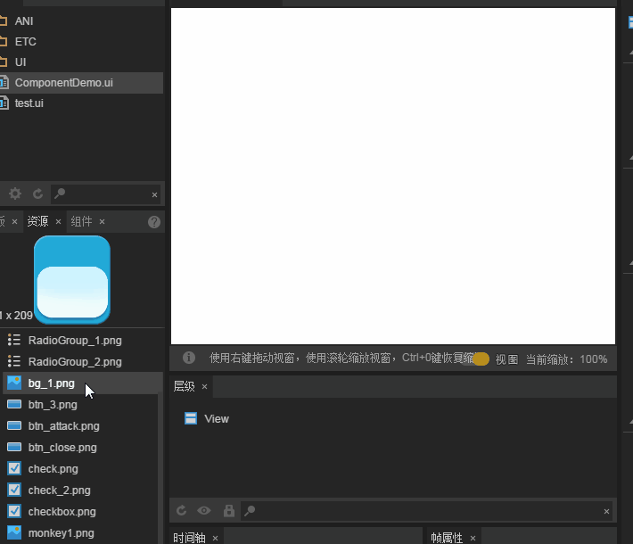
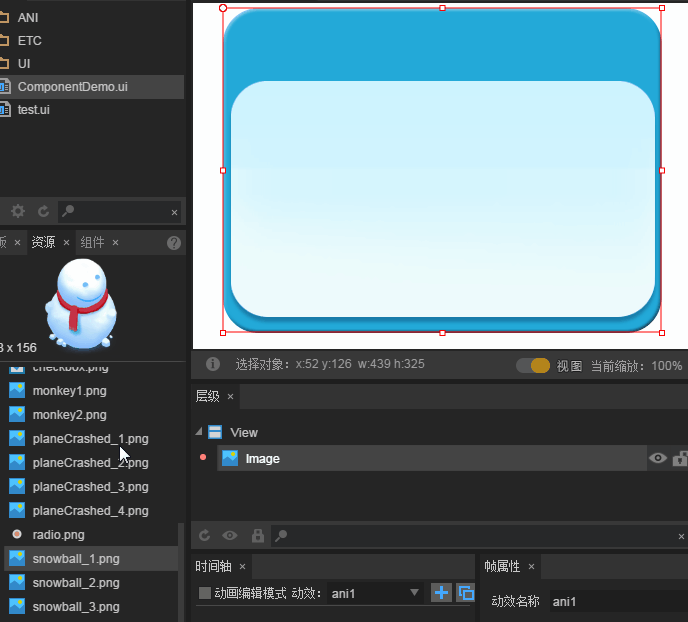

#Ensemble viewstack

> Parce que de nombreux attributs de composant sont génériques, communs et communs`属性设置器`Une présentation est faite dans le document.Avant de lire ce texte, lisez le document attributs.En outre, cette section contient des connaissances sur les composants Tab, lisez d 'abord le document détaillé de l' ensemble Tab.

##Comprendre l 'ensemble viewstack

###1.1 fonctionnement des composants viewstack

Le module viewstack est principalement utilisé pour le transfert de vues Multi - pages.Il contient une pluralité de sous - pages, mais n 'affiche par défaut qu' une seule et peut être commuté à l 'aide d' un index de sous - pages.En général, nous utilisons cette combinaison avec l 'étiquette Tab pour créer une page de transition.Voir figure 1.

< br / > (Figure 1)

###1.2 spécification de ressources (Skin) pour le module viewstack

Le module viewstack passe.`Ctrl+B`L 'ensemble de catégorie de récipients converti n' a pas de spécification distincte de ressource de module.Dans ce mode de réalisation, on utilise directement les ressources d 'un composant image qui peuvent être utilisées en fonction des besoins réels de développement du jeu.

###1.3 présentation de l'API du module viewstack

Pour l 'utilisation de l' API d 'un composant viewstack, voir[http://layaair.ldc.layabox.com/api/index.html?category=Core&class=laya.ui.ViewStack](http://layaair.ldc.layabox.com/api/index.html?category=Core&class=laya.ui.ViewStack)".


##Création de composants viewstack par layaairide

###2.1 création de la page viewstack

####2.1.1 préparation des ressources artistiques

Les plans d'arrière - plan des pages et les ressources nécessaires pour les beaux - arts sont affichés dans le catalogue de projets correspondant au gestionnaire de ressources layaairide.

####2.1.2 Etablissement de la grille des neuf Palais pour les images de fond de page

L 'arrière - plan de la page du cadre d' éjection est habituellement basé sur la grille de Jiu Gong, où nous allons d 'abord définir les propriétés du cadre d' arrière - plan.Comme le montre la figure 2 - 1.

< br / > (Figure 2 - 1)

####2.1.3 création du contexte de page

Faites glisser la carte d 'arrière - plan qui vient d' être installée dans l 'éditeur de scène.Voir figure 2 - 2.

< br / > (Figure 2 - 2)

####2.1.4 création de la page viewstack

Glisser l 'ensemble de base ui sur la page vers le fichier UI`场景编辑器`, puis raccourcis clavier`Ctrl+B`Convertir`ViewStack`Ensemble récipientComme le montre la figure 3 - 1.

< br / > (Figure 3 - 1)


####2.1.5 définition des propriétés de nom de sous - page des composants viewstack

Les règles de désignation des attributs de nom des sous - pages viewstack sont item0, item1, item2... » si d 'autres pages sont ainsi ajoutées, comme le montre la figure 3 - 2, sans ajouter les attributs de nom à cette règle, le composant viewstack produit est un composant non valide qui ne peut pas fonctionner normalement.

< br / > (Figure 3 - 2)

**Tips**- Oui.*Les caractères doivent être item et ne peuvent pas être remplacés par d 'autres caractères.Une fois que les modifications ont été apportées à la Sous - page viewstack, l 'affichage par défaut n' est normal que lorsque l 'item0 est affiché, faute de quoi l' ensemble viewstack n 'est pas entré en vigueur.*


####2.1.6 adaptation de la disposition ui des pages

Lorsque les attributs de nom sont définis, vous pouvez double - cliquer dans l 'ensemble weiwstack pour ajuster la disposition ui de la Sous - page.Dans ce cas, nous n 'utilisons que la taille des ressources, l' emplacement et l 'alignement des trois sous - pages.Les résultats sont présentés dans les figures 3 à 3.

​< br / > (figures 3 à 3)


###2.2 paramètres d 'index de page de viewstack selectedindex

L 'ensemble viewstack affiche par défaut une image dont les propriétés du nom sont item0, car la valeur par défaut de selectedindex de l' index par défaut est 0.On peut modifier la page d 'affichage par défaut de l' ensemble viewstack en ajustant la valeur d 'attribut selectindex.Les résultats sont présentés dans la figure 4.

<br/>（动图4）


**Tips**- Oui.

**La valeur var de l 'ensemble viewstack doit être réglée et, lors de l' élaboration du Code, l 'ensemble viewstack doit être commandé par une variable globale de nom var, ce qui modifie les propriétés de selectedindex et permet le transfert de page.Dans ce cas, on utilise viewstack, dont le nom peut également être choisi par l 'développeur, comme l' indique le coin supérieur droit de la figure 4.**


###2.3 création d 'une étiquette Tab pour le contrôle

Normalement, l 'ensemble viewstack a besoin d' une étiquette de commande correspondante, et nous avons créé une étiquette Tab pour commander l 'affichage de transfert de sous - page de viewstack.

Cliquez sur l 'ensemble tab dans le panneau de ressources de sélection et faites glisser - le vers l' éditeur de scène sur la page UI pour générer l 'ensemble Tab.Les ressources artistiques de l 'ensemble tab sont complétées par le style d' arrière - plan de la figure 5 ci - dessus.

​< br / >
(Figure 5)

Après avoir glissé l 'ensemble tab dans l' éditeur, la position de réglage est alignée sur la carte d 'arrière - plan.Définit un attribut commun var comme Tab pour la commande d 'appel de programme.Définissez les attributs usuels de labels comme "bonbons, canettes, arbres verts", sélectionnez l 'index selectindex 0.Définit la taille de la police, les caractères gras, les couleurs d 'état de la police, etc.

Figure 6

​< br / >
(Figure 6)


##Commande d 'affichage de commutation d' un composant viewstack par Code

Dans les étapes de fabrication ci - dessus, nous avons achevé la création et la combinaison de composants dans l 'IDE, et nous avons ensuite associé l' étiquette tab à l 'affichage de sous - page de viewstack au moyen d' un code de programme.

Enregistre la page, affiche la page F12 et crée la classe Component demoui.as dans le dossier du projet ui après la publication, et nous l 'utilisons directement.


Crée componentdemo.as et définit un programme par défaut pour produire le code suivant:


```java

package
{
	import laya.utils.Handler;
	import laya.webgl.WebGL;	
	//导入UI发布生成的类
	import ui.ComponentDemoUI;

	public class ComponentDemo
	{
		/**包含tab与viewStack组件的测试页面**/
		private var comp:ComponentDemoUI;		
		public function ComponentDemo()
		{
			Laya.init(1334,750, WebGL);
			
			Laya.stage.scaleMode = "full";
			Laya.stage.bgColor = "#ffffff";
			//加载图集成功后，执行onLoaded回调方法
			Laya.loader.load("./res/atlas/ui.atlas", Handler.create(this, onLoaded));

		}
		
		private function onLoaded():void {
			//创建一个UI实例
			comp = new ComponentDemoUI();
						
			//添加到舞台上显示
			Laya.stage.addChild(comp);
			
			//点击Tab选择按钮的处理
			comp.tab.selectHandler=new Handler(this,onSelecte);	
			
		}
		/**根据选择tab的索引切换页面**/
		private function onSelecte(index:int):void
		{
			//切换ViewStack子页面
			comp.viewStack.selectedIndex=index;
		}
	}
}
```


Exécute le Code de l 'exemple, comme le montre la figure 10.

< br / > (Figure 10)