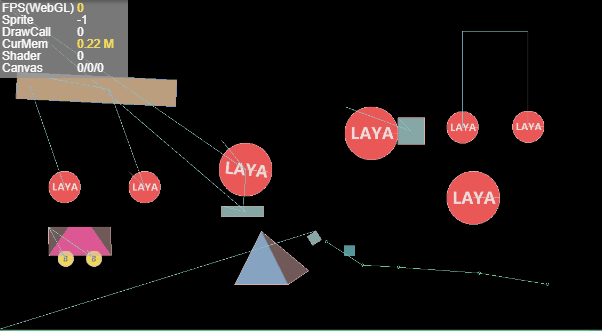

#Système d 'articulation 2D

###Articulation 2D

Dans le développement de jeux physiques, si l'on veut améliorer l'accessibilité d'un système complexe, il faut imposer des contraintes entre les objets, et box2d fournit un système d'articulation.L 'articulation peut contenir deux ou plusieurs objets.

**Box2D支持的关节有**- Oui.

Articulation de distance`DistanceJoint`La distance entre les deux objets est constante.

Articulation d 'engrenage`GearJoint`: pour simuler la relation de contrainte entre les deux engrenages, lorsque les engrenages tournent, le débit produit est de deux manières de sortie: la vitesse angulaire de l 'engrenage lui - même et la vitesse linéaire de la surface de l' engrenage.

Articulation de moteur`MotorJoint`

Articulation de la souris`MouseJoint`: pour manipuler des objets par la souris.Il tente de glisser l 'objet vers la position du curseur actif de la souris.Il n'y a pas de limite à la rotation.

Joint transversal`PrismaticJoint`L 'articulation mobile permet aux deux objets de se déplacer relativement le long de l' axe spécifié, ce qui empêche la rotation relative.

Articulation de poulie`PulleyJoint`Il met les deux objets à la terre et les relie l 'un à l' autre.

Articulation rotative`RevoluteJiont`: obliger deux objets à partager un point d 'ancrage et deux objets à tourner par rapport à eux.

Articulation de câble`RopeJoint`: limite la distance maximale entre les deux points.L 'étirage entre les objets connectés est bloqué même sous une lourde charge.

Joint de soudage`WeldJoint`Pour empêcher le mouvement relatif des deux corps, la position et l 'angle relatifs des deux corps restent inchangés, comme un tout.

Articulation de roue`WheelJoint`: rotation autour du noeud comprenant des propriétés élastiques de sorte que le corps rigide se déplace de manière élastique à la position du noeud.

Toutes les articulations sont héritées de component.

###Présentation du module articulaire

####2.1 articulation à distance

< br / >

La distance à laquelle les deux noeuds sont liés par l 'articulation de distance reste inchangée pour les relations de contrainte comme les bâtons, les os et les ressorts.

#####Description des propriétés

#####Other body

Le corps rigide de raccordement de l 'articulation [conçu pour la première fois] peut être non configuré, par défaut, comme un corps rigide vide du coin supérieur gauche.

#####Other anchor

Le point de liaison rigide est décalé par rapport à l 'angle supérieur gauche de l' autre body.

#####Selfenchor

Le point de connexion rigide est décalé par rapport à l 'angle supérieur gauche de son corps.

#####Frequency

The Frequency of Spring system can be considered as Elastic coefficient of Spring

#####Damping

L 'amortissement du corps rigide lors de son retour au noeud est recommandé de 0 ~ 1.

#####Length

Limite la longueur statique cible.

#####Collideconnect

Les deux corps rigides peuvent - ils se heurter, par défaut false?Attention à ne pas confondre

#####Exemple

On va d'abord utiliser la distance.`DistanceJoint`Fais un effet simple:

Créer un nouvel exemple 2D, appelé test, pour développer le dossier test sous le catalogue Assets et voir les images réservées pour tester les moteurs physiques,

En mode Édition, vous pouvez cocher la barre d 'affichage ou ne pas afficher la ligne d' assistance physique en cliquant sur F9.Figure:

Une fois que vous cliquez sur la confirmation, faites glisser un bloc.png, un c1.png dans la scène, avec l 'effet suivant:

Après avoir sélectionné le carré, cliquez sur le bouton d 'ajout du composant du panneau d' attribut droit pour ajouter`BoxCollider`L 'IDE ajoute automatiquement des rigides.`RigidBody`, comme suit:

Ajouter une boule`CircleCollider`Et dans le menu joint.`DistanceJoint`ID ajout automatique`RigidBody`Les résultats définitifs sont les suivants:

Après l 'enregistrement Ctrl + s, les effets suivants sont observés:

Il n 'y a pas d' effet monoclinal, c 'est parce que le type rigide du bloc est`dynamic`Dynamique. On va le mettre en place.`kinematic`Le type de mouvement, à l 'abri de la gravité, est fixé à un point.Sélectionnez un objet carré dans le menu déroulant des propriétés type, sélectionnez`kinematic`Figure:

Après l 'enregistrement, on peut voir que l' effet d 'un simple clic est réalisé:

Nous allons faire un peu plus d 'effet physique.

Dans la scène, faites glisser deux cercles et ajoutez un collisionneur circulaire.`CircleCollider`, ajouter un joint de distance à l 'un des cercles`DistanceJoint`Et attache l 'autre rigide circulaire, positionne les deux points d' ancrage au Centre du cercle, ajoute un Sprite au bouton droit dans le panneau de niveau inférieur gauche de l 'IDE et ajoute un collisionneur linéaire`ChainCollider`, cliquez`ChainCollider`Allongez les distances de deux points, puis un seul "fil" ajoute un point de pliage en ligne, répétez les étapes ci - dessus, faites un corps de collision de type escalier, puis faites un corps rigide de ligne`RigidBody`A`type`Attributs`static`Type statique (nous n 'avons pas besoin de lui pour faire un mouvement physique), puis glisser un carré au - dessus du corps de collision et ajouter un collisionneur rectangulaire`BoxCollider`- Prends - le.`restitution`Les propriétés de la force de frottement sont définies à 0,5 de sorte qu 'elles soient élastiques.Faites une petite pente au fond de l 'escalier, faites glisser un triangle et ajoutez un collisionneur polygonal.`PolygonCollider`Et triangulaire`RigidBody`Type rigide`Kinematic`Type de mouvementEffet final et structure hiérarchique

Une fois les étapes décrites ci - dessus accomplies, on enregistre les résultats suivants:

This example will understand and control the use of all types of collisions, three Rigid types, Elastic coefficient and Distance joint.

Les documents suivants décrivent successivement tous les effets présentés dans la figure ci - dessous.

