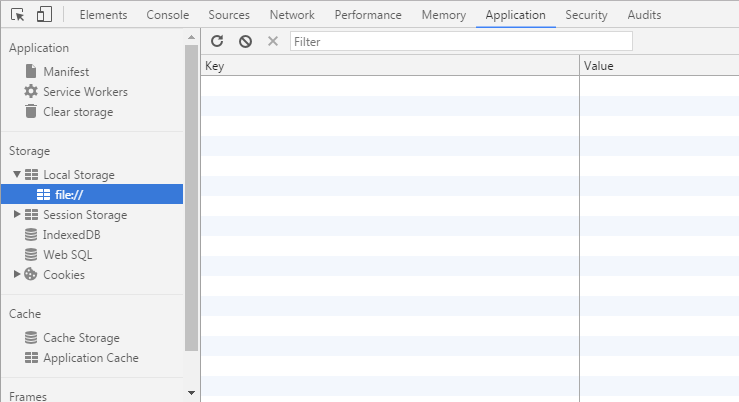

# Web Storage数据存储

HTML5 propose deux nouveaux procédés de stockage de données sur un client:

**Stockage de données sans limitation de temps**

**Sessionstorage - stockage de données pour une session**

Les données stockées à l 'intérieur du sessionstorage seront effacées à la fin de la session du navigateur, c' est - à - dire lorsque le navigateur sera désactivé.

Avant, c'était cookie.Cependant, la taille de Cookie est limitée à 4 k, ce qui ne convient pas au stockage d 'une grande quantité de données, et elles sont transmises par chaque demande de serveur, ce qui fait que Cookie est lente et inefficace.Le rôle de Cookie est d 'interagir avec le serveur et d' exister dans le cadre des normes http, alors que le Web Storage n 'est né que pour "stocker" des données au niveau local.

Dans HTML5, les données ne sont pas transmises à la demande de chaque serveur, mais seulement lorsqu 'elles sont demandées.Il permet de stocker une grande quantité de données sans compromettre la performance du site Web.

Pour les différents sites Web, les données sont stockées dans différentes régions et un site Web ne peut accéder qu'à ses propres données.On peut donc stocker des données locales en utilisant des localstorages.Le moteur layaair a procédé à une simple encapsulation de local storage, correspondant à la catégorie de local storage.On trouvera ci - après un bref exemple de la manière dont il a été utilisé.


```javascript

Laya.init(100,100);
Laya.LocalStorage.setItem("key","hello");
var data = {"index":0,"index1":1};
var str = JSON.stringify(data);
Laya.LocalStorage.setItem("data","hello");
Laya.LocalStorage.setItem("item",str);
```


Appuyez sur le raccourci F12 après le chrome pour obtenir le résultat suivant:

< br / >

D'après les graphiques, les données sont stockées.

Nous procéderons à l'élimination de ces données comme suit:


```javascript

Laya.LocalStorage.setItem("key","hello");
var data = {"index":0,"index1":1};
var str = JSON.stringify(data);
Laya.LocalStorage.setItem("data","hello");
Laya.LocalStorage.setItem("item",str);
Laya.LocalStorage.removeItem("data");//清除数据
```


En ajoutant le Code laya.local storage.removeitem ("Data"); en vidant les données dont la valeur de touche est la Data, on constate qu 'elles ne sont plus disponibles après l' opération de compilation.Comme le montre la figure ci - après:

< br / >

Si nous devons effacer toutes les données, ajoutez un code de ligne à la fin du Code Original:


```javascript

Laya.LocalStorage.clear();
```


Toutes les données stockées sous le nom de domaine antérieur ont disparu, comme le montre la figure ci - dessous:

< br / >

Sessionstorage n'est pas provisoirement encapsulé dans le moteur layaair, mais il est tout à fait utilisable directement.Voici comment utiliser sessionstorage dans layaair.L 'exemple suivant est un compteur de pages qui calcule le nombre de pages consultées par les utilisateurs lors de la session en cours:

Ouvrez layaairide pour créer un projet vide.Les codes spécifiques sont les suivants:


```java

Laya.init(100,100);
var sessionStroage = Laya.Browser.window.sessionStroage;
if(sessionStorage.pagecount){
    sessionStorage.pagecount = parseInt(sessionStorage.pagecount)+1;
}
else{
    sessionStorage.pagecount = 1;
}
console.log(sessionStorage.pagecount);
```


Var = sessionstroage = laya.browser.window.sessionstroage; cette phrase signifie obtenir l 'objet de session sessionstorage sur la page actuelle.


La logique ici est de déterminer si l 'objet de session actif possède des attributs de page, et si l' absence est la première fois que l 'ouverture est définie comme 1, l' existence est déjà ouverte et cumulée.Et le nombre cumulé de sorties.Compilez ce fichier, puis utilisez Google, la console d 'ouverture F12 découvre que la sortie est de 1, puis on actualise constamment la page et on constate que le nombre de sorties s' accumule.Puis nous fermons le navigateur Google et rouvrons cette page et découvrons que le nouveau 1 est sorti à ce moment - là, et que le nombre de pages mises à jour s' accumule.Ceci permet de voir que sessionstorage est un objet de stockage de niveau de session.Désactivez le navigateur et disparaissez.