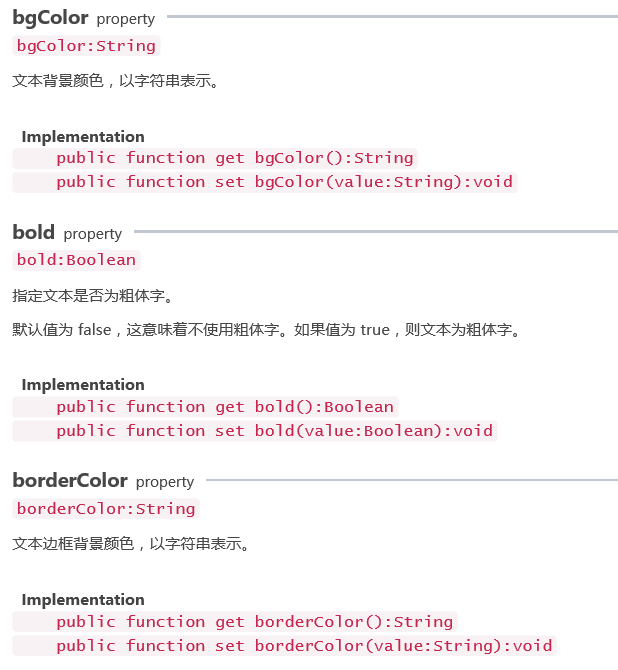

#Définir un style de base de texte

Dans certains de nos projets, le texte est souvent utilisé pour définir la taille de la police, la couleur de la police, le contenu du texte, etc.

Nous faisons d 'abord un texte de base demo qui ajoute le contenu du texte et définit la couleur de la police (l' arrière - plan est noir par défaut, la couleur n 'est pas modifiée).

Paramètres API pour les styles de texte dans laya.display.text:

< / BR >

< / BR >


```typescript

//初始化引擎
Laya.init(1136,640);

var txt = new Laya.Text();
//设置文本内容
txt.text = "hello_world";
//设置文本颜色
txt.color = "#ffffff";
Laya.stage.addChild(txt);
```


À ce moment - là, on peut voir que le txt a été ajouté à la scène, montrant la couleur blanche du txt.

Nous ajoutons ensuite au texte d 'autres styles de police, gras, italiques, tailles, etc.

< br / >

< br / >


```typescript

//初始化引擎
Laya.init(1136,640);

var txt = new Laya.Text();
//设置文本内容
txt.text = "hello_world";
//设置文本颜色
txt.color = "#ffffff";
//设置文本字体
txt.font = "Ya Hei";
//设置字体大小
txt.fontSize = 32;
//设置文本区背景
txt.bgColor = "#c30c30";
//设置文本框的颜色
txt.borderColor = "#23cfcf";
//设置粗体、斜体
txt.bold = true;
//设置斜体
txt.italic = true;
//设置边距
txt.padding = [5,5,5,5];  
Laya.stage.addChild(txt);
```


< / BR >

Ici, on peut voir des changements importants dans le style et la taille de la police, avec un cercle de bordures bleu clair à l 'extrémité la plus proche de la zone de texte et un arrière - plan rouge à l' arrière - plan de la zone de texte.Les valeurs peuvent être modifiées s' il y a lieu et l 'utilisation de ces attributs peut être mieux comprise.