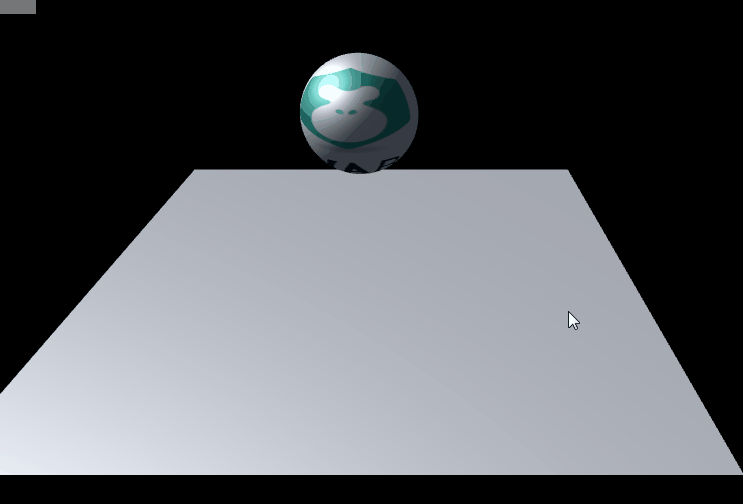
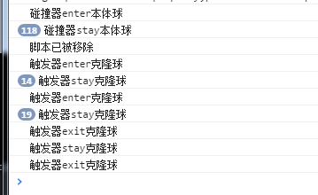

#Trigger and Collider Filter

###Déclencheurs

La portée de collision du déclencheur est la même que celle du collisionneur, mais il peut être pénétré en tant qu 'organe de déclenchement et, en cas de collision, ne déclenche que le procédé ontriggerenter et n' a pas d 'effet de collision physique.

L 'ajout d' une collision ou d 'un déclencheur permet d' entendre un événement de collision ou de déclenchement dans le script et l 'utilisateur doit réécrire le procédé de script3d.

#####Procédé d 'écriture de trigger


```typescript

		/**
         * 当其他碰撞器进入绑定物体碰撞器时触发（子弹进入物品时）
         * 注：如相对移动速度过快，可能直接越过
         */
        override public function onTriggerEnter(other:PhysicsComponent):void{
        }

        /**
         * 当其他碰撞器进入绑定物体碰撞器后逐帧触发（子弹在物品内时）
         * 注：如相对移动速度过快，可能直接越过
         */
        override public function onTriggerStay(other:PhysicsComponent):void{
        }

        /**
         * 当其他碰撞器退出绑定物体碰撞器时逐帧触发（子弹穿出物品时）
         * 注：如相对移动速度过快，可能直接越过
         */
        override public function onTriggerExit(other:PhysicsComponent):void{
        }
```


#####Collisionneur


```typescript

		/**
         * 与触发器相同
         */
        override public function onCollisionEnter(collision:Collision):void{
        }
        override public function onCollisionStay(collision:Collision):void{
        }
        override public function onCollisionExit(collision:Collision):void{
        }
```


Collider and Trigger`Enter`Oui.`stay`Oui.`Exit`Trois méthodes.

Toutefois, à layaair2.0, le collisionneur diffère de l 'événement de collision reçu par le déclencheur.Le déclencheur reçoit des informations sur un autre composant de collision avec lui.L 'événement reçu par le collisionneur est une information de collision physique.

​**Le Code de l 'exemple utilisé ici est modifié sur la base du premier chapitre.**Ajouter une nouvelle catégorie de ballscript, sans changement de catégorie principale

#####Scenescript

​**Des modifications partielles sont apportées à la catégorie scenescript.**


```typescript

import { BallScript } from "./BallScript";
export default  class SceneScript extends Laya.Script3D{
        constructor(){
            super();
        }

        onAwake(){
            this.scene = this.owner;
        }
    
        onStart(){
            var camera = this.scene.addChild(new Laya.Camera( 0, 0.1, 100));

            camera.transform.translate(new Laya.Vector3(1, 6, 10));
            camera.transform.rotate(new Laya.Vector3( -30, 0, 0), true, false);
            camera.clearColor = null;
            
			var directionLight = this.scene.addChild(new Laya.DirectionLight());
            directionLight.diffuseColor = new Laya.Vector3(0.6, 0.6, 0.6);
            directionLight.transform.worldMatrix.setForward(new Laya.Vector3(1, -1, 0));


            //添加自定义模型
            var sphere= this.scene.addChild(new Laya.MeshSprite3D(new Laya.SphereMesh(1,100,100)));
            sphere.transform.rotate(new Laya.Vector3(0,90,0),false,false);
			sphere.transform.translate(new Laya.Vector3(0,3,0));
            var material = new Laya.BlinnPhongMaterial();
            Laya.Texture2D.load("res/layabox.png", Laya.Handler.create(null, function(tex) {
                material.albedoTexture = tex;
            }));
            sphere.meshRenderer.material = material;
            
			//添加物理组件
			sphere.addComponent(Laya.PhysicsCollider);
			//给球添加刚体
			var rigid = sphere.addComponent(Laya.Rigidbody3D);
			//有刚体的shape要加在刚体上
			rigid.colliderShape = new Laya.SphereColliderShape(1);
            //添加一个重量
            rigid.mass = 10;
            //给球添加弹力
            rigid.restitution = 1;
            // 给球添加滚动摩擦力
            rigid.rollingFriction = 0.5;
            //给球添加脚本
            sphere.addComponent(BallScript);
            //给球一个名字 方便识别
            sphere.name = "本体球";

			//添加一个地板
			var floor = this.scene.addChild(new Laya.MeshSprite3D(new Laya.PlaneMesh(10,10)));
			//给地板添加物理组件
            var floorCollicar = floor.addComponent(Laya.PhysicsCollider);
			// 添加collidershape
			floorCollicar.colliderShape = new Laya.BoxColliderShape(10,0,10);
            //监听一次舞台mousedown事件
            Laya.stage.once(Laya.Event.MOUSE_DOWN,this,this.cloneBall,[sphere]);
        }
        /**
         * 点击克隆球体
         */
         cloneBall(sphere){
                //一秒之后复制一个球
                 var cloneSphere = Laya.Sprite3D.instantiate(sphere);
                //获取母体球的脚本
                var sphereScript = sphere.getComponent(BallScript);
                //销毁掉之前加上去的脚本
                sphereScript.destroy();
                //设置位置偏移
                 cloneSphere.transform.translate(new Laya.Vector3(1,4,0));
                //添加到场景
                this.scene.addChild(cloneSphere);
                //获取克隆球的刚体
                var rigid = cloneSphere.getComponent(Laya.Rigidbody3D);
                //设置为触发器
                rigid.isTrigger = true;
                //给个名字方便识别
                cloneSphere.name = "克隆球";
        }
    }  


```


#####Ballscript


```typescript

export class BallScript extends Laya.Script3D{
       constructor(){
           super();
       }

        /**
         * 当其他碰撞器进入绑定物体碰撞器时触发（子弹进入物品时）
         * 注：如相对移动速度过快，可能直接越过
         */
        onTriggerEnter(other){
            console.log("触发器enter" + this.owner.name);
        }

        /**
         * 当其他碰撞器进入绑定物体碰撞器后逐帧触发（子弹在物品内时）
         * 注：如相对移动速度过快，可能直接越过
         */
        onTriggerStay(other){
            console.log("触发器stay" + this.owner.name );
        }

        /**
         * 当其他碰撞器退出绑定物体碰撞器时逐帧触发（子弹穿出物品时）
         * 注：如相对移动速度过快，可能直接越过
         */
        onTriggerExit(other){
            console.log("触发器exit" + this.owner.name);
        }

        /**
         * 与触发器相同
         */
        onCollisionEnter(collision){
            console.log("碰撞器enter" + this.owner.name);
        }
        onCollisionStay(collision){
            console.log("碰撞器stay" + this.owner.name );
        }
        onCollisionExit(collision){
            console.log("碰撞器exit" + this.owner.name);
        }

        onDisable(){
            console.log("脚本已被移除");
        }
    }   

```

Regardez l'effet:



Confirmez la sortie à la console.



###Filtres d'impact

Dans la pratique, il est impossible que tous les objets entrent en collision avec n 'importe quel autre objet, comme les balles tirées par le protagoniste lui - même et qui ne sont pas autorisées par lui - même, ou pour les membres de l' équipe, il faut utiliser un filtre pour définir les groupes qui peuvent entrer en collision et ceux qui ne peuvent pas entrer en collision.


```typescript

......
//给球一个名字 方便识别
sphere.name = "本体球";
//给本体球添加碰撞组
rigid.collisionGroup = Laya.Physics3DUtils.COLLISIONFILTERGROUP_CUSTOMFILTER2;
......
//给地板添加可以碰撞的组
floorCollicar.canCollideWith = Laya.Physics3DUtils.COLLISIONFILTERGROUP_CUSTOMFILTER2;
.....

//cloneBall方法内     
//给个名字方便识别
cloneSphere.name = "克隆球";
//给克隆球添加碰撞组
rigid.collisionGroup = Laya.Physics3DUtils.COLLISIONFILTERGROUP_CUSTOMFILTER1;
......
```


Dans le cas du développement physique, il y a également une demande, par exemple pour pouvoir entrer en collision avec un groupe autre que celui qui a été créé.Il faut passer.**Contre - attaquer**Calcule le groupe qui peut entrer en collision.

On trouvera ci - après un segment de code plus simple ou basé sur les éléments ci - dessus.


```typescript

......
//给球一个名字 方便识别
sphere.name = "本体球";
//给本体球添加碰撞组
rigid.collisionGroup = Laya.Physics3DUtils.COLLISIONFILTERGROUP_CUSTOMFILTER2;
......
//给地板添加可以碰撞的组
floorCollicar.collisionGroup = Laya.Physics3DUtils.COLLISIONFILTERGROUP_CUSTOMFILTER2;
.....

//cloneBall方法内     
//给个名字方便识别
cloneSphere.name = "克隆球";
//给克隆球添加碰撞组
        rigid.canCollideWith = Laya.Physics3DUtils.COLLISIONFILTERGROUP_ALLFILTER^ Laya.Physics3DUtils.COLLISIONFILTERGROUP_CUSTOMFILTER1;

......
```


​**S'il faut encore enlever une équipe d'impact, il faut continuer à prendre l'envers.**


```typescript

	rigid.canCollideWith = Laya.Physics3DUtils.COLLISIONFILTERGROUP_ALLFILTER ^  Laya.Physics3DUtils.COLLISIONFILTERGROUP_CUSTOMFILTER1 ^ Laya.Physics3DUtils.COLLISIONFILTERGROUP_CUSTOMFILTER2;
```


