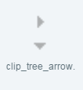
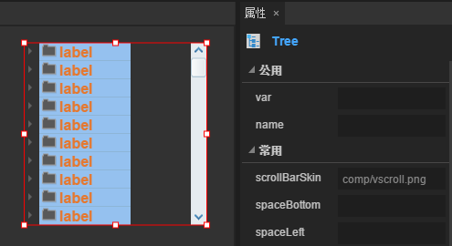
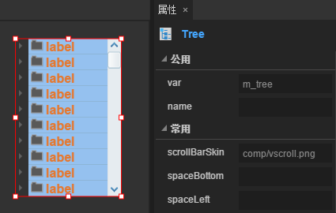

#Références de composants Tree


##Création d 'un composant Tree par layaairide

L 'ensemble Tree est utilisé pour afficher la structure arborescente.L 'utilisateur peut visualiser les données structurelles hiérarchiques classées comme arbres extensibles.
L 'interface de script du module Tree peut être consultée[Tree API](http://layaair.ldc.layabox.com/api/index.html?category=Core&class=laya.ui.Tree)".


 


###1.1 Le module Tree comprend deux éléments principaux:

##- cellules d 'entrée (Box, page view, page personnalisée);Barre de défilement longitudinale vscrollbar;


###1.2 Les cellules du module Tree comprennent normalement quatre éléments:

##- un clip animé à l 'état sélectionné d' une cellule;Une flèche pliante découpe clip animé;
##- un clip animé à l'état de fichier;Autres éléments de contenu des cellules;


###1.3 exemples de ressources d 'image pour le module Tree

Ressources clip d 'animation en tranches d' état sélectionnées des cellules:
Le nombre de tranches est de 2 et l 'index de tranches est représenté successivement à partir de 0: les cellules ne sont pas sélectionnées dans la carte d' état, dans la cellule ou dans la carte d 'état de suspension.
​< br / >
Graphique
Ressources clip animées en flèches pliantes:
Le nombre de tranches est de 2 et l 'index de tranches représente l' état de pliage du noeud du dossier, l 'état de déploiement du noeud du dossier.

   ​        < br / >
Graphique
Ressources clip animées à l'état de fichier:
Si le nombre de tranches est de 3, l 'index de tranches représente l' état de pliage du noeud du dossier, l 'état de déploiement du noeud du dossier et l' état du noeud du dossier non documentaire à partir de 0;
Si le nombre de tranches est de 2, l 'index de tranches représente l' état du noeud du dossier à partir de 0, l 'état du noeud non - dossier à partir de 0;
​< br / >
Graphique


###1.4 création de composants Tree


 ####Édition des entrées de liste du module tree.

Les entrées de liste peuvent être du type box, du type View (page) ou du type de page personnalisé.Ici, par exemple, le type box.
Note: l 'alinéa 6.A.1.a.1 ne vise pas les « logiciels » spécialement conçus ou modifiés pour le « développement » ou la « production » des équipements visés à l' alinéa 6.a.1.a.1.a.2.
   *Remarque: la valeur d 'attribut name d' un objet d 'animation à tranches d' état sélectionnées (ensemble clip) doit être définie comme selectbox pour que le programme puisse l 'identifier et réaliser une fonction qui modifie l' état d 'affichage de l' objet clip en fonction de l 'état sélectionné de l' élément d 'unité, faute de quoi la paire clip sera identifiée comme un objet d' affichage ordinaire de l 'unité.*

​< br / >
Graphique


B. l 'animation de tranches de flèches pliantes (module clip) sélectionnée et traînée à partir d' une cellule dans un panneau de ressources, avec une valeur d 'attribut de nom Arrow pour l' objet de l 'ensemble clip et une valeur clipy d' attribut de 2;
   *Remarque: la valeur d 'attribut name de l' animation à flèche pliante (ensemble clip) doit être définie comme Arrow pour que le programme puisse l 'identifier et réaliser la fonction consistant à cliquer sur l' objet clip pour ouvrir ou plier le noeud arborescent.Sinon, l 'objet clip sera identifié comme l' objet d 'affichage ordinaire de l' élément.*
​< br / >
Graphique
C. une animation à tranches d 'état de fichier (module clip) sélectionnée et traînée à partir d' un panneau de ressources pour définir une valeur d 'attribut name de l' objet de l 'ensemble clip comme folder et une valeur clipy d' attribut égale à 3;
   *Remarque: la valeur d 'attribut name de l' animation d 'état de fichier (module clip) doit être définie comme folder pour que le programme puisse l' identifier et réaliser la fonction de l 'état d' affichage de l 'objet de l' ensemble clip, telle que modifiée par le type de noeud (avec ou sans Byte) de l 'élément d' unité.Sinon, l 'objet clip sera identifié comme l' objet d 'affichage ordinaire de l' élément.*
​< br / >
Graphique

D. objets d 'affichage ordinaires glissés dans cet élément.
Dans le cas de label, sélectionnez et faites glisser un objet de composant label depuis le panneau de ressources, et Définissez ici une valeur de nom d 'attribut pour cet objet label afin de faciliter son attribution dans le script, cette valeur d' attribut de nom pouvant être personnalisée.Définissez à nouveau l 'objet label pour afficher les attributs pertinents afin qu' il soit plus beau.


​        < br / >
Graphique
E) Sélectionner tous les objets composant sélectionnés ci - dessus en utilisant des raccourcis claviers Ctrl + B ou en sélectionnant * * \ \ barres de menu - > Éditer - > convertir en emballages ***Sélectionnez le type de récipient box, puis cliquez sur le bouton de détermination pour compléter l 'ajout du récipient box.****
​< br / >
Graphique

​

####Conversion en conteneurs tree.
****Sélectionnez les objets de rendu de la liste, en utilisant les raccourcis claviers Ctrl + B ou en sélectionnant**La barre de menu - > Édition > convertit en emballage * *, ouvre le panneau de réglage du conteneur, sélectionne le type de conteneur Tree, puis clique sur le bouton de détermination pour compléter l 'ajout du conteneur tree.
​< br / >
Graphique

####Spécifie les éléments de rendu de la liste pour le module tree.
Double - cliquez sur l 'objet du composant Tree, entrez dans l' objet Tree pour l 'éditer, et définissez le nom de propriété de l' élément de rendu de liste du composant Tree pour la valeur de render.
   *Remarque & ‧‧;: la valeur du nom de l 'attribut de rendu dans la liste doit être render, faute de quoi le programme ne sera pas identifiable.*

   ​        < br / >
Graphique

####Ajouter une barre de défilement pour le module tree.
Sélectionnez un composant vscrollbar à partir du panneau de ressources et définissez l 'adresse de ressource (valeur d' attribut Skin) de l 'ensemble vscrollbar comme la valeur de scrollbarskin de l' attribut tree.
​< br / >
Graphique

####Ajustement de la largeur de tree.
Définit la valeur de l 'attribut var (nom de référence global) de l' objet Tree comme m 'u Tree, ce nom pouvant être personnalisé de manière à attribuer une valeur à l' objet Tree dans le script.

​           < br / >
Graphique

####Attribution d'une valeur à l'objet Tree dans le Code


```javascript

var xmlString = "<data>"+
                        "<dir label='box1' isOpen='true'>"+
                            "<file label='child1 ' isOpen='true'/>"+
                            "<file label='child2 ' isOpen='true'/>"+
                            "<file label='child3 ' isOpen='true'/>"+
                            "<file label='child4 ' isOpen='true'/>"+
                            "<file label='child5 ' isOpen='true'/>"+
                        "</dir>"+
                        "<dir label='box2' isOpen='true'>"+
                            "<file label='child1 ' isOpen='true'/>"+
                            "<file label='child2 ' isOpen='true'/>"+
                            "<file label='child3 ' isOpen='true'/>"+
                            "<file label='child4 ' isOpen='true'/>"+
                            "<file label='child5 ' isOpen='true'/>"+
                        "</dir>"+
  					"</data>";
//解析xml字符。 
var xml = domParser.parseFromString(xmlString, "text/xml");
//设置 m_tree 的数据源。
m_tree.xml =xml;
```

####Exécution des tâches de vérification dans le cadre du processus.

​< br / >
Graphique

###1.5 propriétés courantes des composants Tree

​< br / >
Graphique

- 124.**Attribut**- 124.**Description fonctionnelle**- 124.
124 ---------------------------------------------------------------------------------------------
124. Roule sur la peau.- 124.
La distance entre chacun de ces objets.L 'unité est un pixel.- 124.
124. Distance de retrait à gauche.L 'unité est un pixel.- 124.


##Création d 'un composant Tree par Code

Lorsque nous procédons à l 'écriture, nous ne pouvons pas forcément contrôler l' ui par le Code, créer les ui \ \ u Tree, importer dans le Code`laya.ui.Tree`Et définit les propriétés associées à Tree par l 'intermédiaire du Code.

**Exécution de l 'exemple:**
​< br / >
Figure 5 création de Tree par Code

Les autres attributs de Tree peuvent également être définis par un code qui montre comment créer une peau différente (style) par un code.

Les lecteurs intéressés peuvent paramétrer Tree par leur propre code et créer des dossiers adaptés à leurs besoins.

**Exemple:**


```javascript

(function()
{

     var Box = Laya.Box;
     var Clip = Laya.Clip;
     var Label = Laya.Label;
     var Utils = Laya.Utils;
     // 此类对应的json对象：
     // {"child": [{"type": "Clip", "props": {"x": "13", "y": "0", "left": "12", "height": "24", "name": "selectBox", "skin": "ui/clip_selectBox.png", "right": "0", "clipY": "2"}}, {"type": "Clip", "props": {"y": "4", "x": "14", "name": "folder", "clipX": "1", "skin": "ui/clip_tree_folder.png", "clipY": "3"}}, {"type": "Label", "props": {"y": "1", "text": "treeItem", "width": "150", "left": "33", "height": "22", "name": "label", "color": "#ffff00", "right": "0", "x": "33"}}, {"type": "Clip", "props": {"x": "0", "name": "arrow", "y": "5", "skin": "ui/clip_tree_arrow.png", "clipY": "2"}}], "type": "Box", "props": {"name": "render", "right": "0", "left": "0"}};
     function Item()
     {
          Item.__super.call(this);

          this.right = 0;
          this.left = 0;

          var selectBox = new Clip("../../res/ui/tree/clip_selectBox.png", 1, 2);
          selectBox.name = "selectBox"; //设置 selectBox 的name 为“selectBox”时，将被识别为树结构的项的背景。2帧：悬停时背景、选中时背景。  
          selectBox.height = 32;
          selectBox.x = 13;
          selectBox.left = 12;
          this.addChild(selectBox);

          var folder = new Clip("../../res/ui/tree/clip_tree_folder.png", 1, 3);
          folder.name = "folder"; //设置 folder 的name 为“folder”时，将被识别为树结构的文件夹开启状态图表。2帧：折叠状态、打开状态。
          folder.x = 14;
          folder.y = 4;
          this.addChild(folder);

          var label = new Label("treeItem");
          label.name = "label"; //设置 label 的name 为“label”时，此值将用于树结构数据赋值。
          label.fontSize = 20;
          label.color = "#FFFFFF";
          label.padding = "6,0,0,13";
          label.width = 150;
          label.height = 30;
          label.x = 33;
          label.y = 1;
          label.left = 33;
          label.right = 0;
          this.addChild(label);

          var arrow = new Clip("../../res/ui/tree/clip_tree_arrow.png", 1, 2);
          arrow.name = "arrow"; //设置 arrow 的name 为“arrow”时，将被识别为树结构的文件夹开启状态图表。2帧：折叠状态、打开状态。
          arrow.x = 0;
          arrow.y = 5;
          this.addChild(arrow);
     }
     Laya.class(Item, "Item", Box);


     var Stage = Laya.Stage;
     var Tree = Laya.Tree;
     var Browser = Laya.Browser;
     var Handler = Laya.Handler;
     var WebGL = Laya.WebGL;

     (function()
     {
          // 不支持WebGL时自动切换至Canvas
          Laya.init(550, 400, WebGL);

          Laya.stage.alignV = Stage.ALIGN_MIDDLE;
          Laya.stage.alignH = Stage.ALIGN_CENTER;

          Laya.stage.scaleMode = Stage.SCALE_SHOWALL;
          Laya.stage.bgColor = "#232628";

          var res = [
               "../../res/ui/vscroll.png",
               "../../res/ui/vscroll$bar.png",
               "../../res/ui/vscroll$down.png",
               "../../res/ui/vscroll$up.png",
               "../../res/ui/tree/clip_selectBox.png",
               "../../res/ui/tree/clip_tree_folder.png",
               "../../res/ui/tree/clip_tree_arrow.png"
          ];

          Laya.loader.load(res, new Handler(this, onLoadComplete));
     })();


     function onLoadComplete()
     {
          // 组装tree的数据
          var treeData = "<data>";
          for (var i = 0; i < 5; ++i)
          {
               treeData += "<item label='Directory " + (i + 1) + "' isOpen='true'>";
               for (var j = 0; j < 5; ++j)
               {
                    treeData += "<leaf label='File " + (j + 1) + "'/>";
               }
               treeData += "</item>";
          }
          treeData += "</data>";
          // 解析tree的数据
          var xml = Utils.parseXMLFromString(treeData);

          var tree = new Tree();
          tree.scrollBarSkin = "../../res/ui/vscroll.png";
          tree.itemRender = Item;
          tree.xml = xml;
          tree.size(300, 300);
          tree.x = (Laya.stage.width - tree.width) / 2;
          tree.y = (Laya.stage.height - tree.height) / 2;
          Laya.stage.addChild(tree);
     }
})();
```


 