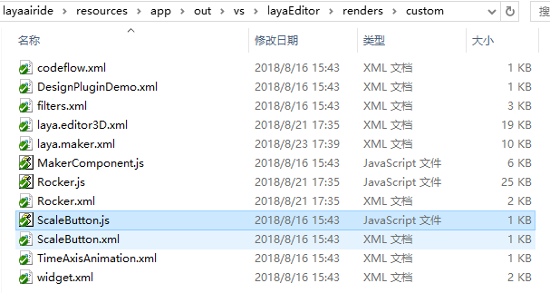
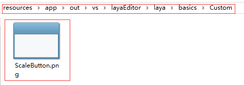
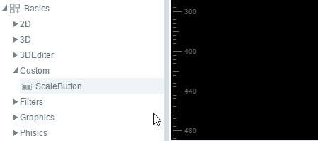
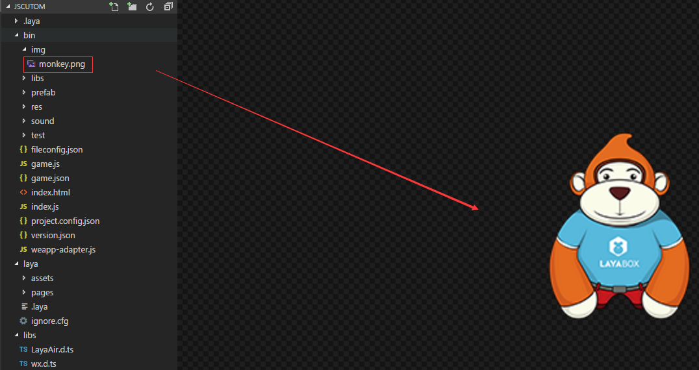
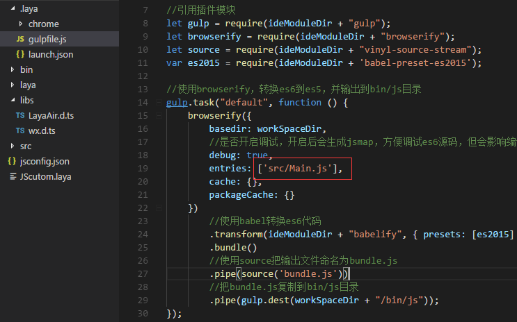

#Fabrication et utilisation de composants personnalisés

Le layaair - IDE fournit de nombreux composants ui communs pour répondre aux besoins fondamentaux, mais les développeurs en développement ont souvent besoin de composants ui personnalisés pour répondre à leurs besoins particuliers.Layaair fournit une interface pour un composant personnalisé que l 'développeur peut modifier ou ajouter en fonction des besoins et que le nouveau composant peut être identifié et utilisé par layaairide.Cet article donne un exemple de la manière d 'ajouter un nouveau composant et de l' utiliser dans layaairide.


##Comprendre la structure et les règles des composants

###1.1 structure du Répertoire des composants

Le catalogue des composants se trouve dans le catalogue des racines de layaairide.Comme le montre la figure 1:


(Figure 1)

**Présentation de la structure du Répertoire des composants**- Oui.

"Custom": Ce répertoire est utilisé pour stocker les fichiers JS et XML des composants personnalisés;

« laya.editorui.js »: Code de réalisation fonctionnelle pour les composants à bande libre layaairide;

« laya.editorui.xml »: informations sur la configuration des composants de la bande autonome layaairide;

###1.2 Description des informations de configuration XML des composants

Un composant complet comprend deux parties: JS et XML, dans lesquelles JS est une partie de mise en oeuvre fonctionnelle du composant et XML une partie d 'affichage et d' appel du composant dans l 'IDE, comprenant un nom de ressource d' image du composant (qui distingue la taille de l 'écriture), des Options de panneau d' attribut et des valeurs par défaut.

On trouvera ci - après l'exemple de l'ensemble textarea de laya.editorui.xml:


```xml

<TextArea className="laya.editorUI.TextArea" inherit="TextInput" defaultValue="text='TextArea'" skinLabel="skin" resName="area" icon="TextArea" groups="公用,常用,宽高及位置,旋转及缩放" drag="3">
	<prop name="vScrollBarSkin" tips="垂直滚动条皮肤" type="string" default="" accept="res" group="常用" />
	<prop name="hScrollBarSkin" tips="水平滚动条皮肤" type="string" default="" accept="res" group="常用" />
</TextArea>
```


**Description de composant XML**- Oui.

".`<textarea></textarea>`": textarea marque le début et la fin du composant.Le nom de textarea peut être différent de la catégorie, mais il est facile de comprendre la mémoire pour l 'affichage du nom du composant dans l' IDE;

".`classsName`": le trajet complet du composant, tel que laya.editorui.textarea;

".`inherit`« les pères hérités;

".`defaultValue`": la valeur par défaut des propriétés du composant;

".`skinLabel`": pour les paramètres de corrélation skin dans le panneau d 'attributs.Les valeurs de skinlabel correspondent aux champs name de prop et aux paramètres associés, et si aucun paramètre n 'est prévu dans le prop, aucun paramètre n' est prévu dans l 'ensemble textarea;

".`resName`"Un préfixe de ressource de composant (taille différenciée) dont la ressource est identifiée comme constituant l 'ensemble; une zone de configuration de textarea est un modèle d' abréviation de textarea qui apparaît sur le panneau de composant de l 'IDE.Pour ce qui est de la nomenclature des composants, on peut consulter le document des règles de nomenclature des ressources des composants sur la base des composants IDE;

".`icon`"Le nom de l'icône (qui distingue la taille de l'icône), le catalogue de l'icône se trouve dans le Répertoire racine de layaairide, où l'on peut créer une nouvelle icône icon ou où plusieurs composants peuvent utiliser une icône en commun.Par exemple: textarea correspondra à textarea.ping dans le répertoire Component

".`groups`": affichage de paquets pour le panneau d 'attributs, séparé par une virgule;

".`drag`« paramètres d 'alignement d' étirage: 1: il y a deux points qui ne peuvent être étirés que de manière transversale, tels que l 'ensemble hscroll; 2: il n' y a que deux points qui peuvent être étirés verticalement, tels que l 'ensemble vscroll; 3: il y a huit points qui peuvent être étirés horizontalement, verticalement, agrandis et rétrécis;

".`<prop>`"Prop est un paramètre d 'attributs dans le panneau d' attributs et chaque marque prop correspond aux propriétés d 'un composant;</prop>

".`name`": le nom de l 'attribut est affiché sur le panneau d' attribut;

".`tips`": la souris s' arrête sur les informations d 'avertissement tips affichées sur le nom de propriété;

".`type`": type de valeur de propriété dans la zone de saisie;

".`default`": la valeur par défaut de cette propriété;

".`accept`": Cette propriété reçoit les valeurs res et files.Res représente la barre d 'attributs qui peut être glissée dans une ressource unique; Files représente la barre d' attributs qui peut être glissée dans une pluralité de ressources;

".`group`": le Sous - groupe dans lequel cette propriété est située; le Sous - groupe correspondant dans les groupes n'existe pas et appartient à d '" autres ";


##Import de la Banque de composants layaairide

###2.1 téléchargement de la Bibliothèque des composants layaairide (version JS du présent article)

**Down address**- Oui.[https://layabox.github.io/layaair-doc/resources/2D/Component/layaeditor.d.zip](https://layabox.github.io/layaair-doc/resources/2D/Component/layaeditor.d.zip)

*Les versions ts et JS peuvent utiliser la même bibliothèque de composants*

###2.2 créer un projet et l 'importer dans son catalogue

Pour créer un projet JS, utilisez layaairide (pour le projet de création, voir le Programme d 'enseignement pertinent, ce chapitre n' est plus détaillé).Le paquet zip téléchargé est alors d écompressé et les fichiers layaeditor.d.ts sont placés sous le catalogue de libras.Comme le montre la figure 2:


(Figure 2)


##Fabrication d 'un composant personnalisé

###3.1 Création d'une catégorie de composants

Créer un catalogue de composants (paquets) "Laya / customui" pour faciliter la classification des autres composants futurs, puis créer un type de bouton scalebutton.js sous le catalogue customui, comme le montre la figure 3:


(Figure 3)

Une fois la création terminée, nous avons commencé à élaborer le code suivant pour les modules de zoom:


```javascript


    export default class ScaleButton extends laya.editorUI.Button {
        constructor(skin,label=""){
           
            super(skin, label);
            /* 设置按钮为单态按钮
            ** 取值：
            ** 1：单态。图片不做切割，按钮的皮肤状态只有一种。
            ** 2：两态。图片将以竖直方向被等比切割为2部分，从上向下，依次为弹起状态皮肤、按下和经过及选中状态皮肤。
            ** 3：三态。图片将以竖直方向被等比切割为2部分，从上向下，依次为弹起状态皮肤、经过状态皮肤、按下和选中状态皮肤
            */
            this.stateNum = 1;
            //添加鼠标按下事件侦听。按时时缩小按钮。
            this.on(Laya.Event.MOUSE_DOWN, this, this.scaleSmall);
            //添加鼠标抬起事件侦听。抬起时还原按钮。
            this.on(Laya.Event.MOUSE_UP, this, this.scaleBig);
            //添加鼠标离开事件侦听。离开时还原按钮。
            this.on(Laya.Event.MOUSE_OUT, this, this.scaleBig);
        }
        scaleSmall(){
            //缩小至0.8的缓动效果
            Laya.Tween.to(this, {scaleX:0.8, scaleY: 0.8}, 100);
        }
        scaleBig(){
            //变大还原的缓动效果
            Laya.Tween.to(this, {scaleX:1, scaleY:1}, 100);
        }
    }

```


###3.2 Établissement des fichiers de configuration XML des composants

Selon la description de configuration XML mentionnée ci - dessus, nous avons achevé la configuration XML de ce bouton de zoom, même si le module personnalisé a été fabriqué.Les informations de configuration XML du bouton de zoom sont établies comme suit:


```xml

<?xml version="1.0" encoding="utf-8" ?>
<uiComp>
	<ScaleButton className="laya.customUI.ScaleButton" runClass="laya.customUI.ScaleButton"  inherit="Button" skinLabel="skin" 
	defaultValue="label=''" resName="sbtn" icon="sbtn" groups="公用，常用，宽高及位置" drag="3">
		<prop name="scaleTime" tips="缩放使用的时间" type="number" default="100" group="常用" />
	</ScaleButton>
</uiComp>
```


*Le contenu des informations de configuration Tips: XML est expliqué par référence à la description XML du composant ci - dessus.*


##Ajout et utilisation de composants personnalisés

###4.1 catalogue de composants personnalisés ajoutant des composants à l 'IDE

Une fois les fichiers de configuration XML établis, le nom du composant XML doit correspondre à celui du composant JS, où nous sommes appelés scalebutton.xml.Ensuite, nous copierons la version écrite de scalebutton.js (sous le catalogue des racines du projet / src / Laya / customui, voir la figure 3) dans le catalogue des composants personnalisés.Comme le montre la figure 4:


(Figure 4)


###4.2 affichage sur le panneau de composant IDE

Ouvre le catalogue des composants de l'IDE (catalogue des composants de l'IDE) pour créer un répertoire des composants personnalisés, Custom, pour stocker les composants de l'autodéfinition, comme le montre la figure 5.


(Figure 5)

Une icône PNG nommée sbtn (taille suggérée 16 * 16) est ensuite insérée dans le catalogue Custom, ce qui permet, comme le montre la figure 6, de trouver l 'ensemble Bouton d' agrandissement que nous avons créé nous - mêmes dans le panneau de composants de l 'IDE.


(Figure 6) icône pour nommer les valeurs des attributs resname dans le composant XML


Figure 7 nom de composant de l 'IDE

**Tips:**Rappelez - vous que les icônes icon du composant ne sont pas des abréviations dans le catalogue.L'icône icon se trouve dans le catalogue des "ressources" sous le catalogue racine de layaairide, correspondant à la valeur de l'attribut de icon XML, décrite dans la note XML ci - dessus.Si vous créez votre propre icône icon, faites - le par référence à l 'identification de la taille de l' icon dans le répertoire Components et placez - le dans le répertoire Components, puis définissez le nom de fichier correspondant dans le XML.


###4.3 affichage sur le tableau de ressources IDE

Dans le panneau de ressources, une ressource skin d 'un composant ui commun est placée par défaut dans le fichier Comp, ce qui facilite l' identification de la ressource skin comme composant par l 'application de la règle de désignation du composant (les ressources doivent être stockées sous la rubrique "liste des racines de projet" pour être identifiées comme composant).Contrairement à la valeur skin d 'attribut de composant du panneau de composant, la valeur par défaut de l' attribut de composant du panneau de ressources est un chemin relatif dans le répertoire \ \ Laya \ \ assets.

Afin de faciliter l 'utilisation d' un composant avec une ressource skin pour le projet, nous continuons d 'expliquer comment le composant peut être affiché sur le panneau ressources.Tout d 'abord, nous préparons une ressource skin, puisque le module personnalisé de l' exemple ci - dessus est un bouton d 'agrandissement.Les ressources d 'image sont copiées dans le répertoire des racines de projet, et les ressources d' image s' appellent scalebutton ou préfixe scalebutton comme indiqué à la figure 8.


(Figure 8)

Une fois la copie terminée, nous ouvrirons de nouveau le tableau de gestion des ressources de layaairide, et nous verrons scalebutton \ \ u monkey.png, qui vient d 'être reproduit, en cliquant sur l' image, et nous verrons un aperçu de l 'image.L 'ajout réussi d' un module personnalisé avec une valeur par défaut skin au tableau de gestion des ressources du projet, comme le montre la figure 9.


(Figure 9)

　　*Les composants affichés dans le panneau de ressources ne sont utilisés que pour l 'élément actif et sont ajoutés au panneau de composants pour tous les éléments.*

###4.4 utilisation de composants personnalisés

Crée une page de présentation dans le panneau de gestion de projet (cette page n 'est utilisée que pour la présentation de l' effet du composant, sans description détaillée de l 'étape de fonctionnement), avec deux modes d' utilisation de l 'ensemble bouton de zoom personnalisé.

####4.4.1 utilisation à partir du tableau de ressources

Un composant de préfixe sbtn est trouvé dans le panneau de gestion des ressources, glissé directement sur la page et cliquez pour voir l 'effet d' agrandissement, comme le montre la figure 10.


(Figure 10)

####4.4.2 utilisation des panneaux de composants

Trouve l 'ensemble scalebutton dans le panneau de composant, glisse - le directement sur la page et clique pour voir l' effet de zoom, comme le montre la figure 11.


Figure 11) Les ressources d 'image ne sont pas incluses dans le panneau de composant et doivent être configurées par l' attribut skin


##Mise en service des composants

Sur la base de ce qui précède, nous avons achevé tous les processus de fabrication et d 'utilisation des composants de layaairide.Cependant, dans le processus d 'un composant personnalisé formel, une étape très importante a été franchie pour simplifier le processus et atteindre l' objectif du composant personnalisé le plus rapidement possible, étape qui consiste à ajuster le composant.

Bien qu 'il n' y ait pas de problème avec l 'absence de maillon de débogage, la plupart des gens ne peuvent pas garantir que le codage n' est pas erroné pendant le processus de développement réel.L 'ajout d' un composant erroné à l 'IDE n' aurait pas été aussi facile que dans ce document, et il serait difficile de l 'adapter dans l' IDE.Par conséquent, dans cette sous - section, nous ajoutons les étapes manquantes et, une fois les composants achevés, nous procéderons à la mise à l'essai puis à la compilation sous - traitante.


###5.1 rediffusion d 'images vers les ressources du projet

Copiez une image sous le catalogue des sources / RES / img des ressources du projet, voir la figure 12.


(Figure 12)


###5.2 références de classe pour les composants modifiés

Ouvre le Code de bouton scalebutton.js ci - dessus et modifie le button hérité de ui.Comme le montre la figure 13:


(Figure 13)


###5.3 création d'une catégorie d'entrée

Crée une catégorie d 'entrée main.js sous la rubrique « Liste des racines du projet / src », codée comme suit:


```javascript

import ScaleButton from "./laya/customUI/ScaleButton"
import GameConfig from "./GameConfig";

class Main {
	constructor() {
		//根据IDE设置初始化引擎		
		if (window["Laya3D"]) Laya3D.init(GameConfig.width, GameConfig.height);
		else Laya.init(GameConfig.width, GameConfig.height, Laya["WebGL"]);

	

		Laya["Physics"] && Laya["Physics"].enable();
		Laya["DebugPanel"] && Laya["DebugPanel"].enable();
		Laya.stage.scaleMode = GameConfig.scaleMode;
		Laya.stage.screenMode = GameConfig.screenMode;
		Laya.stage.alignV = GameConfig.alignV;
		Laya.stage.alignH = GameConfig.alignH;

		//打开调试面板（通过IDE设置调试模式，或者url地址增加debug=true参数，均可打开调试面板）
		if (GameConfig.debug || Laya.Utils.getQueryString("debug") == "true") Laya.enableDebugPanel();
		if (GameConfig.stat) Laya.Stat.show();
		Laya.alertGlobalError = true;

		//激活资源版本控制，version.json由IDE发布功能自动生成，如果没有也不影响后续流程
		Laya.ResourceVersion.enable("version.json", Laya.Handler.create(this, this.onVersionLoaded), Laya.ResourceVersion.FILENAME_VERSION);
	}

	onVersionLoaded() {
		//激活大小图映射，加载小图的时候，如果发现小图在大图合集里面，则优先加载大图合集，而不是小图
		Laya.AtlasInfoManager.enable("fileconfig.json", Laya.Handler.create(this, this.onConfigLoaded));
	}

	onConfigLoaded() {
		//加载资源
                     Laya.loader.load("img/monkey.png",Laya.Handler.create(this,this.onLoaded),null,Laya.Loader.IMAGE)

	}
	 onLoaded(){
		var scaleButton = new ScaleButton();
		//组件skin的资源路径
		scaleButton.skin = "img/monkey.png";
		//添加到舞台上
		Laya.stage.addChild(scaleButton);
	}
}
//激活启动类
new Main();

```


Définit main comme démarreur dans le fichier gulpfile.js, comme indiqué à la figure 14.Cliquez ensuite dans le Navigateur pour obtenir un effet d 'agrandissement, comme le montre la figure 15.L 'invention concerne également un composant personnalisé efficace qui peut être ajouté sans problème à l' IDE.


(Figure 14)


(Figure 15)

*N 'oubliez pas de mettre la date de la mise en page.`export default class ScaleButton extends Laya.Button `Il faut aussi`export default class ScaleButton extends laya.editorUI.Button;`".*


##Enregistrement des composants

L 'enregistrement d' un composant est l 'Association d' un composant personnalisé avec un nom de classe, et l 'affichage d' un exemple est effectué selon une carte d 'enregistrement.

**Par exemple:**


```javascript

View.regComponent("ScaleButton",laya.customUI.ScaleButton);//注册组件
```


##Autres annotations

Si le composant personnalisé est un composant de catégorie de récipients et que l 'on doit l' utiliser dans le projet layaair - IDE, il est nécessaire d 'ouvrir le panneau de configuration du projet F9 et d' ajouter un nom de groupe de récipients personnalisé (espacé par une virgule en anglais) dans la liste des récipients, comme le montre la figure 16.


(Figure 16)


Si le composant personnalisé est un composant de classe de page, il est nécessaire d 'ouvrir le panneau de configuration de projet en mode Éditeur du projet layaair et d' ajouter un nom de groupe de pages personnalisé (par espacement de virgule) dans la liste des pages, comme le montre la figure 17.


(Figure 17)


A la fin de l 'article, s' il y a un doute, adressez - vous à la communauté:[http://ask.layabox.com](http://localhost/LayaAir2_Auto/img/http://ask.layabox.com)