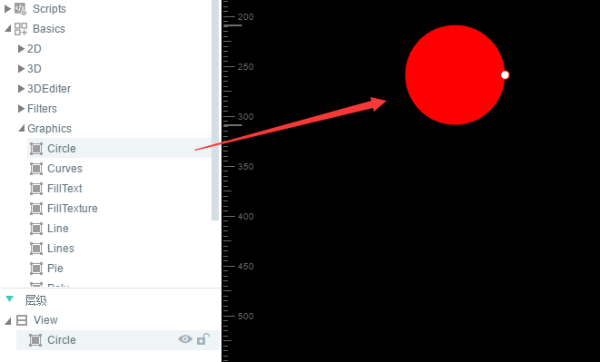
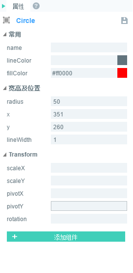
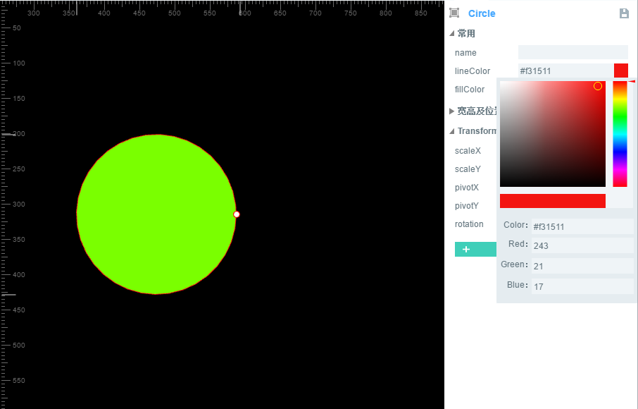

#Dessiner un secteur et un cercle


###Dessiner un cercle

Le dessin circulaire est plus simple à comprendre et peut facilement être réalisé par l 'intermédiaire des coordonnées et rayons du point central circulaire du moteur layaair laya.display.graphics, le « drawcircle () » de l' API.La description détaillée de la méthode est présentée dans la figure ci - après:

​< br / >
(Figure 1)

Nous dessinons ci - après un cercle avec le moteur layaair.


```javascript

module laya {
    import Sprite = Laya.Sprite;
    import Stage = Laya.Stage;
    import WebGL = Laya.WebGL;
  
    export class Sprite_DrawShapes {
        private sp: Sprite;
  
        constructor()
        {
            Laya.init(500, 300, WebGL);
            this.drawSomething();
        }
  
        private drawSomething(): void {
            this.sp = new Sprite();
            Laya.stage.addChild(this.sp);
            //画圆
            this.sp.graphics.drawCircle(80,80,50,"#ff0000");
  
        }
    }
}
new laya.Sprite_DrawShapes();
```


L 'effet de fonctionnement du Code est illustré dans le graphique suivant:

​< br / >
(Figure 2)

Le dessin circulaire est relativement simple et les coordonnées du point central circulaire "80,80"."50 rayons."#F0000 "est la couleur de remplissage circulaire.


###Secteur de dessin

On trouvera ci - après une description plus détaillée de la méthode de dessin sectoriel "drawpie ()", qui est un peu plus complexe que la forme circulaire, comme le montre la figure suivante:

​< br / >
(Figure 3)

Nous dessinons ci - après un secteur avec le moteur layaair.


```typescript

module laya {
    import Sprite = Laya.Sprite;
    import Stage = Laya.Stage;
    import WebGL = Laya.WebGL;
  
    export class Sprite_DrawShapes {
        private sp: Sprite;
  
        constructor()
        {
            Laya.init(500, 300, WebGL);
            this.drawSomething();
        }
  
        private drawSomething(): void {
            this.sp = new Sprite();
            Laya.stage.addChild(this.sp);
            //画圆
            this.sp.graphics.drawPie(80,80,50,90,180,"#ff0000");
  
        }
    }
}
new laya.Sprite_DrawShapes();
```


L 'effet de fonctionnement du Code est illustré dans le graphique suivant:

​< br / >
(Figure 4)
Le secteur de dessin est semblable à celui du cercle, les trois premiers paramètres étant utilisés de la même manière, à l 'exception de l' ajout d 'un angle de début et de fin de dessin.Pour une meilleure compréhension, les codes de dessin et les paramètres du secteur suivent l 'exemple du Code circulaire et, à l' exception de la modification du nom de la méthode, seuls 90 et 180 paramètres angulaires ont été ajoutés.Vous pouvez mieux comprendre en ajustant les paramètres pendant le codage.


###Dessiner le cercle à travers le contrôle de traction layaairide

**Première étape:**Ouvrez notre layaairide, cliquez sur le modèle de conception et créez une nouvelle page view.


​	< br / >
(Figure 5)

**Mesure 2:**Glisser l 'ensemble courbe dans l' ensemble sur la page view, ce qui crée automatiquement un cercle par défaut

​< br / >
(Figure 6)

**Mesure 3:**Modifier (ajouter / réduire) Les valeurs dans les propriétés de l 'ensemble Circle, modifier la taille du cercle, la couleur, le cadre extérieur, etc.

​< br / >
(Figure 7)

​< br / >
(Figure 8)


###Dessiner un secteur par glisser le contrôle de layaairide

**Première étape:**Ouvrez notre layaairide, cliquez sur le modèle de conception et créez une nouvelle page view.

​< br / >
(Figure 9)

**Mesure 2:**Glisser l 'ensemble courbe dans l' ensemble sur la page view, ce qui crée automatiquement un secteur par défaut

​< br / >
(Figure 10)

**Mesure 3:**Modifier (ajouter / réduire) Les valeurs dans les propriétés de l 'ensemble pie, modifier l' angle, la taille, la couleur du secteur, etc.

​< br / >
(Figure 11)

​< br / >
(Figure 12)

C 'est ainsi que nous avons fini de dessiner les secteurs et les cercles par l' intermédiaire de l 'ensemble layaairide.