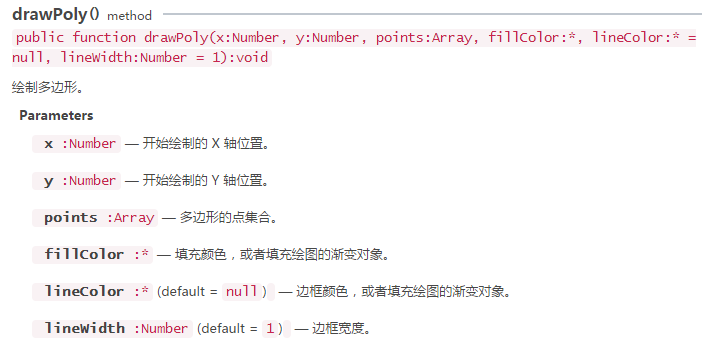
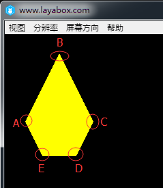
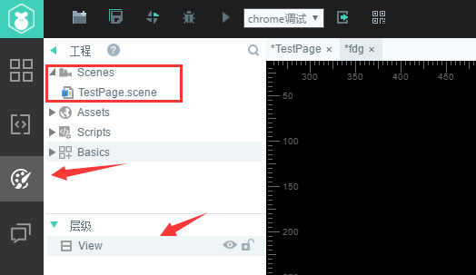
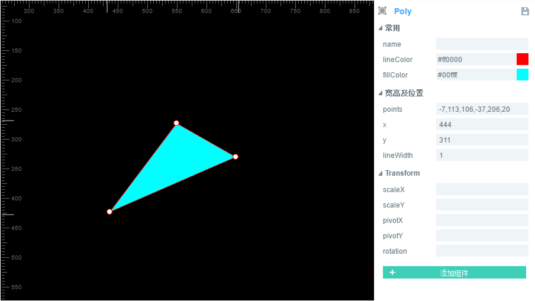

#Dessin d 'un triangle, d' un polygone et d 'un motif de dessin basé sur des données


Pour dessiner un triangle, un polygone et un motif basé sur des données de trajet spécifiées, on peut utiliser la classe laya.display.graphics "drawpoly ()" dans le moteur layaair.La description détaillée de la méthode est présentée dans la figure ci - après:

​< br / >
(Figure 1)


###Dessiner un triangle

Nous allons dessiner un triangle avec le moteur layaair.


```javascript

module laya {
    import Sprite = Laya.Sprite;
    import Stage = Laya.Stage;
  
    export class Sprite_DrawShapes {
        private sp: Sprite;
  
        constructor()
        {
            Laya.init(500, 300);
            this.drawSomething();
        }
  
        private drawSomething(): void {
            this.sp = new Sprite();
            Laya.stage.addChild(this.sp);
            //画三角形
            this.sp.graphics.drawPoly(30, 28, [0, 100, 50, 0, 100, 100], "#ffff00");
  
        }
    }
}
new laya.Sprite_DrawShapes();
```


L 'effet de fonctionnement du Code est illustré dans le graphique suivant:

​< br / >
(Figure 2)

Grâce à ce code, nous pouvons voir que le troisième paramètre de drawpoly "0,100" est le point a."50, 0" est le point B."100, 100" est une coordonnées de point C qui permet de relier les trois coordonnées et de remplir les valeurs de couleur du quatrième paramètre binaire, c 'est - à - dire de dessiner le triangle jaune illustré ci - dessus.Cependant, il convient de noter que toutes les coordonnées du troisième paramètre sont des coordonnées relatives qui sont influencées par le premier et le deuxième paramètre "30,28".Une fois que "30,28" aura été modifié, la position globale de la forme sera affectée.


### **Dessiner un polygone**

Nous continuons d 'utiliser l' exemple du code ci - dessus pour obtenir un dessin polygonal en augmentant les coordonnées du troisième paramètre drawpoly, le Code modifié étant le suivant:


```typescript

//画多边形
this.sp.graphics.drawPoly(30, 28, [0, 100, 50, 0, 100, 100, 75, 150, 25, 150], "#ffff00");
```


L 'effet de fonctionnement du Code est illustré dans le graphique suivant:


​	< br / >
(Figure 3)

Dans le Code modifié, ajouter les coordonnées du point d 75, 150 "et du point E" 25, 150 ".Le polygone que nous voulons est dessiné en reliant chaque point de coordonnées à la couleur de remplissage.Pour dessiner un polygone plus multilatéral, il suffit d 'ajouter des points de coordonnées comme indiqué ci - dessus.


### **Dessiner un motif sur la base des données de trajet spécifiées**

Grâce au triangle et au polygone ci - dessus, nous disposons déjà de l 'utilisation de drawpoly pour la cartographie, et voici un exemple de la manière dont le chemin est désigné pour dessiner un Pentagone.L'exemple est le suivant:


```typescript

module laya {
    import Sprite = Laya.Sprite;
    import Stage = Laya.Stage;
  
    export class Sprite_DrawShapes {
        private sp: Sprite;
  
        constructor()
        {
            Laya.init(500, 300);
            this.drawSomething();
        }
  
        private drawSomething(): void {
            var canvas: Sprite = new Sprite();
            Laya.stage.addChild(canvas);
 
            var path: Array<number> = [];
            path.push(0, -130);//五角星A点坐标
            path.push(33, -33);//五角星B点坐标
            path.push(137, -30);//五角星C点坐标
            path.push(55, 32);//五角星D点坐标
            path.push(85, 130);//五角星E点坐标
            path.push(0, 73);//五角星F点坐标
            path.push(-85, 130);//五角星G点坐标
            path.push(-55, 32);//五角星H点坐标
            path.push(-137, -30);//五角星I点坐标
            path.push(-33, -33);//五角星J点坐标
 
            canvas.graphics.drawPoly(Laya.stage.width / 2, Laya.stage.height / 2, path, "#FF7F50");
      }
    }
}
new laya.Sprite_DrawShapes();
```


L 'effet de fonctionnement du Code est illustré dans le graphique suivant:

​< br / >
(Figure 4)

Par l 'écriture du Code illustratif ci - dessus, la lisibilité du Code sensoriel est - elle améliorée, et vous pouvez également utiliser le triangle ou le polygone antérieur de cette manière pour expérimenter ces bases, ce qui permet d' obtenir un certain nombre d 'applications souples, telles que des données provenant du serveur, etc.


###Dessiner des images irrégulières (y compris des triangles, des polygones) à l 'aide de layaairide


**Première étape:**Ouvrez notre layaairide, cliquez sur le modèle de conception et créez une nouvelle page view.

​< br / >
(Figure 5)

**Mesure 2:**Glisser l 'ensemble courbe dans l' ensemble sur la page View et générer automatiquement un polygone par défaut

​< br / >
(Figure 6)

**Mesure 3:**Modifier (ajouter / réduire) Les valeurs dans les propriétés de l 'ensemble Poly, modifier la taille du polygone, la couleur, etc.

​< br / >
(Figure 7)

​< br / >
Diagramme 8 triangle

​< br / >
Figure 9 polygone irrégulier


Nous avons ainsi terminé de dessiner le polygone à travers l 'ensemble layaairide.