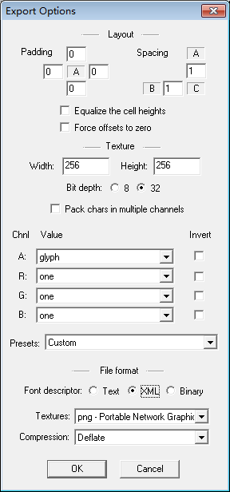
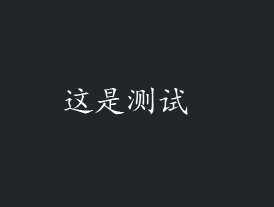
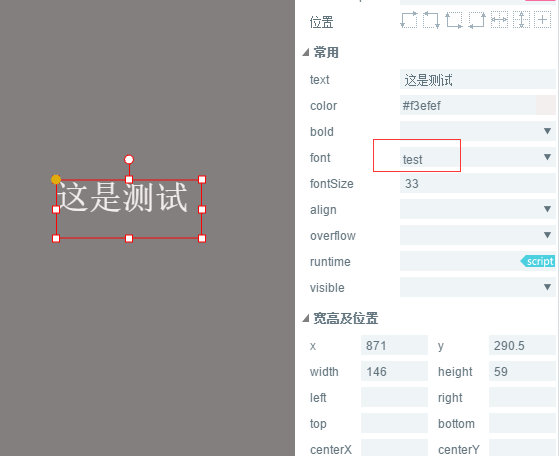

#Production et utilisation de caractères bitmap

Avec Starling ou cocos, voire Unity, les caractères bitmap ne sont certainement pas inconnus.L 'utilisation et l' affichage des caractères bitmap sont également supportés à layaair.Voici l 'effet de l' utilisation des caractères bitmap dans layaair.

###Création de caractères bitmap

Écrivez le texte devant être exporté dans un texte TXT.

< / BR >

Fichier de sélection >

< / BR >

Téléchargement de l'outil de création de caractères bitmap - font - General gratuit sous Windows.
Down Address:[http://www.angelcode.com/products/bmfont/](http://www.angelcode.com/products/bmfont/install_bmfont_1.13.exe)

Ouvrir le logiciel et sélectionner option - > fontsetting pour définir les paramètres habituels de la police à exporter, puis cliquer sur le bouton OK pour enregistrer.

< / BR >

**Principaux paramètres:**

Font: la police de bitmap exportée.
Size: définit la taille de la police à utiliser pour les caractères bitmap exportés.Il est conseillé de définir ici le même nombre de mots qu 'il faut utiliser.
Définit la hauteur d 'étirage de la police et Maintiens le taux de 100% par défaut.
 *Remarque: la valeur de charset est sélectionnée Unicode.*

< / BR >

Dans la barre de menu Edit - > select chars from file, sélectionnez le fichier txt qui vient d'être créé et, en cas d'échec de la suggestion, vérifiez si le fichier txt est un document codé par Unicode et si la police contient des polices dans le texte.

< / BR >

Définir le style d 'exportation, sélectionner les options - > Export > dans la barre de menu, ouvrir les options d' exportation pour les options export, puis cliquer sur le bouton OK pour les enregistrer.

La bordure intérieure du texte ou la taille des espaces autour du texte.Cette propriété est importante dans le style de fin d 'exécution, et il faut réserver de l' espace pour les bords de description, la lumière, etc.Par exemple, il est prévu d 'ajouter une bordure de 2px, puis un effet de projection de 2px dans le coin inférieur droit, ce qui permet de configurer le padding: 2px - 4px - 2px.
Il faut 32, sinon il n 'y a pas de couche transparente.
Les recommandations sont en caractères blancs et peuvent être configurées directement avec Alpha, c 'est - à - dire en fond transparent de caractères blancs.
Font Descriptor: fichier de description de police, sélectionnez XML.
Texture Image Format, sélectionnez pg.

< / BR >

Exporter les caractères bitmap.Options - > sélectionner bitmap font comme..., vous exportez un fichier de description de police (... Format fnt) et un fichier de texture de police (.Png).


###Utilisation de caractères bitmap dans le projet layaair

Placer les ressources sous le catalogue des exportations des projets.
Remplacer le fichier de bitmap produit par le même nom (.Fnt et.png) et le placer au catalogue bin / H5 du projet layaair.

< / BR >

Figure: remplacer le nom de test \ \ u 0.png par le nom de test.png, de sorte que le même nom que le fichier fnt soit garanti.Les fichiers test.ping et test.fnt sont ensuite placés sous H5.

**Méthodes d 'utilisation courantes des caractères bitmap dans le projet layaair:**

Créer des objets de caractères bitmap.

Chargement des caractères bitmap et vérification de leur achèvement.

Caractères bitmap enregistrés.

Utilisation de la police.

Voici l 'effet d' un exemple complet.

< / BR >

Code complet


```typescript

module laya {
    import BitmapFont = Laya.BitmapFont;
    import Stage = Laya.Stage;
    import Text = Laya.Text;
    import Browser = Laya.Browser;
    import Handler = Laya.Handler;
    import WebGL = Laya.WebGL;

    export class Text_BitmapFont {
        private fontName: string = "diyFont";

        constructor()
        {
            // 不支持WebGL时自动切换至Canvas
            Laya.init(Browser.clientWidth, Browser.clientHeight, WebGL);

            Laya.stage.alignV = Stage.ALIGN_MIDDLE;
            Laya.stage.alignH = Stage.ALIGN_CENTER;

            Laya.stage.scaleMode = "showall";
            Laya.stage.bgColor = "#232628";
            this.loadFont();
        }

       private loadFont(): void {
            var bitmapFont: BitmapFont = new BitmapFont();
            bitmapFont.loadFont("test.fnt", new Handler(this, this.onFontLoaded, [bitmapFont]));
        }

        private onFontLoaded(bitmapFont: BitmapFont): void {
            bitmapFont.setSpaceWidth(10);
            Text.registerBitmapFont(this.fontName, bitmapFont);
            this.createText(this.fontName);
        }
        private createText(font: string): void {
            var txt: Text = new Text();
            txt.width = 250;
            txt.wordWrap = true;
            txt.text = "这是测试";
            txt.font = font;
            txt.leading = 5;
            txt.pos(Laya.stage.width - txt.width >> 1, Laya.stage.height - txt.height >> 1);
            Laya.stage.addChild(txt);
        }
    }
}
new laya.Text_BitmapFont();
```


### **Interfaces associées dans la catégorie Text:**

**Méthode registerbitmapfont ()**

Public - static function - registerbitmapfont (name: String, bitmapfont: bitmapfont): void

Enregistrez la police de bitmap.

Paramètres

Nom: String - nom des caractères bitmap.
Bitmapfont: bitmapfont - fichiers de caractères bitmap.

**Méthode unregisterbitmapfont ()**

Public = static = function = unregisterbitmapfont (name: String, destory: Boolean = True): void

Supprime le fichier de police de bitmap enregistré.

Paramètres

Nom: String - nom des caractères bitmap.
Destory: Boolean (default = True) - - destruction des fichiers de police actuels.

###Interfaces pertinentes dans la catégorie bitmapfont:

**Méthode loadfont ()**

Public function loadfont (PATH: String, Complete: Handler): void

Chargez le fichier de police de bitmap en spécifiant le chemin du fichier de police de bitmap.

Paramètres
Path: String - path for bitmap police file.
Complete: Handler - Téléchargez le retour terminé pour informer le fichier de police supérieur que le chargement et l 'analyse sont terminés.

**Procédé de parsefont ()**

Public function parsefont (XML: xmldom, texture: Texture): void

Analyser le fichier de police

Paramètres

XML: xmldom - fichier de police XML.
Texture de la police.

**Méthode de destory ()**

Public function destory (): void

Lorsque l'on appelle text.unregisterbitmapfent, on détruit par défaut les caractères bitmap.

**Méthode setspacewidth**

Public function setspacewidth (spacewidth: Number): void

Définissez la largeur de l 'espace (si la Bibliothèque de polices est vide, il n' y a pas de réglage ici).

Paramètres

Spacewidth: Number - largeur, unité de pixel.


###Utilisation de caractères bitmap dans layaair IDE

Placer les fichiers de police dans le catalogue des ressources du projet layaair - IDE (Laya / assets /) afin de garantir que les deux noms de fichier, tels que test.fnt et test.png, soient identiques, ce qui permet d 'enregistrer automatiquement les caractères bitmap appelés test.

< / BR >

Définit la valeur d 'attribut font de l' ensemble de texte devant être utilisé comme nom de la police bitmap importée dans l 'éditeur.

< / BR >

Avant de mettre en pratique les pages de caractères bitmap dans les codes de programme, il faut créer et enregistrer les caractères bitmap utilisés sur les pages.