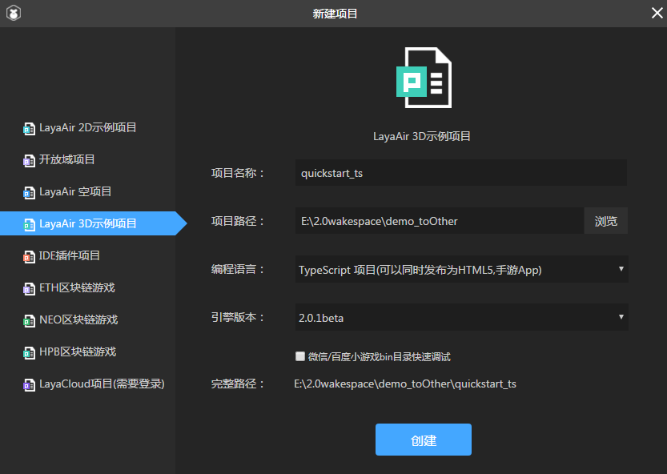

#Démarrage rapide d 'un projet layaair3d

Nous allons démarrer rapidement un projet en 3D avec le moteur layaair et suivre un cours en langue as, avec une démonstration simple du Code moteur pour une application en 3D fondamentale.

##IDE création d 'un exemple 3D

Téléchargement de layaairide et lancement du nouveau projet de sélection 3D, comme le montre la figure.

(Figure 1)

C'est notre choix.**Tavascript**Langue.Créer un modèle 3D pour terminer ce que nous avons trouvé.Les concepteurs de la présentation de la structure du projet peuvent se référer au Programme d'enseignement de la deuxième génération.Il n 'y a pas de répétition.

##Affichage rapide de scénarios 3D

Nous pouvons voir la scène 3D dans laquelle le projet d 'exemple fonctionne.

(Figure 2)

Dans la catégorie Runtime de la page d 'ouverture, gameu.js nous a construit un monde en 3D et a ajouté plusieurs éléments nécessaires à un monde en 3D simple (scènes, caméras, lumières, modèles, matériaux).Le code suivant est extrait de gameu.js.


```typescript

//添加3D场景
var scene: Laya.Scene3D = Laya.stage.addChild(new Laya.Scene3D()) as Laya.Scene3D;

//添加照相机
var camera: Laya.Camera = (scene.addChild(new Laya.Camera(0, 0.1, 100))) as Laya.Camera;
camera.transform.translate(new Laya.Vector3(0, 3, 3));
camera.transform.rotate(new Laya.Vector3(-30, 0, 0), true, false);

//添加方向光
var directionLight: Laya.DirectionLight = scene.addChild(new Laya.DirectionLight()) as Laya.DirectionLight;
directionLight.color = new Laya.Vector3(0.6, 0.6, 0.6);
directionLight.transform.worldMatrix.setForward(new Laya.Vector3(1, -1, 0));

//添加自定义模型
var box: Laya.MeshSprite3D = scene.addChild(new Laya.MeshSprite3D(Laya.PrimitiveMesh.createBox(1, 1, 1))) as Laya.MeshSprite3D;
box.transform.rotate(new Laya.Vector3(0, 45, 0), false, false);
var material: Laya.BlinnPhongMaterial = new Laya.BlinnPhongMaterial();
Laya.Texture2D.load("res/layabox.png", Laya.Handler.create(null, function(tex:Laya.Texture2D) {
    material.albedoTexture = tex;
}));
box.meshRenderer.material = material;
```


##### 	