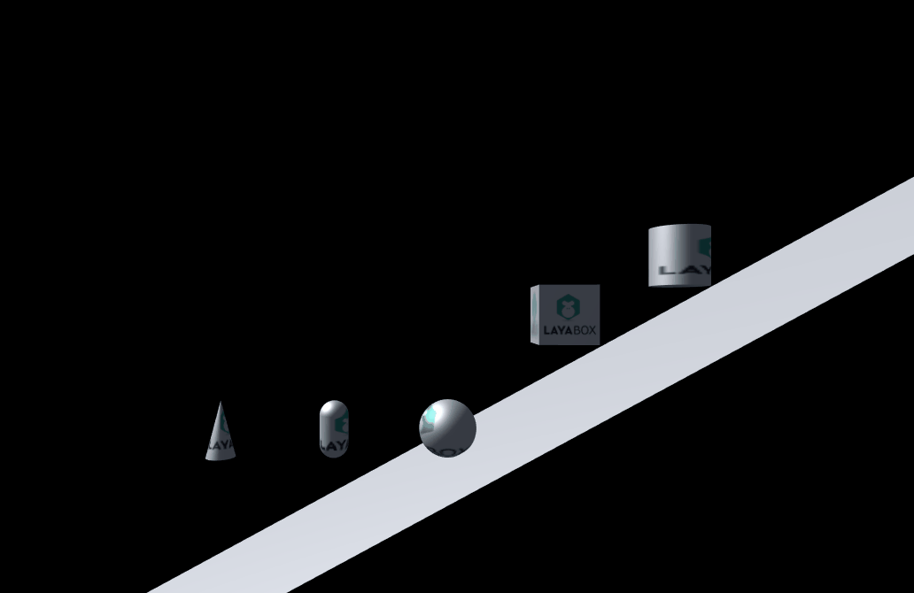

#Collider and Rigid

L 'ajout d' un corps de collision et d 'un corps rigide à l' entrée simple est décrit dans ce chapitre.

2.0 Le collisionneur 3D est physicscollider.Le Corps rigidbody3d est rigidbody3d.

Pour créer une collision, il faut ajouter un rigidbody et un collisionneur à l 'objet de jeu, ce qui permet à l' objet de se déplacer sous l 'effet physique.L 'objet de collision est une catégorie d' éléments physiques qui doivent être ajoutés à l 'objet de jeu avec le corps rigide pour déclencher la collision.En cas de collision entre deux corps rigides, le moteur physique calcule la collision à moins que les deux objets ne soient en collision et, dans la simulation physique, les corps qui n 'ont pas de collision se traversent l' un l 'autre.

Conditions nécessaires à la collision d'un objet: les deux objets doivent être munis d'un collisionneur (physicscollider) et l'un d'eux doit également être muni d'un rigidbody3d.

Collision Box: Collider Shape, is a model Box for Physical operation and collision in 3D World.

###Ajout de collimateurs et de corps rigides

Nous allons d 'abord créer une petite balle simple et ajouter un collisionneur et un rigide à la balle.


```javascript

//新建一个球体模型
var sphere:Laya.MeshSprite3D = this.scene.addChild(new Laya.MeshSprite3D(new SphereMesh(1))) as Laya.MeshSprite3D;
//给球体添加碰撞器
var spherePhy:Laya.PhysicsCollider = sphere.addComponent(Laya.PhysicsCollider);
//新建一个球形的碰撞盒
var sphereShape:SphereColliderShape = new Laya.SphereColliderShape(1)

/* 没有刚体时：
//给碰撞器添加碰撞盒
spherePhy.colliderShape = sphereShape;
*/
//有刚体
 //给球添加刚体
 var sphereRigid:Laya.Rigidbody3D = sphere.addComponent(Laya.Rigidbody3D);
//将碰撞盒添加到刚体上
shpereRigid.colliderShape = sphereShape;
```

Différents modèles sont simplement nécessaires pour créer des Mess et collidershape différents.**Attention à ne pas ajouter de shape sur un corps rigide et un collisionneur en même temps.**Le diagramme suivant est l 'effet de la balle.


###Cas simples

Après avoir appris à ajouter un collisionneur et un rigide, on peut créer une scène simple pour tester cette partie de la fonction.

Pour synchroniser la collision avec l 'affichage, il faut un modèle identique à la boîte de collision.

#####Catégorie principale:


```javascript

import GameConfig from "./GameConfig";
import SceneScript from "./script/SceneScript"; 
class Main {
         constructor() {
            //初始化引擎
            Laya3D.init(0, 0);
            //适配模式
            Laya.stage.scaleMode = Laya.Stage.SCALE_FULL;
            Laya.stage.screenMode = Laya.Stage.SCREEN_NONE;
            //开启统计信息
            Laya.Stat.show();
           	Laya.loader.load("res/layabox.png",Laya.Handler.create(this,this.loadComplete));
        }        
        private loadComplete():void{
            var _scene:Laya.Scene3D = new Laya.Scene3D();
            Laya.stage.addChild(_scene);
            _scene.addComponent(SceneScript);
        }
    }

//激活启动类
new Main();
```


#####Catégorie de scripts:


```javascript


export default class SceneScript extends Laya.Script3D{
    private scene:Laya.Scene3D;
    constructor(){
        super();
    } 

    onAwake():void{
        this.scene = this.owner as Laya.Scene3D;
    }  

    onStart():void{
        var camera:Laya.Camera = (this.scene.addChild(new Laya.Camera( 0, 0.1, 100))) as Laya.Camera;

        camera.transform.translate(new Laya.Vector3(0, 5, 20));
        camera.transform.rotate(new Laya.Vector3( 0, 1, 0), true, false);
        camera.clearColor = null;
        
        var directionLight:Laya.DirectionLight = this.scene.addChild(new Laya.DirectionLight()) as Laya.DirectionLight;
        directionLight.diffuseColor = new Laya.Vector3(0.6, 0.6, 0.6);
        directionLight.transform.worldMatrix.setForward(new Laya.Vector3(1, -1, 0));


        //添加球体模型
        var sphere:Laya.MeshSprite3D = this.scene.addChild(new Laya.MeshSprite3D(new Laya.SphereMesh(1))) as Laya.MeshSprite3D;
        sphere.transform.translate(new Laya.Vector3(0,1,0));
        sphere.meshRenderer.material = new Laya.BlinnPhongMaterial();

        //添加正方体模型
        var cube:Laya.MeshSprite3D = this.scene.addChild(new Laya.MeshSprite3D(new Laya.BoxMesh(2,2,2))) as Laya.MeshSprite3D;
        cube.transform.translate(new Laya.Vector3(4,3,0));
        cube.meshRenderer.material = new Laya.BlinnPhongMaterial();

        //圆柱体模型
        var cylinder:Laya.MeshSprite3D = this.scene.addChild(new Laya.MeshSprite3D(new Laya.CylinderMesh(1,2))) as Laya.MeshSprite3D;
        cylinder.transform.translate(new Laya.Vector3(8,5,0));
        cylinder.meshRenderer.material = new Laya.BlinnPhongMaterial();
        
        //胶囊体模型
        var capsule:Laya.MeshSprite3D = this.scene.addChild(new Laya.MeshSprite3D(new Laya.CapsuleMesh(0.5,2))) as Laya.MeshSprite3D;
        capsule.transform.translate(new Laya.Vector3(-4,1,0));
        capsule.meshRenderer.material = new Laya.BlinnPhongMaterial();

        //圆锥模型
        var cone:Laya.MeshSprite3D = this.scene.addChild(new Laya.MeshSprite3D(new Laya.ConeMesh(0.5,2))) as Laya.MeshSprite3D;
        cone.transform.translate(new Laya.Vector3(-8,1,0));
        cone.meshRenderer.material = new Laya.BlinnPhongMaterial();
        //添加物理组件
        sphere.addComponent(Laya.PhysicsCollider);
        cube.addComponent(Laya.PhysicsCollider);
        cylinder.addComponent(Laya.PhysicsCollider);
        capsule.addComponent(Laya.PhysicsCollider);
        cone.addComponent(Laya.PhysicsCollider);

        var sphererigid:Laya.Rigidbody3D = sphere.addComponent(Laya.Rigidbody3D);
        var cuberigid:Laya.Rigidbody3D = cube.addComponent(Laya.Rigidbody3D);
        var cylinderrigid:Laya.Rigidbody3D = cylinder.addComponent(Laya.Rigidbody3D);
        var capsulerigid:Laya.Rigidbody3D = capsule.addComponent(Laya.Rigidbody3D);
        var conerigid:Laya.Rigidbody3D = cone.addComponent(Laya.Rigidbody3D);

        sphererigid.colliderShape = new Laya.SphereColliderShape(1);
        cuberigid.colliderShape = new Laya.BoxColliderShape(2,2,2);
        cylinderrigid.colliderShape = new Laya.CylinderColliderShape(1,2);
        capsulerigid.colliderShape = new Laya.CapsuleColliderShape(0.5,2);
        conerigid.colliderShape = new Laya.ConeColliderShape(0.5,2);
        //添加一个地板
        var floor:Laya.MeshSprite3D = this.scene.addChild(new Laya.MeshSprite3D(new Laya.PlaneMesh(100,10))) as Laya.MeshSprite3D;
        //给地板添加物理组件
        var floorCollicar:Laya.PhysicsCollider = floor.addComponent(Laya.PhysicsCollider);
        // 添加collidershape
        floorCollicar.colliderShape = new Laya.BoxColliderShape(100,0,10);
        //给地板一个角度
        floor.transform.rotate(new Laya.Vector3(0,0,0.5),false);


        //材质相关
        var material:Laya.BlinnPhongMaterial = new Laya.BlinnPhongMaterial();
        Laya.Texture2D.load("res/layabox.png", Laya.Handler.create(null, function(tex:Laya.Texture2D):void {
            material.albedoTexture = tex;
        }));
        sphere.meshRenderer.material = material;
        cube.meshRenderer.material = material;
        cylinder.meshRenderer.material = material;
        capsule.meshRenderer.material = material;
        cone.meshRenderer.material = material;
    }
    }  
```


En l'espèce, on n'a utilisé que cinq géométries simples, avec les effets concrets suivants:



###Ajout de rigides ou de collimateurs d'objets exportés

**Si vous avez besoin de rigides pour l 'exporter, il est préférable d' avoir un collisionneur.**

#####1) Si l 'objet exporté est doté d' un rigide et d 'un collisionneur, il peut être utilisé directement

#####2) Si l 'objet exporté n' est pas muni d 'un collisionneur et d' un rigide, il faut ajouter un composant physique

C'est ici qu'on utilise la boîte d'impact de grille.


```javascript

//////读取导出的lh文件
		Laya.Sprite3D.load("Conventional/shoot.lh",Laya.Handler.create(this,function(sp:Laya.Sprite3D):void{
				//获取你需要素材
                var cube:Laya.MeshSprite3D = sp.getChildAt(0) as Laya.MeshSprite3D;
                cube.transform.translate(new Laya.Vector3(0,3,0));
                this.scene.addChild(cube);
                var cubeCollider:PhysicsCollider = cube.addComponent(Laya.PhysicsCollider);
				//网格触发器
                var cubeShape:Laya.MeshColliderShape = new Laya.MeshColliderShape();
				//通过导出的网格来获取shape
                cubeShape.mesh = cube.meshFilter.sharedMesh as Laya.Mesh;
				//如果不需要刚体
				//cubeCollider.colliderShape = cubeShape;
				//需要刚体
                var cubeRigid:Laya.Rigidbody3D = cube.addComponent(Laya.Rigidbody3D);
                cubeRigid.colliderShape = cubeShape;

		}));
```


#####3) Si l 'objet exporté est muni d' un collisionneur, il est nécessaire d 'ajouter des rigides

Il existe deux procédés de traitement, l 'un consistant à utiliser une cartouche de collision de grille, l' autre à obtenir une cartouche de collision à partir d 'un collisionneur et à l' ajouter à un corps rigide.Toutefois, dans les deux cas, les boîtes de collision sur le collisionneur doivent être enlevées.Dans le second procédé, il faut veiller à ce que la même boîte de collision ne soit pas appliquée simultanément au collisionneur et au corps rigide.


```javascript

	//方法一
      Laya.Sprite3D.load("Conventional/shoot.lh",Laya.Handler.create(this,function(sp:Laya.Sprite3D):void{
                var cube:Laya.MeshSprite3D = sp.getChildAt(0) as Laya.MeshSprite3D;
                cube.transform.translate(new Laya.Vector3(0,3,0));
                this.scene.addChild(cube);
				//移除之前的碰撞盒
                var cubeCollider:Laya.PhysicsCollider = cube.getComponent(Laya.PhysicsCollider);
                cubeCollider.colliderShape = null;
				//添加刚体与碰撞盒
                var cubeRigid:Laya.Rigidbody3D = cube.addComponent(Laya.Rigidbody3D);
                var cubeShape:Laya.MeshColliderShape = new Laya.MeshColliderShape();
                cubeShape.mesh = cube.meshFilter.sharedMesh as Laya.Mesh;
                cubeRigid.colliderShape = cubeShape;
        }));

	///方法二		
	Laya.Sprite3D.load("Conventional/shoot.lh",Laya.Handler.create(this,function(sp:Laya.Sprite3D):void{
                var cube:Laya.MeshSprite3D = sp.getChildAt(0) as Laya.MeshSprite3D;
                cube.transform.translate(new Laya.Vector3(0,3,0));
                this.scene.addChild(cube);
                var cubeCollider:Laya.PhysicsCollider = cube.getComponent(Laya.PhysicsCollider);
                var cubeRigid:Laya.Rigidbody3D = cube.addComponent(Laya.Rigidbody3D);
				//获取到之前的碰撞盒
                var cubeShape:Laya.ColliderShape = cubeCollider.colliderShape;
                cubeCollider.colliderShape = null;
                cubeRigid.colliderShape = cubeShape;
            }));
```


Regardez les effets ajoutés ci - après:


##### 