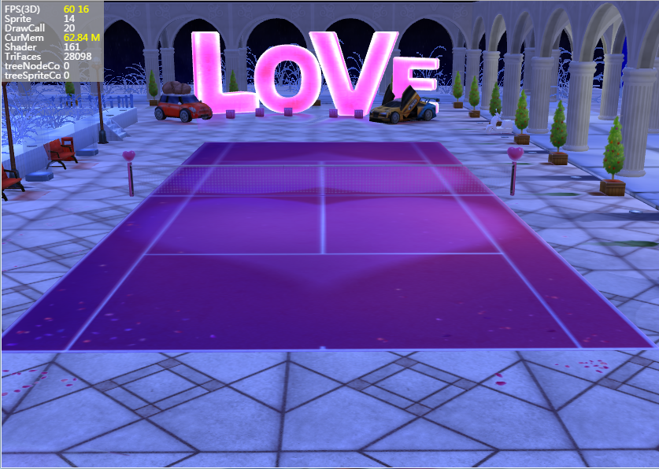
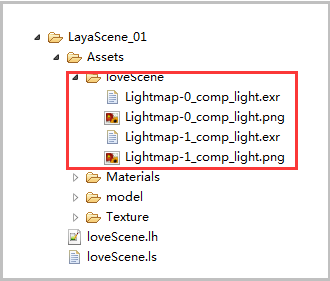

##Scène layaair3d, scene.

Le scénario est un conteneur mondial 3D du moteur layaair pour présenter des images 3D du jeu et charger divers éléments 3D, des caméras, des lumières, des personnages, des objets, etc.

Grâce à l'héritage de scene, on peut voir qu'il a hérité de la classe Sprite.Il est donc facile de le traiter comme un objet d 'affichage dans le 2D.

Dans le moteur layaair, les 3D et 2D peuvent être combinés et les scènes scne - 3D créées et les récipients ou éléments Sprite - 2d peuvent être chargés simultanément sur la scène.

Dans le cadre du cours « démarrage rapide du voyage en 3D », nous avons mis en place une application 3D de base dans laquelle sont incorporés les principaux éléments, et nous allons approfondir la fonction brouillard de la scène et la méthode de chargement des documents de scénario générés par l 'outil d' exportation layaair dans l 'Unity.

###Chargement de ressources de scène

Dans le code ci - après, le fichier Laya scene \ \ 01 / lovescene.ls est l 'Export sélectif du module d' exportation layaair dans unity3d.Les images d 'éclairage requises pour la scène, les fichiers de modèles multiples ou individuels inclus, etc., sont stockés en interne.Le procédé scene3d.load () peut être téléchargé directement dans la scène et affiché.


```typescript

//初始化引擎
Laya3D.init(0, 0, true);
Laya.stage.scaleMode = Laya.Stage.SCALE_FULL;
Laya.stage.screenMode = Laya.Stage.SCREEN_NONE;
Laya.Stat.show();
//加载插件导出的场景。
Laya.Scene3D.load("LayaScene_01/loveScene.ls",Laya.Handler.create(this,function(s:Laya.Scene3D){
  	var scene: Laya.Scene3D = s;
    Laya.stage.addChild(scene);
    //创建摄像机(横纵比，近距裁剪，远距裁剪)
    var camera: Laya.Camera = new Laya.Camera(0, 0.1, 1000);
    //加载到场景
    scene.addChild(camera);
    //移动摄像机位置
    camera.transform.position = new Laya.Vector3(0, 5, 23);
    //旋转摄像机角度
    camera.transform.rotate(new Laya.Vector3(-17, 0, 0), true, false);
    //设置摄像机视野范围（角度）
    camera.fieldOfView = 35;
    //设置背景颜色
    camera.clearColor = new Laya.Vector4(0, 0, 0.6, 1);
    //加入摄像机移动控制脚本
    camera.addComponent(CameraMoveScript);
    //创建方向光 -------------------
    var light: Laya.DirectionLight = scene.addChild(new Laya.DirectionLight()) as Laya.DirectionLight;
    //移动灯光位置
    light.transform.translate(new Laya.Vector3(0, 2, 5));
    //调整灯光方向
  	light.transform.worldMatrix.setForward(new Laya.Vector3(0, -0.5, 0));
    //设置灯光环境色
    light.color = new Laya.Vector3(1, 1, 1);
}));
```


Compiler des exemples de débogage permet de voir une belle scène sur l 'écran (fig. 1).

<br>(图1)


###Prechargement de ressources de scénario

Le procédé scene3d.load () ci - dessus consiste à charger de manière asynchrone des ressources, parfois avec des ressources plus importantes, ce qui nécessite un Préchargement pour améliorer l 'expérience de l' écran principal.On peut le précharger avec un chargeur.Les ressources de jeu 2D sont préchargées à l 'aide de la méthode laya.loader.load () et les ressources 3D doivent l' être à l 'aide de la méthode laya.loader.create () pour les descriptions d' ap pertinentes.


```typescript

//单个资源
Laya.loader.create("res/Cube.ls",Laya.Handler.create(this,this.completeHandler));
//批量加载 并且支持不同类型
Laya.loader.create(["res/Cube1.ls","res/Cube2.lh","res/Cube3.lm"],Laya.Handler.create(this,this.completeHandler));
//第二种实现方式
Laya.loader.create([{url:"res/Cube1.ls"},{url:"res/Cube2.lh"},{url:"res/Cube3.lm"}],Laya.Handler.create(this,this.completeHandler));
```


Dans les projets, nous utiliserons généralement des moyens de chargement qui permettent une bonne gestion des ressources.

Code:


```typescript

//初始化引擎
Laya3D.init(0, 0, true);
Laya.stage.scaleMode = Laya.Stage.SCALE_FULL;
Laya.stage.screenMode = Laya.Stage.SCREEN_NONE;
Laya.Stat.show();
//因为只有一个资源 所以我们传进去字符串就可以，队列的话可以传递一个数组队列。
// 缓存后加载方式
Laya.loader.create("LayaScene_01/loveScene.ls",
    Laya.Handler.create(this, this.completeHandler));

function completeHandler(): void {
    var scene: Laya.Scene3D = Laya.loader.getRes("LayaScene_01/loveScene.ls");
    Laya.stage.addChild(scene);
	......
}
```


###Atomisation de scène

L 'effet de pulvérisation joue un rôle important dans le projet, et l' effet de pulvérisation est l 'effet d' ouverture de l 'atmosphère.Le moteur layaair 3D peut définir la distance visible (égale à la concentration) et la couleur de la scène.L 'utilisation appropriée de la atomisation permet non seulement d' améliorer les performances du jeu, mais aussi d 'accroître l' expérience du jeu.


```typescript

//开启雾化效果
scene.enableFog = true;
//设置雾化的颜色
scene.fogColor = new Laya.Vector3(0,0,0.6);
//设置雾化的起始位置，相对于相机的距离
scene.fogStart = 10;
//设置雾化最浓处的距离。
scene.fogRange = 40;
```


Ajoutez le Code logique ci - dessus à l 'exemple ci - dessus, et découvrez qu' une couche de brouillard bleu (fig. 2) est encombrée dans la scène, plus elle est épaisse à plus de 40 mètres de la caméra.

</br>(图2)


###Photo de scène

L 'image d' éclairage est la projection produite par le modèle 3D dans la scène, la transition de l 'ombre, l' atmosphère lumineuse, l 'influence de la couleur entre le matériau de modèle et le matériau.

Il y a peu de scènes de jeux en 3D qui produisent des effets de projection et de couleurs par la lumière et le rendu instantané des modèles, c 'est un moyen très consommable, en particulier pour les jeux de téléphones portables, qui ne fonctionnent pas très bien et qui sont tous des jeux de lumière instantanée.

Pour résoudre ce problème, il s' agit de simuler la couleur de l 'ombre de la scène de jeu sous forme d' une image, ce qui permet de réduire la quantité d 'opérations instantanées.

L 'affichage d' éclairage propose de rendre l 'image d' éclairage par l 'éditeur unity3d et d' en exporter l 'utilisation.

Si l 'unité n' affiche pas l 'image de la lumière, le moteur d' exportation n 'est pas mal chargé, mais les effets du jeu peuvent être considérablement réduits.La figure 3 n 'utilise pas l' effet de la lumière, la figure 4 est l 'effet de la lumière, vous êtes bien méchant.Les autocollants sont souvent utilisés pour simuler le soleil, les paysages nocturnes, l 'ambiance de jeu, etc., ce qui améliore l' expérience du jeu.

(Figure 3)

(Figure 4)

La méthode de rendu de l 'image d' éclairage n 'est pas expliquée ici, les concepteurs de jeux en 3D mûrs font généralement des photos d' éclairage.

Nous ouvrirons la liste des arbres de ressources dérivées du Code de l 'exemple ci - dessus (fig. 5).

**Le nom du dossier lovescene est généré en fonction du nom de la scène après la création d 'un autocollant d' éclairage dans lequel la ressource est un autocollant d 'éclairage de scène, l' autocollant d 'éclairage original est un format xr, qui doit être converti en format JPG ou PNG utilisé dans le moteur layaair, de préférence manuellement dans un Photoshop, qui peut être configuré en huit couleurs et stocké en format Ping, réduisant efficacement la taille des ressources et réduisant le jeu.Temps de chargement de ressources**

Aucun dossier n 'est créé si l' autocollant n 'est pas créé dans l' unité.

< / BR > (Figure 5)

Si vous avez besoin d 'un format d' image JPG plus petit pour être converti en format JPG, vous devez également modifier le chemin de l 'autocollant optique dans le fichier de configuration LS, par exemple (Figure 6), ouvrir le fichier de données exporté par la scène "lovescene.ls", modifier la grille exr en.jpg, faute de quoi le moteur de compilation va automatiquement chercher le chargement d' images au format PG au lieu de charger l 'image au format JPG.

</br>(图6)