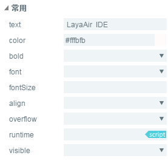

# Label 组件参考


##Création d 'un composant label par layaairide

###1.1 Création de label

L 'ensemble label permet d' afficher un segment de texte qui peut être soit la police du système, soit la police bmfont.

Cliquez sur l 'ensemble label dans le panneau de ressources et faites - le glisser dans la zone d' édition de page pour ajouter l 'ensemble label à la page.
Interface de script pour module label[Label API](http://layaair.ldc.layabox.com/api/index.html?category=Core&class=laya.ui.Label)".

Exemples de ressources pour le module Label:

​< br / >
(Figure 1)

Après avoir glissé le composant label dans la zone d 'édition, la valeur de la propriété text est définie comme suit:

​< br / >
(Figure 2)


 

 


###1.2 propriété label

​< br / >
Graphique

- 124.**Attribut**Description fonctionnelle \ \ 124.
124 ----------------------------------------------------------------------------------------------------------
Chaîne de contenu du texte.- 124.
124. Alignement horizontal du texte.Les valeurs sélectionnées sont left, Center, right.- 124.
Le texte \ \ \ \ \ \ \ \ \ \ \ \ \ \ \Les valeurs sélectionnées sont top, Middle, bottom.- 124.
La valeur de couleur du texte \ \ \ \ \ \ \ \ \ \ \ \ \Noir par défaut- 124.
Couleur d 'arrière - plan du texte.- 124.
§ 124 font \ \ nom de la police du texte.- 124.
La taille de la police du texte \ \ 124 fontsize \ \ 124.- 124.
Si le texte \ \ 124bold \ \ est en caractères gras.- 124.
Le texte \ \ \ \ \ \ \ \ \ \ \ \ \ \- 124.
Le texte \ \ 124wordwrap \ \ 124 a - t - il été remplacé par une ligne?- 124.
La largeur de la bordure du texte \ \ \ \ \ \ \ \ \ \ \ \- 124.
La couleur de bordure du texte.- 124.
Le texte \ \ \ \ \ \ \ \ \ \ \ \ \ \ \- 124.
124 Espacement vertical du texte.- 124.
La marge du texte \ \ 124.- 124.


 


##Création d 'un composant label par Code

Quand on écrit un code d 'écriture, on ne peut pas forcément contrôler l' ui par le Code, créer`UI_Label`Classe, les propriétés associées à label sont déterminées par Code.

**Exécution de l 'exemple:**
​< br / >
Figure 5 création de label par Code

D 'autres attributs de label peuvent également être définis au moyen d' un code qui montre comment créer un label à partir d 'un code pour différentes peaux (Styles) et qui permet aux lecteurs intéressés de définir label par leur propre code pour créer un effet de texte correspondant à leurs propres besoins.

D 'autres effets de texte peuvent être consultés dans la partie de texte de base 2D.

**Exemple:**


```javascript

module laya {
	import Stage = Laya.Stage;
	import Label = Laya.Label;
	import WebGL = Laya.WebGL;

	export class UI_Label {
		constructor() {
			// 不支持WebGL时自动切换至Canvas
			Laya.init(800, 600, WebGL);

			Laya.stage.alignV = Stage.ALIGN_MIDDLE;
			Laya.stage.alignH = Stage.ALIGN_CENTER;

			Laya.stage.scaleMode = Stage.SCALE_SHOWALL;
			Laya.stage.bgColor = "#232628";

			this.setup();
		}

		private setup(): void {
			this.createLabel("#FFFFFF", null).pos(30, 50);
			this.createLabel("#00FFFF", null).pos(290, 50);
			this.createLabel("#FFFF00", "#FFFFFF").pos(30, 100);
			this.createLabel("#000000", "#FFFFFF").pos(290, 100);
			this.createLabel("#FFFFFF", "#00FFFF").pos(30, 150);
			this.createLabel("#0080FF", "#00FFFF").pos(290, 150);
		}

		private createLabel(color: string, strokeColor: string): Label {
			const STROKE_WIDTH: number = 4;

			var label: Label = new Label();
			label.font = "Microsoft YaHei";
			label.text = "SAMPLE DEMO";
			label.fontSize = 30;
			label.color = color;

			if (strokeColor) {
				label.stroke = STROKE_WIDTH;
				label.strokeColor = strokeColor;
			}

			Laya.stage.addChild(label);

			return label;
		}
	}
}
new laya.UI_Label();
```


 	