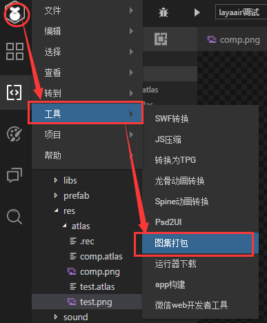
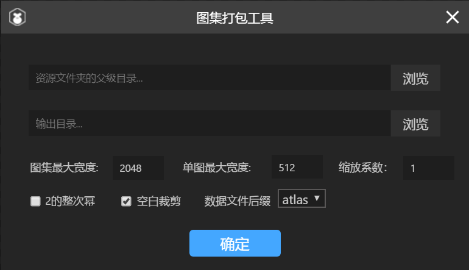
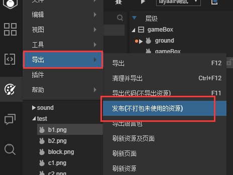
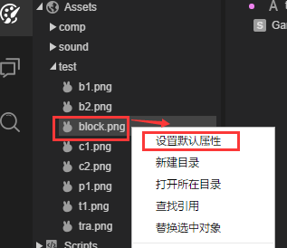
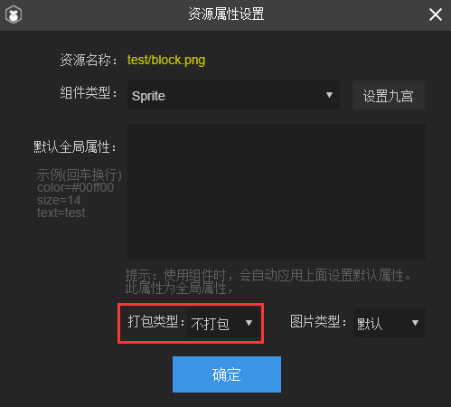
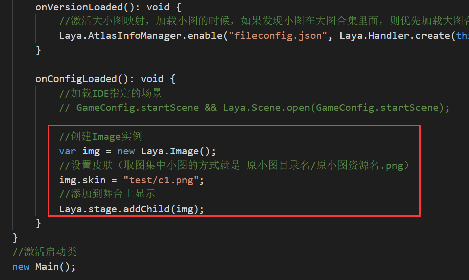

#Production et utilisation d 'Atlas

> Author: Charley > language: Typescript > update: 2019.01.11

*Note: ce programme est basé sur la version officielle de layaairide 2.0.0, en cas de divergence, utilisez la version la plus récente de layaairide.*


L 'Atlas est une ressource artistique courante dans le développement du jeu qui combine plusieurs images en une majuscule et stocke les informations relatives aux ressources d' images originales dans des documents tels que Atlas et json.La figure 1 représente une ressource d'Atlas Ping emballée par layaairide.


   


(Figure 1)


##Pourquoi utiliser les ressources de la collection

**L 'utilisation des ressources d' Atlas de la synthèse de plusieurs images dans le jeu comme ressource artistique présente les avantages suivants:**

####1.1 optimisation de la mémoire

Les zones vides entourant chaque image sont supprimées lors de la synthèse de l 'image, et divers algorithmes d' optimisation peuvent être appliqués dans l 'ensemble, ce qui permet de réduire considérablement l' occupation du paquet de jeu et de la mémoire.

####1.2 réduction des opérations de CPU

Multi`Sprite`Si vous affichez des images provenant du même Atlas, celles - ci`Sprite`Le même lot de rendu peut être utilisé pour réduire sensiblement le temps de fonctionnement de l 'unité centrale et améliorer l' efficacité de fonctionnement.


##Présentation de l'Atlas

Layaairide supporte l 'emballage en tant qu' Atlas des deux formats de ressources PNG et JPG.Cependant, les ressources d 'origine de l' Atlas sont recommandées pour l 'utilisation du PNG, car le JPG peut être plus grand.

*Il convient de noter que la profondeur binaire de la ressource brute du PNG ne doit pas dépasser 32, faute de quoi l 'image emballée peut apparaître sur un écran de fleurs.En outre, les ressources PNG et JPG ne peuvent pas être remplacées par d 'autres formats de ressources sous forme de PNG et de JPG.*


##Modalité de réalisation de l'Atlas au moyen de layaairide

Il y a deux façons d'emballer l'Atlas à layaairide.

####3.1 outils d 'emballage d' Atlas utilisant l 'IDE

De navigation`工具`Dans le menu`图集打包`Ouvre le panneau d 'outil d' emballage d 'Atlas, comme le montrent les figures 2 et 3.

  


(Figure 2)

　　   （图3）


**Description du panneau d 'outil d' emballage**

**`资源根目录`**

`资源根目录`Est un répertoire parent d 'un répertoire de ressources d' origine avant l 'emballage de l' Atlas, chaque répertoire correspond à un fichier d 'Atlas et la pluralité de catalogues génère une pluralité de fichiers d' Atlas.(les fichiers d'Atlas emballés sont désignés par les sous - répertoires figurant dans le répertoire des sources de ressources, comme indiqué dans les figures 4 et 5.

 


(Figure 4)

　  


(Figure 5)


####Infobulles:

Glisser le dossier directement vers`资源根目录`, ou cliquez sur`浏览`Pour obtenir le chemin du Répertoire`输出目录`Remplissage automatique et`资源根目录`C 'est un bon chemin.

#### **`输出目录`**

`输出目录`Catalogue des ressources d 'Atlas emballées

Par défaut et répertoire source de ressources`浏览`Manuellement`输出目录`Saisissez le chemin à modifier dans la zone.

*Tips: la modification du Répertoire de sortie ne peut pas se faire par glisser - déposer dans le Répertoire, faute de quoi le chemin du Répertoire racine de ressources sera affecté.*

#### **`图集最大宽\高度`**

Par défaut`2048×2048`, cette valeur détermine la taille maximale d 'un seul ensemble.Si l 'image originale est trop grande et que la largeur maximale d' un seul ensemble est supérieure, un nouveau fichier d 'images (une pluralité d' images) est généré lors de l 'emballage.

#### **`单图最大宽\高度`**

Par défaut`512×512`, une image unique dépassant cette taille ne sera pas emballée dans l 'image.

*Tips: les monographies de plus de 512 x 512 ne sont pas recommandées pour être emballées dans l 'Atlas et peuvent être préchargées séparément, mais elles ne peuvent pas dépasser 1024 x 1024, faute de quoi les performances seront affectées.*

#### `缩放系数`

Il est possible de réduire le volume de l 'image en l' ajustant, par exemple en le faisant passer à 0,5, l 'outil étant généré dans l' Atlas en multipliant par 0,5 la largeur de l 'image originale et en maintenant la taille de l' image originale par l 'étirage.Si vous voulez maintenir la précision de l 'image au moment de la conception, essayez de ne pas ajuster la valeur par défaut.

#### **`2的整次幂`**

Si vous cochez cette case, la largeur de l 'image générée sera la puissance secondaire totale de 2.Ici, il est recommandé que les beaux - arts soient conçus en fonction de la puissance unitaire de 2 au moment de la conception, et que le maintien de la puissance unitaire de 2 par l 'outil d' Atlas entraîne certainement une augmentation du volume de l 'image.Par conséquent, sauf dans le cas d 'un environnement Runtime qui doit être optimisé en fonction d' une puissance unitaire de deux exigences obligatoires, il n 'est pas nécessaire, en règle générale, de cocher la case, dans la mesure du possible pour les dessinateurs d' art, de concevoir la largeur de l 'image En fonction de la puissance unitaire de 32, 64, 128, 256, etc.

#### **`空白裁剪`**

Si vous cochez cette option, l 'image d' Atlas générée est automatiquement coupée de la zone vide de l 'image originale.Par défaut est l 'état de sélection, n' enlève pas.

#### `数据文件后缀`

Le suffixe de fichier de données est par défaut Atlas et peut également sélectionner json.Cependant, nous suggérons aux concepteurs d'utiliser le système Atlas comme suffixe de l'Atlas lorsqu'ils utilisent le moteur layaair.


###3.2 Atlas automatisés dans un gestionnaire de ressources

####3.2.1 emballage d'Atlas

#### **Emballage automatique des ressources dans le répertoire des Assets lors de l 'exportation de layaairide**

Toutes les ressources d 'image dans le Répertoire du gestionnaire de ressources (Assets) sont indiquées dans la figure 6 - 1.Quand on appuie`F12`Ou`Ctrl+F12`Au moment de l 'exportation**Emballage automatique par nom de répertoire**Voir la figure 6 - 2.

 


(Figure 6 - 1)

####Itinéraire d 'Export d' Atlas dans un gestionnaire de ressources

Après exporter l 'ui vers l' élément, l 'image automatiquement emballée est positionnée par défaut. "`项目根目录/bin/res/atlas/`Dans le catalogue, le nom de l 'Atlas est le même que celui de l' Atlas dans l 'outil d' emballage, et le nom de l 'Atlas est celui d' un sous - catalogue dans l 'ASSETS, comme le montre la figure 6 - 2.


   


(Figure 6 - 2)

####Modifier le chemin d 'Export d' Atlas par défaut

Si vous voulez modifier le répertoire d 'Export par défaut de l' Atlas, vous pouvez utiliser le raccourci F9 en mode Conception`项目设置`Panneau`图集设置`Barre`资源发布目录`Modifie le chemin d 'exportation de l' Atlas, comme le montre la figure 6 - 3.La largeur maximale de l 'Atlas peut également être définie, ainsi que des critères de limitation de largeur d' image unique non emballés, etc.La signification des paramètres est la même que celle de l 'outil d' atlas décrit plus haut.

  


(figures 6 à 3)

#### **Comment ne pas emballer les ressources inutilisées dans l 'Atlas**

`资源管理器`Si les ressources ne sont pas utilisées dans la scène de projet, passez par le menu`导出`- >`发布（不打包未使用）`Figure 6 - 4.Les ressources inutilisées peuvent être libérées de l 'Atlas, ce qui permet de réduire sa taille.Toutefois, étant donné que ce mode d 'emballage nécessite l' utilisation de toutes les ressources, ce qui entraîne une lenteur de l 'emballage, il n' est généralement utilisé que lorsque la version en ligne est publiée.

 


(figures 6 à 4)

#### **Comment configurer une ressource unique sans l 'emballer dans l' Atlas**

Sélectionnez la ressource, double - cliquez sur le bouton gauche ou sélectionnez le bouton droit`设置默认属性`Voir les figures 6 à 5.Ouvre le panneau des attributs de ressources.

   


(figures 6 à 5)

Dans le panneau d 'attributs`打包类型`Définir comme`不打包`Type, comme le montrent les figures 6 à 6.Cette ressource n 'est pas emballée dans l' Atlas.

 


(figures 6 à 6)


##Présentation des fichiers d'Atlas produits par emballage

####4.1 fichiers d 'Atlas générés par emballage

Une fois l 'Atlas emballé, une ressource spécifique d' Atlas est générée.`.atlas`Fichier`.json`Documentation`.png`Fichier, et pour le Programme d 'emballage d' Atlas`rec`Document (* Ce logiciel de conditionnement de fichiers rec est utilisé par les concepteurs, comme le montre la figure 6 - 2 ci - dessus).

####4.2 Les suffixes d'Atlas et de json

`.atlas`Et`.json`Tous les fichiers sont des fichiers d 'informations de configuration pour l' Atlas PNG.Pour optimiser l 'utilisation du moteur, par défaut`.atlas`Cependant, pour être compatible avec l 'ancienne version, la création de l' Atlas, la version de l 'IDE sur une longue période existe dans les deux formats.`.atlas`, si vous voulez créer json, modifiez manuellement les paramètres du suffixe d 'Atlas.

Au moment de l'utilisation, la différence entre les deux types de suffixe est la suivante:

`.atlas`C 'est un format d' Atlas propre à layaairide, utilisé uniquement pour les images, donc chargé`.atlas`Il n 'est pas nécessaire de remplir le type de document, mais aussi plus commode et recommandé pour le chargement de l' image que pour le chargement d 'une seule carte.Le Code de l 'exemple pour le chargement de l' Atlas est le suivant:


```typescript

//atlas方式图集使用示例
Laya.loader.load("./res/atlas/test.atlas", Laya.Handler.create(this, this.onLoaded));
```


`.json`Est une configuration d 'Atlas compatible avec des tiers`.json`Les fichiers sont largement utilisés, non seulement pour l 'image, mais aussi pour déterminer s' il s' agit d' informations de configuration d 'Atlas.`.json`Dans l 'icône du document, il faut distinguer le type de remplissage.Le Code d 'exemple de l' Atlas téléchargé par json est le suivant:


```typescript

//json方式图集使用示例
Laya.loader.load([{url: "res/atlas/test.json", type: Laya.Loader.ATLAS}], Laya.Handler.create(this, this.onLoaded));
```


##Erreurs courantes dans l'Atlas

####Supprimer un fichier d 'icône

Lorsque l 'utilisateur supprime manuellement le fichier d' icône sans supprimer le fichier Rec, comme le montre la figure 7 - 1.Dans ce cas,**Si les ressources d 'origine ne changent pas, l' utilisation directe de F12 ne permet pas de réexporter le fichier d 'Atlas.**

En ce moment, vous pouvez passer par le raccourci clavier`Ctrl+F12`Nettoie et exporte.Ou supprime le fichier rec directement, puis exporte avec F12.L 'image peut être exportée normalement.

 


(Figure 7 - 1)


##Comment utiliser les légendes de l'Atlas dans les projets

Si les ressources de l 'Atlas sont utilisées dans un projet, les ressources de l' Atlas doivent être préalablement chargées et la valeur des propriétés cutanées de l 'image (* skin *) est définie comme étant "le nom initial de l' annuaire graphique / le nom de la ressource graphique primaire.ping".


 

(Figure 6 - 1)

   


(Figure 1)

####Gestionnaire de ressources

Par exemple: lorsque les ressources de la figure 6 - 1 ci - dessus ont été emballées, comme le montre la figure 1, nous allons maintenant passer à la figure 6 - 1.`test`Sous le catalogue`c1.png`Le Code de l 'exemple est affiché sous forme d' Atlas dans un projet, comme le montre la figure 8:

 


(Figure 8)

Etant donné que layaair 2.0 IDE a été initialisée au moment de la création du projet et que les codes de base tels que le chargement de l 'Atlas sont écrits, nous pouvons écrire directement pour afficher l' image c1.png de l 'Atlas.

Code de base:


```javascript

    //创建Image实例
    var img = new Laya.Image();
    //设置皮肤（取图集中小图的方式就是 原小图目录名/原小图资源名.png）
    img.skin = "test/c1.png";
    //添加到舞台上显示
    Laya.stage.addChild(img);
```


La figure 9 montre les effets d'exploitation du Code:

  （图9）


Comme le montre la figure 9, nous avons réussi à extraire des ressources graphiques mineures de l 'Atlas et à les appliquer à des projets, alors que les codes`sink`PH`test/c1.png`En fait, c 'est le répertoire correspondant et le nom et l' itinéraire des ressources avant l 'emballage de l' Atlas.

A la fin de l 'article, s' il y a un doute, adressez - vous à la communauté:[https://ask.layabox.com](https://ask.layabox.com/)


##Appreciation

Si vous trouvez cet article utile pour vous, bienvenue à l 'auteur du Code de balayage, votre motivation est de nous pousser à écrire plus de documents de qualité.

