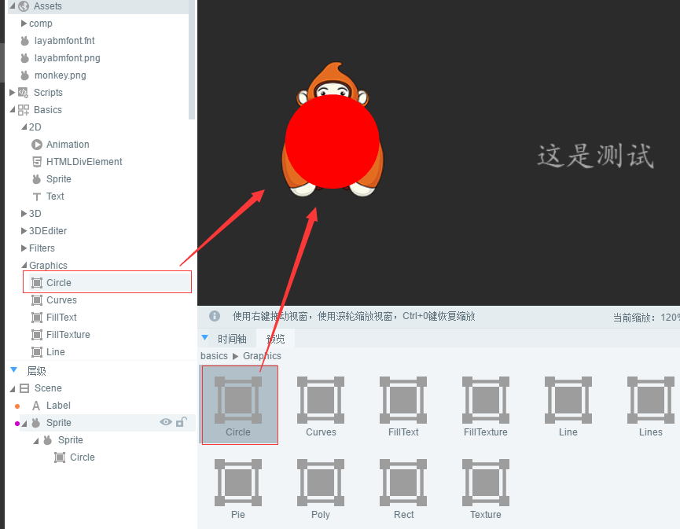

#カバーを設ける

>LayaAirのカバーは、オブジェクト（ビットマップとベクトル図に対応）を設定し、オブジェクトの形状に応じてカバー表示することができます。
>


##一、カバーAPIの紹介

カバーのプロパティがあります。[laya.display.Sprite](http://layaair.ldc.layabox.com/api/index.html?category=Core&class=laya.display.Sprite%3Ch1%3Emask)API内では、この属性の説明は図1に示されている。

<br/>(図1)


##二、簡単なカバーの例

###2.1まずLayaAirエンジンでビットマップを表示します。

MaskDemo.asエントリクラスを作成し、デフォルトのアプリケーション（推奨FlashBuider）に設定し、コードを作成します。


```java

package
{
	import laya.display.Sprite;
	import laya.resource.Texture;
	import laya.utils.Handler;
	
	public class MaskDemo
	{
		private var Res:String;
		private var img:Sprite;
      
		public function MaskDemo()
		{
			Laya.init(1136,640);
			//设置舞台背景色
			Laya.stage.bgColor = "#ffffff"        
			//资源路径              
			Res = "res/img/monkey1.png";
			
			//先加载图片资源，在图片资源加载成功后，通过回调方法绘制图片并添加到舞台
			Laya.loader.load(Res,Handler.create(this,graphicsImg));          
		}
			
		private function graphicsImg():void
		{
			img = new Sprite();
			//获取图片资源，绘制到画布
			img.graphics.drawTexture(Laya.loader.getRes(Res),150,50);
			
			//添加到舞台
			Laya.stage.addChild(img);
		}	
	}
}
```


コンパイル運転効果は図2に示す通りです。

<br/>(図2)

###2.2円形のカバーエリアを作成する

コードで円形のカバー領域を作成します。マスター属性により、カバー効果を実現します。コードとコメントを見続けて、2.1のコード例を下記のコードに修正します。


```java

package
{
	import laya.display.Sprite;
	import laya.resource.Texture;
	import laya.utils.Handler;
	
	public class MaskDemo
	{
		private var Res:String;
		private var img:Sprite;
		
		public function MaskDemo()
		{
			Laya.init(1136,640);
			//设置舞台背景色
			Laya.stage.bgColor = "#ffffff"      
			//资源路径
			Res = "res/img/monkey1.png";		
			
			//先加载图片资源，在图片资源加载成功后，通过回调方法绘制图片并添加到舞台
			Laya.loader.load(Res,Handler.create(this,graphicsImg));   
		}
		
		private function graphicsImg():void
		{
			img = new Sprite();
			//获取图片资源，绘制到画布
			img.graphics.drawTexture(Laya.loader.getRes(Res),150,50);
			
			//添加到舞台
			Laya.stage.addChild(img);
			
			
			//创建遮罩对象
			var cMask:Sprite = new Sprite();
			//画一个圆形的遮罩区域
			cMask.graphics.drawCircle(80,80,50,"#ff0000");
          	//圆形所在的位置坐标
			cMask.pos(120,50);
          
         	//实现img显示对象的遮罩效果
			img.mask = cMask;
			
		}
	}
}
```


運転効果は図3に示す通りです。

<br/>(図3)

コードを比較することにより、カバーが簡単に実現され、作成された表示対象cMaskをカバー対象として、対象のmask属性に値を付けることができます。即ち、対象のカバー効果が実現されました。


##三、LayaAirIDEにカバーを設置する

>コードの中に直接カバーを設置する以外に、LayaAirIDEで簡単に対象にカバーを設置することができます。次は案内に従って手順に従って操作します。

ステップ1：UIページを作成する`maskDemo.ui`を選択します。*（本ステップでは分かりませんが、UIの作成とリソース導入に関する文書をIDEチャプターで確認してください。）*


ステップ2：リソースパネルで一つにドラッグします。`Sprite`セットはシーン編集エリアに行き、図4に示すように

<br/>(図4)


ステップ3：ダブルクリックして入る`Sprite`コンポーネントの内部を、もう一つのモジュールパネルにドラッグします。`Sprite`コンポーネントを図5に示します。

<br/>(図5)


ステップ4:選択`Sprite`モジュールは、右側のプロパティ''その他''パネルに共通の属性を設定します。`renderType`設定`mask`を選択します。

<br/>(図6)


ステップ5：ダブルクリックして入る`Sprite`コンポーネントの内部を、もう一つのモジュールパネルにドラッグします。`Graphics`円形のコンポーネントで、位置と大きさを調整します。階層関係を図7に示す。

<br/>(図7)


ステップ6：編集エリアの空白領域を連続的にダブルクリックして終了します。`Sprite`セットの内部には、図8に示すようにカバーの効果が見られます。

<br/>(図8)


##四、プロジェクトにLayaAirIDE設定のカバーを適用する。

###4.1 UIのリリース

IDE画面で`F12`カバーを作るUIページを発表します。`src/ui`ディレクトリでUIクラスを生成し、`bin/h5/res/atlas`ディレクトリの下の図セットファイルは、図9に示します。

<br/>(図9)


###4.2 IDEで生成したクラスと図セットを使ってカバー効果を実現する

エントリクラスを作成`Main.as`コードは以下の通りです


```java

package
{
	import laya.net.Loader;
	import laya.utils.Handler;	
	import ui.maskDemoUI;
	
	public class Main
	{
		public function Main()
		{
			//初始化舞台
			Laya.init(1136,640);
			//设置舞台背景色
			Laya.stage.bgColor = "#ffffff"    
				
			//加载图集资源，加载成功后添加到舞台
			Laya.loader.load("res/atlas/ui.atlas",Handler.create(this,onLoaded));
			
		}
		
		private function onLoaded():void
		{
			var cMask:maskDemoUI = new maskDemoUI();
			Laya.stage.addChild(cMask);
		}
	}
}
```


運転効果は図10に示すように、すばやくカバー効果を実現しました。

<br/>(図10)

