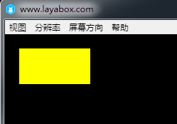
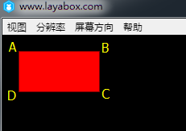
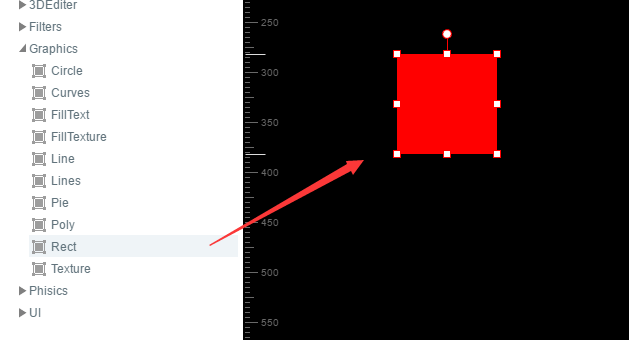
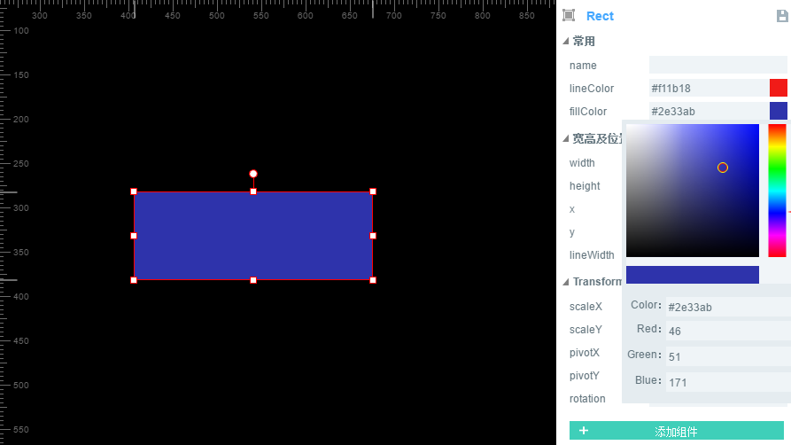

# 绘制矩形与圆角矩形


###一、DRawRect方法で矩形を描きます。

APIで検索`laya.display.Graphics`クラスは、APIの様々なベクトル描画方法を見ることができます。「drawRect()」;ベクトルの長方形を描く方法。この方法の詳細は下図の通りです。

​<br/>
（図1）

次にLayaAirエンジンでベクトル矩形を描きます。コード例は以下の通りです。


```java

package
{
    import laya.display.Sprite;
    import laya.display.Stage;
      
    public class Sprite_DrawShapes
    {
        private var sp:Sprite;
          
        public function Sprite_DrawShapes()
        {
            Laya.init(500, 300);
            drawSomething();
        }
  
        private function drawSomething():void
        {
            sp = new Sprite();
            Laya.stage.addChild(sp);
            //画矩形
            sp.graphics.drawRect(20, 20, 100, 50, "#ffff00");
              
        }
    }
}
```


コード実行効果:

​<br/>
（図2）

例の「20，20」は長方形の始点座標で、100は右側の幅であり、負の場合は左の幅である。50は下の高さで、負の場合は上の高さです。コード作成中に、パラメータを自分で調整して体験することができます。


###二、DRawPathで矩形を描きます。

LayaAirエンジン`laya.display.Graphics`クラスの描画経路の方法「drawPath（）」は経路に従ってベクトル図形を描くことができます。もちろん矩形と角の長方形も含まれています。この方法の詳細な説明は下図のようになります。

​	<br/>
（図3）

drawPath法のパラメータは比較的複雑である。分かりやすくするために、まず「drawPath（）」を使って矩形を描き、経路の一部パラメータを理解します。

drawPath描画矩形の例コードは以下の通りです。


```javascript

package
{
    import laya.display.Sprite;
    import laya.display.Stage;
      
    public class Sprite_DrawShapes
    {
        private var sp:Sprite;
          
        public function Sprite_DrawShapes()
        {
            Laya.init(500, 300);
            drawSomething();
        }
  
        private function drawSomething():void
        {
            sp = new Sprite();
            Laya.stage.addChild(sp);
            //自定义路径
            var path:Array =  [
                ["moveTo", 0, 0], //画笔移到A点
                ["lineTo", 100, 0],//画到B点
                ["lineTo", 100, 50],//再画到C点
                ["lineTo", 0, 50], //继续画到D点
                ["closePath"] //闭合路径
            ];
             //绘制矩形
            sp.graphics.drawPath(20, 20, path, {fillStyle: "#ff0000"});
        }
    }
}
```


コード実行効果:

​<br/>
（図4）

drawPath第一位と第二位の座標点「20,20」は全体位置を制御する開始位置であり、第三位はパスパラメータである。説明情報「MoveTo」は、ブラシを初期位置に移動させるもので、描き始めていません。「0,0」は「20,20」という開始位置に対するものですから、A点はまだ開始位置の原点です。記述情報「lininto」は、ルートポイント座標に描画します。「100、0」これはB点位置に描画された座標です。C点とD点はこのように類推して、最後に情報「closePath」とMoveToの起点位置を記述することによって閉じられます。そうでなければ閉じられません。

長方形の描画から見ると、DRawPath方法は、DRawRect方法ほど便利ではないに違いない。しかし、この例を通して、関連するパラメータの使用法を理解することができる。その他の角のない図形については、ご自分で符号化し、パラメータを調整して体験することができます。


###三、DRawPathで角の丸い長方形を描きます。

####3.1用法説明

LayaAirエンジンではgraphicsのdrwaPathを使って円角や弧を描くことができます。具体的な操作には3ステップが必要です。描画経路の開始点を指定します。`["moveTo", x, y]`を選択します。水平線を描きます。`["lineTo", x, y]`を選択します`["arcTo", p1.x, p1.y, p2.x, p2.y, r]`。

**パラメータの例**:


```java

["moveTo", 50, 50],
["lineTo", 150, 50],
["arcTo", 200, 50, 200, 100, 50],
```


上記パラメータ運転効果図は5-1に示す通りです。

<br/>(図5-1)

図5-1を通して、`["moveTo", 50, 50]`ブラシの始点を位置に固定します。`"50,50"`この席です。`["lineTo", 150, 50]`開始点から現在の終点点までを描きました。`150, 50`「」の直線。`["arcTo", 200, 50, 200, 100, 50]`しばらく描いています`r`（半径）は`50`円弧

**弧を描く原理**:

この弧を作る時、この弧は現在の端を利用します。`"150, 50"`端点1`"200, 50"`端点2`"200, 100"`この三つの端点によって形成された夾角は，半径50 pxであり，両サイドに接する円周上の一段の弧を作った。


ラジアンの描画原理を理解していれば、ラジアンを構成するコア要素は2つの辺と2つの辺との間に挟まれた頂点(上の例では端点1)を形成しています。図5-1の端点2と端点1のx軸辺が分かりやすいです。現在の端点と端点1はすでにy軸辺を構成しています。落とします。事実はいけません。ブラシの始点は必ず存在しますが、直線を描いたライントップは削除できます。`["lineTo", 150, 50],`注記されていると、arcToが弧を描く時、始点を現在の端点とします。arcToがラインToで描かれている直線が見つからない時、自動的に始点から弧の始点までの直線を追加します。したがって、角の長方形を描く時、ラインToは省略できます。


####3.2角を描く長方形の例

次に、半径30の円角の長方形を描きます。例のコードは次の通りです。


```java

package
{
    import laya.display.Sprite;
    import laya.display.Stage;
      
    public class Sprite_DrawShapes
    {
        private var sp:Sprite;
          
        public function Sprite_DrawShapes()
        {
            Laya.init(1136, 640);
            drawSomething();
        }
  
        private function drawSomething():void
        {
            sp = new Sprite();
            Laya.stage.addChild(sp);
            //自定义路径
            var path:Array =  [
				["moveTo", 0, 0], //画笔的起始点，
				["lineTo",400,0],
                ["arcTo", 500, 0, 500, 30, 30], //p1（500,0）为夹角B，（500,30）为端点p2
                ["lineTo",500,200],
                ["arcTo", 500, 300, 470, 300, 30],//p1（500,300）为夹角C，（470,300）为端点p2
                ["lineTo",30,300],
                ["arcTo", 0, 300, 0, 270, 30], //p1(0,300)为夹角D，（0,270）为端点p2
                ["lineTo",0,100],
				["arcTo", 0, 0, 30, 0, 30],//p1(0,0)为夹角A，（30,0）为端点p2
			];
             //绘制圆角矩形
            sp.graphics.drawPath(100, 100, path, {fillStyle: "#ff0000"});
        }
    }
}
```


コード実行効果:

​<br/>
（図5-2）

上のコードの中では問題がないように見えますが、実はmoveToの開始点は円弧間の直線上に必要です。下の部分はdrawPathを描く時に外枠線を追加するだけで、間違いがはっきり分かります。描画方法graphics.drawPathは、


```java

//绘制圆角矩形
sp.graphics.drawPath(100, 100, path, {fillStyle: "#ff0000"},{"strokeStyle":"#ffffff","lineWidth":"10"});
```


修正後の運転効果は図5-3に示すように、線を引く時は、ブラシの開始点から`0,0`最初のことですから、私たちが欲しい結果ではありません。

<br/>(図5-3)

例を正しいコードに変更します。


```java

package
{
	import laya.display.Sprite;
	import laya.display.Stage;
	import laya.webgl.WebGL;
	
	public class Main
	{
		private var sp:Sprite;
		
		public function Main()
		{
			Laya.init(1136, 640);
			drawSomething();
		}
		
		private function drawSomething():void
		{
			sp = new Sprite();
			Laya.stage.addChild(sp);
			
			
			//自定义路径
			var path:Array =  [
				["moveTo", 30, 0], //画笔的起始点，
				["lineTo",400,0],
                ["arcTo", 500, 0, 500, 30, 30], //p1（500,0）为夹角B，（500,30）为端点p2
                ["lineTo",500,200],
                ["arcTo", 500, 300, 470, 300, 30],//p1（500,300）为夹角C，（470,300）为端点p2
                ["lineTo",30,300],
                ["arcTo", 0, 300, 0, 270, 30], //p1(0,300)为夹角D，（0,270）为端点p2
                ["lineTo",0,100],
				["arcTo", 0, 0, 30, 0, 30],//p1(0,0)为夹角A，（30,0）为端点p2
			];
			//绘制圆角矩形
			sp.graphics.drawPath(100, 100, path, {fillStyle: "#ff0000"},{"strokeStyle":"#ffffff","lineWidth":"10"});

		}
	}
}
```


運転効果は図5-4に示す通りです。

 （图5-4）


###四、LayaAirIDEでコントロールをドラッグして長方形を描きます。

​**ステップ1**：LayaAirIDEを開いて、デザインモードをクリックして、Viewページを新規作成します。

​<br/>
（図6）

**ステップ2**：コンポーネント内の曲線コンポーネントをViewページにドラッグすると、自動的にデフォルトの曲線が生成されます。

​<br/>
（図7）

**ステップ3**：Rectコンポーネントの属性の値を変更（追加/減少）し、矩形のサイズ、色、回転角度などを変更します。

​<br/>
（図8）

​<br/>
（図9）

ここでLayaAirIDEのセットで矩形を描きます。
