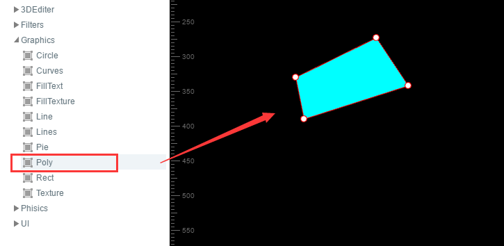
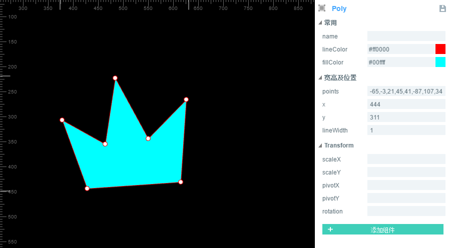

#三角形、多角形を描画し、データに基づいて図案を描きます。


三角形、多角形を描画し、指定されたパスデータに基づいてパターンを描画する場合、LayaAirエンジン中のlaya.display.Graphics類の「drawpoly()」を使用して実現できます。この方法の詳細は下図の通りです。

​<br/>
（図1）


###一、三角形を描く

次にLayaAirエンジンで三角形を描きます。コード例は次の通りです。


```java

package
{
    import laya.display.Sprite;
    import laya.display.Stage;
    import laya.webgl.WebGL;
      
    public class Sprite_DrawShapes
    {
        private var sp:Sprite;
          
        public function Sprite_DrawShapes()
        {
            Laya.init(500, 300, WebGL);
            drawSomething();
        }
  
        private function drawSomething():void
        {
            sp = new Sprite();
            Laya.stage.addChild(sp);
            //画三角形
            sp.graphics.drawPoly(30, 28, [0, 100, 50, 0, 100, 100], "#ffff00");
              
        }
    }
}
```


コード運転効果は下図のようになります。

​<br/>
（図2）

コードを通して，drawPolyの3番目のパラメータの「0，100」はA点座標であることを示した。「50，0」はB点座標です。「100，100」はC点座標で、3つの座標点を接続した後、4番目のパラメータの色値を塗りつぶします。つまり、上図の黄色三角形を描きます。しかし、ここでは、3番目のパラメータのすべての座標は相対座標であり、1位と2位の座標パラメータ「30，28」の影響を受けます。「30，28」が変わると、全体の形状位置が影響されます。


### **二、多角形を描く**

上記のコード例を引き続き使用して、DRawPoly第三位パラメータの座標を増加させることにより、多角形の描画を実現します。修正コードは以下の通りです。


```java

//画多边形
sp.graphics.drawPoly(30, 28, [0, 100, 50, 0, 100, 100, 75, 150, 25, 150], "#ffff00");
```


コード運転効果は下図のようになります。

​<br/>
（図3）

修正コードには、D点座標75、150「E点座標と」25、150「が追加されています。各スナップポイントを塗りつぶした後、私たちが欲しい多角形を描画します。多角形を描画するには、上記のようにスナップポイントを追加すればいいです。


### **三、指定されたパスデータに基づいてパターンを作成する**

上の三角形と多角形を通して、我々はすでにdrawPolyの図形描画の使い方を把握しました。例を通して詳しく紹介します。どのように経路を指定して五角星を描きますか？サンプルコードは以下の通りです。


```java

package
{
    import laya.display.Sprite;
    import laya.display.Stage;
      
    public class Sprite_DrawShapes
    {
        private var sp:Sprite;
          
        public function Sprite_DrawShapes()
        {
            Laya.init(500, 300);
            drawSomething();
        }
  
        private function drawSomething():void
        {
             var canvas:Sprite = new Sprite();
         Laya.stage.addChild(canvas);
          
         var path:Array = []; 
         path.push(0, -130);//五角星A点坐标
         path.push(33, -33);//五角星B点坐标
         path.push(137, -30);//五角星C点坐标
         path.push(55, 32);//五角星D点坐标
         path.push(85, 130);//五角星E点坐标
         path.push(0, 73);//五角星F点坐标
         path.push(-85, 130);//五角星G点坐标
         path.push(-55, 32);//五角星H点坐标
         path.push(-137, -30);//五角星I点坐标
         path.push(-33, -33);//五角星J点坐标
          
         canvas.graphics.drawPoly(Laya.stage.width / 2, Laya.stage.height / 2, path, "#FF7F50");       
     }
    }
}
```


コード運転効果は下図のようになります。

​<br/>
（図4）

上のコード例の書き方によって、コードの可読性が強くなったと感じていますか？皆さんも前の三角形や多角形をこのような方式に変えて体験してみてください。これらの基礎を身につけて、データからサービスエンドなど多くの柔軟な使い方が生まれます。


###四、LayaAirIDEでコントロールを通して不規則な図形を描く（三角形、多角形を含む）


**ステップ1**：LayaAirIDEを開いて、デザインモードをクリックして、Viewページを新規作成します。

​<br/>
（図5）

**ステップ2**：コンポーネントの曲線コンポーネントをViewページにドラッグすると、デフォルトの多角形が自動的に生成されます。

​<br/>
（図6）

**ステップ3**：Polyコンポーネントの属性の値を変更（追加/減少）し、ポリゴンのサイズ、色などを変更します。

​<br/>
（図7）

​<br/>
（図8）三角形

​<br/>
(図9)不規則多角形


ここでLayaAirIDEコンポーネントを通して多角形を描きます。