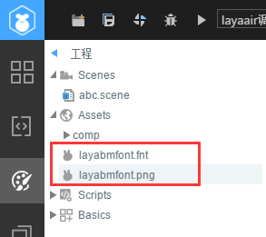

#ビットマップフォントの作成と使用


StaringやCocosを使ったことがあります。ユニティの場合も、ビットマップのフォントになじみがないはずです。簡単な写真をユーザー定義のテキストに入れて、プロジェクトの中で美しいテキストの表示効果を作り出すことができます。LayaAirでもビットマップフォントの使用と表示をサポートします。以下はビットマップフォントのLayaAirでの使用効果です。


 


###ビットマップのフォントを作成

1.エクスポートしたいテキストをtxt文に書きます。
​

2.選択ファイル->Unicodeコードのtxtファイルとして保存します。
​

3.windowsの下に無料のビットマップフォントをインストールするツールBitmap Font Generatorをダウンロードします。
ダウンロード先:[http://www.angelcode.com/products/bmfont/](http://www.angelcode.com/products/bmfont/install_bmfont_1.13.exe)

4.ソフトウェアを開いて、Opotion->FontSettingを選択して、エクスポートするフォントの通常設定を設定し、設定が完了したらOKボタンを押して保存します。

        

**重要なパラメータの説明：**

Font:エクスポートしたビットマップフォントで使用するフォントです。
Size:エクスポートしたビットマップのフォントサイズを設定します。使用に必要な文字の大きさはここで同じサイズの文字を設定することを推奨します。
Height：フォントの高さを設定し、デフォルトの100%を維持すればいいです。
​*注意：Charrsetの値はUnicodeを選択します。*

​

5.選択メニューバーEdit->Select chars from fileで、先ほど作成したtxtファイルを選択します。もしヒントが失敗したら、txtファイルはunicode符号化されたファイルではないかどうか、フォントはテキスト内のフォントが含まれているかどうかを確認してください。

​

6.エクスポートスタイルを設定し、メニューバーのOptions->Export Optionsを選択し、Export Optionsを開いてエクスポートオプションを設定し、設定が完了したらOKボタンを押して保存します。

Padding：文字の内枠、または文字として解釈される周辺の空欄はどれぐらいですか？後期様式を作る時にはこの属性が重要で、境界線、発光などの特殊効果を使うために空間を残しておく必要があります。例えば、2 pxの枠を追加して、右下2 pxの投影効果を加える予定なので、padding:2 px 4 px 2 pxを設定しました。
Bit depth：32ビットが必要です。そうでないと透明層がないです。
Prests：フォント初期化のためのカラーチャネル設定、つまりフォントの初期色設定はどのようなものですか？ホワイトワードを使って、White text with alphaに直接設定することができます。つまり、ホワイトワードの透明性の底です。
Font descriptor：フォント記述ファイル、xmlを選択します。
Textures：テクスチャ画像フォーマット、pngを選択します。


​        
7.ビットマップフォントをエクスポートします。メニューバーのOptions->Save bitmap font asを選択して、フォント記述ファイル（.fntフォーマット）とフォントテクスチャファイル（.png形式）が生成されます。


 


###LayaAirプロジェクトでビットマップフォントを使う

1.プロジェクトの出力ディレクトリに資源を置く。
作成したビットマップファイルを同一の名前（.fntファイルと.pngファイル）に変更し、LayaAirプロジェクトのbinディレクトリに保存します。

​

図のように：testu 0.pngの名前をtest.pngに変えて、fntファイルと同名であることを保証します。test.pngとtest.fntファイルをbinディレクトリの下に置いてください。


 


**ビットマップフォントのLayaAirプロジェクトでの一般的な使用方法：**

1.ビットマップフォントオブジェクトを作成します。

2.ビットマップのフォントを読み込み、完了するかどうかをヒアリングします。

3.ビットマップフォントを登録します。

4.フォントを使用します。

以下は完全な実行例の効果です。


完全コードは以下の通りです。


 


```java

package
{
    import laya.display.Stage;
    import laya.display.Text;
    import laya.resource.Texture;
    import laya.utils.Handler;
    import laya.display.BitmapFont;
    public class TestBitmapFont
    {
        //自定义文件名称
        private var mFontName:String = "diyFont";
        private var mBitmapFont:BitmapFont;
        public function TestBitmapFont()
        {
            Laya.init(550, 400);
            mBitmapFont = new BitmapFont();
            //这里不需要扩展名，外部保证fnt与png文件同名
            mBitmapFont.loadFont("layabmfont.fnt",new Handler(this,onLoaded));
        }
        private function onLoaded():void
        {
            init();
        }
        private function init():void
        { 
            //如果位图字体中，没放空格，最好设置一个空格宽度
            mBitmapFont.setSpaceWidth(10);
            Text.registerBitmapFont(mFontName, mBitmapFont);
            var txt:Text = new Text();
            txt.text = "这是测试";
            //设置宽度，高度自动匹配
            txt.width = 250;
            //自动换行
            txt.wordWrap = true;
            txt.align = "center";
            //使用我们注册的字体
            txt.font = this.mFontName;
            txt.fontSize = 50;
            txt.leading = 5;
            Laya.stage.addChild(txt);
        }
    }
}
```


 


### **Textクラスにおける関連インターフェース：**


 **register Bitmap Fontメソッド**  

public static function register BitmapFont：void

ビットマップフォントを登録します。

パラメータ

name:String-ビットマップフォントの名前。
BitmapFont:BitmapFont-ビットマップフォントファイル。


 


**unregister Bitmap Fontメソッド** 

public static function unregister BitmapFont(name:String，destory:Boolean=true)：void

登録したビットマップフォントファイルを削除します。

パラメータ

name:String-ビットマップフォントの名前。
destory:Boolean(default=true)—現在のフォントファイルを破棄しますか？


  


###Bitmap Fontクラスの関連インターフェース：


 **loadFont()方法** 

public function loadFont(path:String，compplete:Handler)：void

ビットマップフォントファイルのパスを指定することにより、ビットマップフォントファイルをロードします。

パラメータ
パス：String-ビットマップフォントファイル。
complettee:Handler-ロード完了のコールバックは、上部フォントファイルのロードが完了したことを通知します。


 


**パーフォート方法** 

public function parseFont(xml:Xml Dom，texture:Texture)：void

フォントファイルを解析します。

パラメータ

xml:Xml Dom-フォントファイルXML。
texture:Texture-フォントのテクスチャ。


 

 


**destory()方法**

public function destory()：void

ビットマップのフォントを破壊し、Text.unregister BitmapFontを呼び出すと、デフォルトでは破棄されます。


  


**set Space Width()方法**

public function set Space Width（space Width：Number）：void

スペースの幅を設定します。フォントバンクにスペースがあれば、ここで設定しなくてもいいです。

パラメータ

space Width：Number-幅、単位はピクセルです。


 

  


###LayaAir IDEにビットマップフォントを使う

1.フォントファイルをLayaAir IDEプロジェクトのリソースディレクトリ（laya/asseets/）に入れて、test.fnt、test.pngのような2つのファイル名が同じであることを保証して、自動的にtestというビットマップフォントを登録します。



2.ビットマップフォントを設定するテキストコンポーネントのfont属性値を、エディタに導入されたビットマップフォントの名前に設定します。


3.プログラムコードにビットマップフォントを使用したページを具体化する前に、ページ内で使用されるビットマップフォントを作成して登録する必要があります。


 