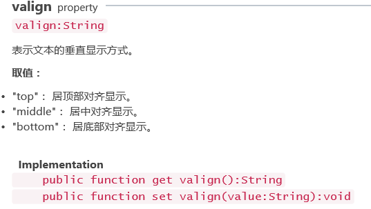
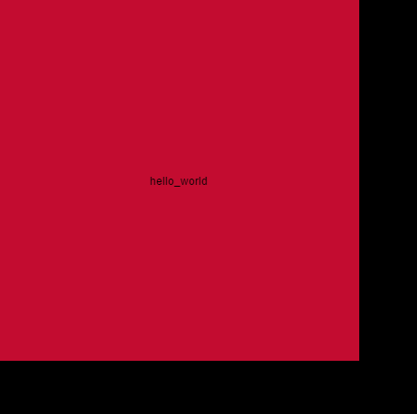

#テキストの配置&自動改行

配置モードに関しては、主に従来の水平方向の配置が垂直方向に配置されており、テキスト領域の中央にテキストが表示されます。まずAPIのパラメータ説明を理解して、サンプルコードを通して紹介します。laya.display.textにおけるテキストスタイルに関するAPIパラメータ：

<br/>

<br/>

<br/>

<br/>

フォントスタイルを設定してくれるコードの中で、まずこのテキストにテキスト範囲を設定してから、テキスト範囲の水平方向の中央揃えと垂直方向の中央揃えにテキストを設定します。テキスト領域を直接設定しないと、テキストの水平方向の配置と垂直方向の配置は効果がありません。


```java

package
{
	import laya.display.Text;

	public class LayaSample
	{
		public function LayaSample()
		{
			//初始化引擎
			Laya.init(1136,640);
			
			var txt:Text = new Text();
			//设置文本内容
			txt.text = "hello_world";
			//设置文本区背景
			txt.bgColor = "#c30c30";
			//设置文本的宽高
			txt.width = 400;
			txt.height = 400;
			//设置文本水平居中
			txt.align = "center";
			//设置文本垂直居中
			txt.valign = "middle";
			Laya.stage.addChild(txt);
		}
	}
}
```


<br/>

実際の符号化で他の配置モードが必要な場合は、APIにおけるalignとvalignの値を参照して、プロジェクトに適した水平配置モードと垂直配置モードを見つけてください。

テキストの内容が私達が設定したテキストエリアを超えていると、舞台の内容を超えて表示されません。この時は自動的に改行してテキストを表示する必要があります。

APIパラメータ:

<br/>

上のコードでtxtのテキストの内容を多く設定し、自動改行のコードを追加します。

テキスト範囲の幅と高さを設定すると、テキストはデフォルトのテキストの幅で自動的に改行されます。コードは以下の通りです。


```java

package
{
	import laya.display.Text;

	public class LayaSample
	{
		public function LayaSample()
		{
			//初始化引擎
			Laya.init(1136,640);
			
			var txt:Text = new Text();
			//设置文本内容
			txt.text = "Layabox是HTML5引擎技术提供商与优秀的游戏发行商，面向AS/JS/TS开发者提供HTML5开发技术方案！";
			//设置文本区背景
			txt.bgColor = "#c30c30";
			//设置文本的宽高
			txt.width = 400;
			txt.height = 400;
			//设置文本水平居中
			txt.align = "center";
			//设置文本垂直居中
			txt.valign = "middle";
			//设置自动换行
			txt.wordWrap = true;
			Laya.stage.addChild(txt);
		}
	}
}
```


<br/>

ここに行くと、私たちが設定した自動改行が実現され、すべてのテキストがこのテキスト領域に表示されます。